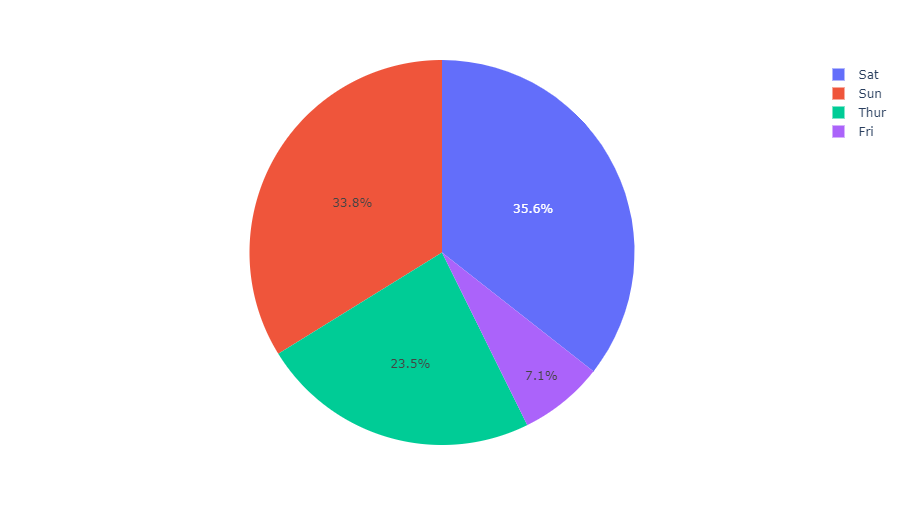
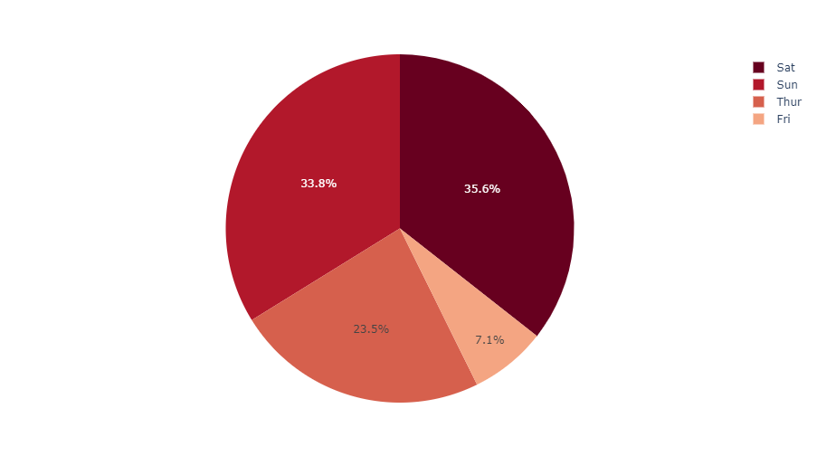
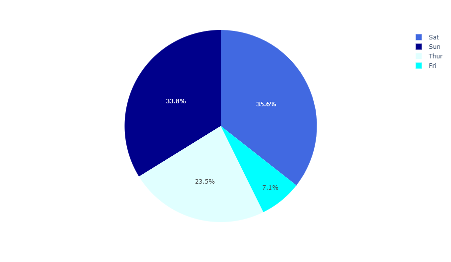

## 使用 Plotly Express 绘制饼图

在 `px.pie` 中，饼图的可视化数值由 `values` 参数指定，扇区标签由 `names` 参数指定。

```python
from plotly import express as px

df = px.data.gapminder().query("year == 2007").query("continent == 'Europe'")
# 仅展示人口数量较多（200万以上）的国家
df.loc[df['pop'] < 2e6, 'country'] = 'Other countries'
fig = px.pie(df, values='pop', names='country', title='Population of European continent')
fig.show()
```

::: center

:::

### 带有重复标签的饼图

*DataFrame* 的数据行会将指定标签列按照相同的标签值聚集到同一个扇区中（数值默认是求和）。

```python
# 这个数据集有 244 行，但只有 4 个互不相同的 'day' 值
df = px.data.tips()
fig = px.pie(df, values='tip', names='day')
fig.show()
```

::: center

:::

### 设置饼图扇区的颜色

```python
fig = px.pie(df, values='tip', names='day',
             color_discrete_sequence=px.colors.sequential.RdBu)
fig.show()
```

::: center

:::

### 对离散色彩使用显式映射

::: tips 更多信息
更多有关离散色彩的信息，请查阅 [此页面](https://plotly.com/python/discrete-color) 。
:::

```python
fig = px.pie(df, values='tip', names='day', color='day',
             color_discrete_map={
               'Thur':'lightcyan', 'Fri':'cyan',
               'Sat':'royalblue', 'Sun':'darkblue'
             })
fig.show()
```

::: center

:::

### 自定义使用 px.pie 创建的饼图

下面这个例子，我们首先用 `px.pie` 创建了一张饼图，使用了诸如 `hover_data` （应该在悬浮状态下显示的数据列）和 `labels` （重命名列）的选项，对于后续的调整，我们调用 `fig.update_traces` 去设置关于图表的其他参数（你还可以使用 `fig.update_layout` 去变更布局）。

```python
df = px.data.gapminder().query("year == 2007").query("continent == 'Americas'")
fig = px.pie(df, values='pop', names='country
             # 图表标题
             title='Population of American continent',
             # 悬浮数据栏，重命名数据列
             hover_data=['lifeExp'], labels={'lifeExp':'life expectancy'})
fig.update_traces(
  textposition='inside',        # 数据标签位置
  textinfo='percent+label'      # 百分比＋标签显示模式
)
fig.show()
```

::: center

:::

## 使用 Graph Objects 绘制饼图

如果 *Plotly Express* 不太行，也可以选择 [`plotly.graph_objects`](https://plotly.com/python/graph-objects/) 中更为通用的 `go.Pie` 类。

在 `go.Pie` 中，数据可视化时的扇区借助 `values` 参数进行设置，各扇区的标签由 `labels` 参数设置，各扇区的颜色由 `marker.colors` 设置。

::: tip
如果你在寻找多级分层饼式图表，请前往 [旭日图教程](https://plotly.com/python/sunburst-charts/) 。

