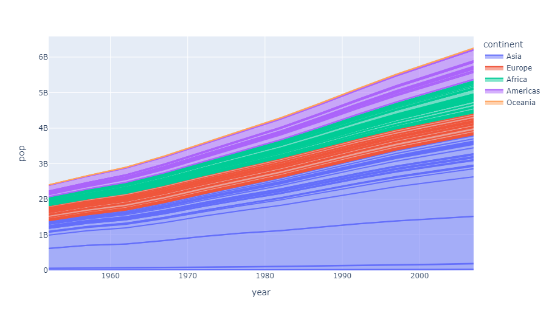
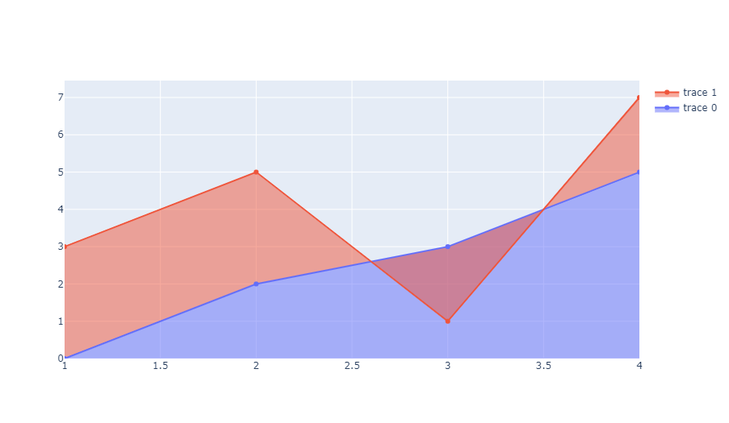
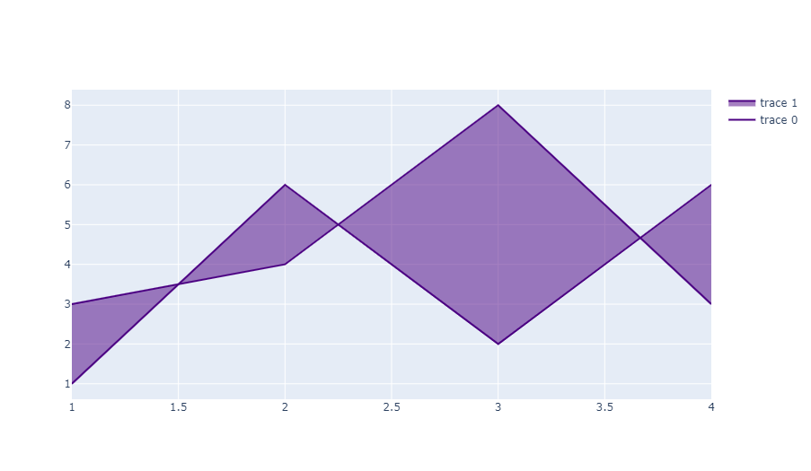
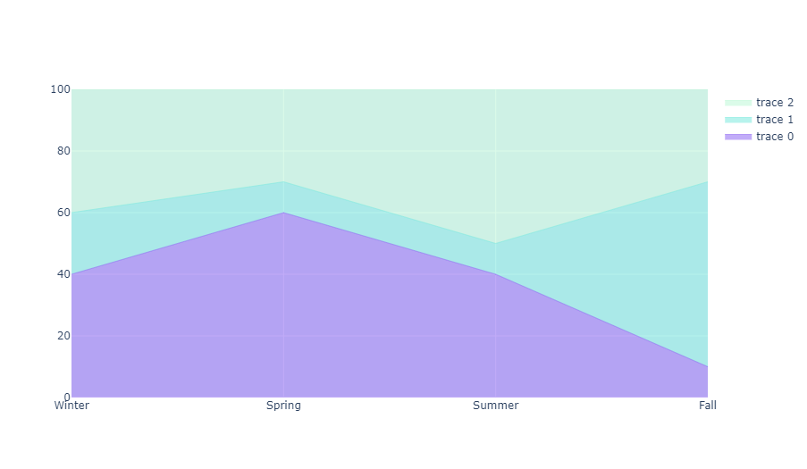
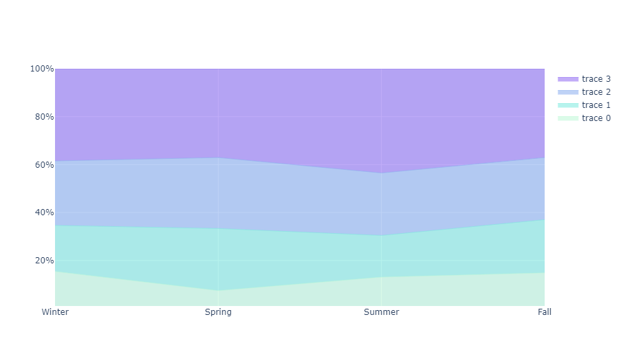
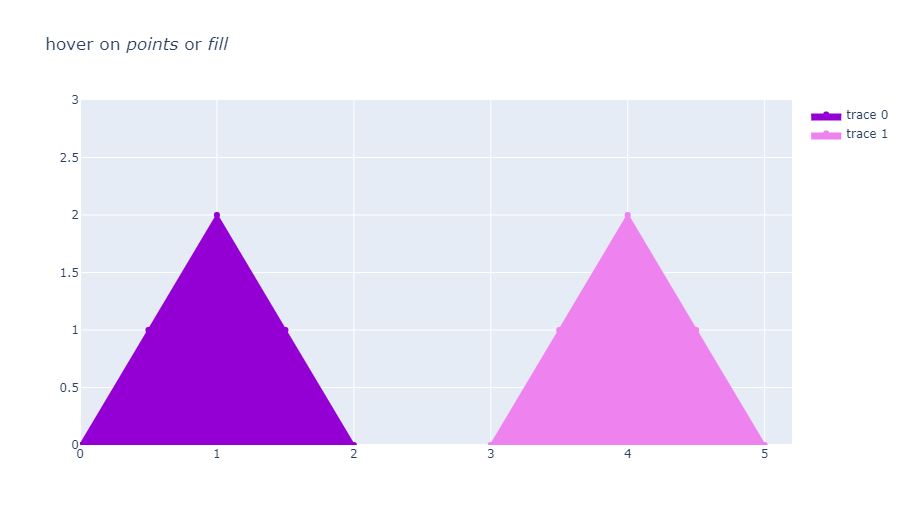

## 用 Plotly Express 绘制填充面积图

`px.area` 能够创建一个堆叠面积图，每一个填充的面积与 `line_group` 参数指定的数据列的每一个值对应。

```python
from plotly import express as px

df = px.data.gapminder()
fig = px.area(df, x="year", y="pop", color="continent", line_group="country")
fig.show()
```

::: center

:::

## 用 Graph Objects 绘制填充面积图

### 基本重叠面积图

```python
from plotly import graph_objects as go

fig = go.Figure()
fig.add_trace(go.Scatter(
  x=[1, 2, 3, 4], y=[0, 2, 3, 5],
  fill='tozeroy'      # 以横坐标轴为基准进行填充
))
fig.add_trace(go.Scatter(
  x=[1, 2, 3, 4], y=[3, 5, 1, 7],
  fill='tonexty'      # 上一条图线为基准进行填充
))
fig.show()
```

::: center

:::

### 无边界线的重叠面积图

```python
fig = go.Figure()
fig.add_trace(go.Scatter(
    x=[1, 2, 3, 4], y=[0, 2, 3, 5], fill='tozeroy',
    mode='none'     # 覆盖默认 'markers+lines' 模式
))
fig.add_trace(go.Scatter(x=[1, 2, 3, 4], y=[3, 5, 1, 7], fill='tonexty', mode='none'))
fig.show()
```

::: center

:::

### 面积图的内部填充

```python
fig = go.Figure()
fig.add_trace(go.Scatter(
    x=[1, 2, 3, 4], y=[3, 4, 8, 3],
    fill=None,          # 不填充第一条图线
    mode='lines', ine_color='indigo'
))
fig.add_trace(go.Scatter(
    x=[1, 2, 3, 4], y=[1, 6, 2, 6],
    fill='tonexty',	    # 填充两条图线之间的范围
    mode='lines', line_color='indigo'
))
fig.show()
```

::: center

:::

### 堆叠面积图

`stackgroup` 参数用于累计同一组中不同图线的 `y` 值，同一组中的图线会被堆叠到上一条图线的上方。

```python
x = ['Winter', 'Spring', 'Summer', 'Fall']

fig = go.Figure()
fig.add_trace(go.Scatter(
    x=x, y=[40, 60, 40, 10], hoverinfo='x+y', mode='lines',
    line=dict(width=0.5, color='rgb(131, 90, 241)'),
    stackgroup='one'      # 定义一个堆叠组
))
fig.add_trace(go.Scatter(
    x=x, y=[20, 10, 10, 60], hoverinfo='x+y', mode='lines',
    line=dict(width=0.5, color='rgb(111, 231, 219)'),
    stackgroup='one'
))
fig.add_trace(go.Scatter(
    x=x, y=[40, 30, 50, 30], hoverinfo='x+y', mode='lines',
    line=dict(width=0.5, color='rgb(184, 247, 212)'),
    stackgroup='one'
))
fig.update_layout(yaxis_range=(0, 100))
fig.show()
```

::: center

:::

### 具有归一化值的堆叠面积图

```python
x = ['Winter', 'Spring', 'Summer', 'Fall']

fig = go.Figure()
fig.add_trace(go.Scatter(
    x=x, y=[40, 20, 30, 40], mode='lines',
    line=dict(width=0.5, color='rgb(184, 247, 212)'),
    stackgroup='one',
    groupnorm='percent'     # 指定堆叠组的归一化方法
))
fig.add_trace(go.Scatter(
    x=x, y=[50, 70, 40, 60], mode='lines',
    line=dict(width=0.5, color='rgb(111, 231, 219)'),
    stackgroup='one'
))
fig.add_trace(go.Scatter(
    x=x, y=[70, 80, 60, 70], mode='lines',
    line=dict(width=0.5, color='rgb(127, 166, 238)'),
    stackgroup='one'
))
fig.add_trace(go.Scatter(
    x=x, y=[100, 100, 100, 100], mode='lines',
    line=dict(width=0.5, color='rgb(131, 90, 241)'),
    stackgroup='one'
))
fig.update_layout(
    showlegend=True, xaxis_type='category',
    yaxis=dict(type='linear', range=[1, 100],
               ticksuffix='%')      # 指定刻度后缀
)
fig.show()
```

::: center

:::

### 选择悬浮点

```python
fig = go.Figure()
fig.add_trace(go.Scatter(
    x=[0,0.5,1,1.5,2], y=[0,1,2,1,0], fill='toself', fillcolor='darkviolet',
    hoveron = 'points+fills',     # 设置悬浮标签的启用条件
    line_color='darkviolet', text="Points + Fills", hoverinfo = 'text+x+y'
))
fig.add_trace(go.Scatter(
    x=[3,3.5,4,4.5,5], y=[0,1,2,1,0], fill='toself', fillcolor = 'violet', hoveron='points',
   line_color='violet', text="Points only", hoverinfo='text+x+y'
))
fig.update_layout(
    title = "hover on <i>points</i> or <i>fill</i>",
    xaxis_range = [0, 5.2], yaxis_range = [0, 3]
)
fig.show()
```

::: center

:::

## 参考

- [散点图（line 参数） - Python 参考手册](https://plotly.com/python/reference/scatter/#scatter-line)
- [散点图（fill 参数） - Python 参考手册](https://plotly.com/python/reference/scatter/#scatter-fill)