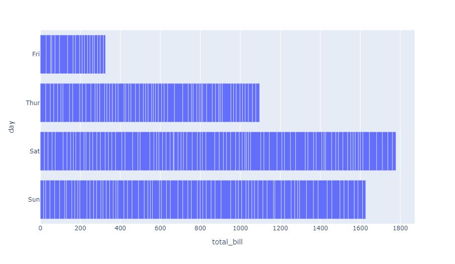
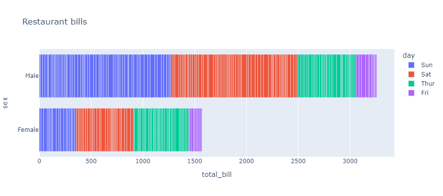
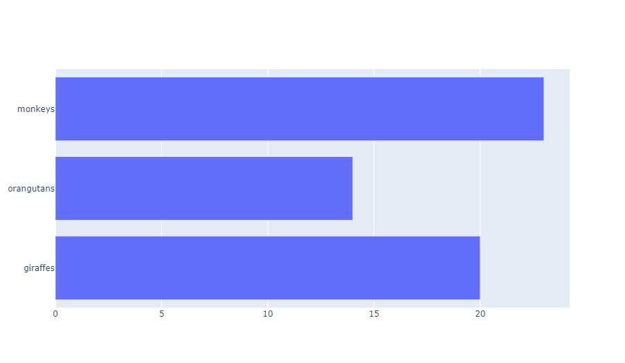
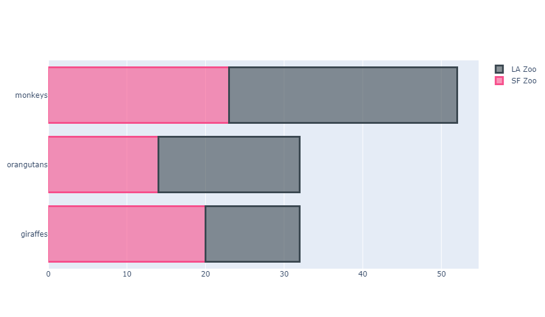
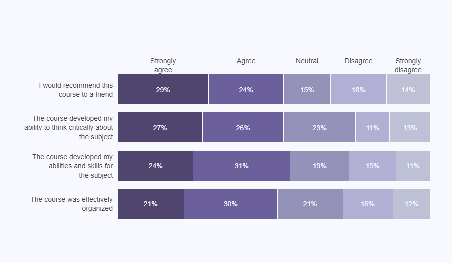
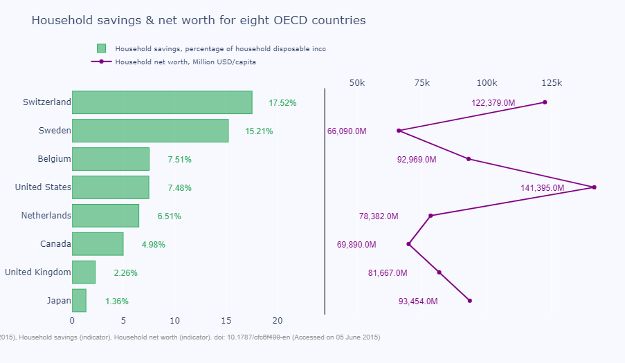

::: tip
如需查看更多有关条形统计图（包括竖直柱状图）及其个性化样式的示例，请查看 [此处](/bar-charts/) 。
:::

## 使用 Plotly Express 绘制条形图

为了绘制水平条形统计图，请使用 `px.bar` 函数并附带参数 `orientation=h` 。

### 基础条形图

```python
from plotly import express as px

df = px.data.tips()
fig = px.bar(df, x="total_bill", y="day", orientation='h')
fig.show()
```

::: center

:::

### 配置条形图

在这个例子中，一列数据用于为数据条上色，同时我们还从其他数据列中添加了一些信息到悬浮数据栏中。

```python
from plotly import express as px

df = px.data.tips()
fig = px.bar(df, x="total_bill", y="sex",
             orientation='h',                 # 水平方向绘图
             color='day',                     # 色彩列
             hover_data=["tip", "size"],      # 悬浮标签中的额外信息
             height=400, title='Restaurant bills')
fig.show()
```

::: center

:::

## 用 Graph Objects 绘制条形图

你还可以使用 [`plotly.graph_objects` 中更为通用的 `go.Bar` 类](https://plotly.com/python/graph-objects/) 绘制水平条形统计图。关于 `go.Bar` 类的所有选项全部记录在 [柱状图 - Python 参考手册](https://plotly.com/python/reference/bar/) 。

### 基础条形图

```python
from plotly import graph_objects as go

fig = go.Figure(go.Bar(
    x=[20, 14, 23],y=['giraffes', 'orangutans', 'monkeys'],
    orientation='h'
))
fig.show()
```

::: center

:::

### 带有色彩的条形图

```python
from plotly import graph_objects as go

fig = go.Figure()
fig.add_trace(go.Bar(
    y=['giraffes', 'orangutans', 'monkeys'], x=[20, 14, 23],
    name='SF Zoo', orientation='h', marker=dict(
        color='rgba(246, 78, 139, 0.6)',
        line=dict(color='rgba(246, 78, 139, 1.0)', width=3)
    )
))
fig.add_trace(go.Bar(
    y=['giraffes', 'orangutans', 'monkeys'], x=[12, 18, 29],
    name='LA Zoo', orientation='h', marker=dict(
        color='rgba(58, 71, 80, 0.6)',
        line=dict(color='rgba(58, 71, 80, 1.0)', width=3)
    )
))
fig.update_layout(barmode='stack')
fig.show()
```

::: center

:::

### 使用色彩索引的条形图

```python
from plotly import graph_objects as go

top_labels = ['Strongly<br>agree', 'Agree', 'Neutral', 'Disagree', 'Strongly<br>disagree']
colors = ['rgba(38, 24, 74, 0.8)', 'rgba(71, 58, 131, 0.8)', 'rgba(122, 120, 168, 0.8)',
          'rgba(164, 163, 204, 0.85)', 'rgba(190, 192, 213, 1)']
x_data = [[21, 30, 21, 16, 12], [24, 31, 19, 15, 11],
          [27, 26, 23, 11, 13], [29, 24, 15, 18, 14]]
y_data = ['The course was effectively<br>organized',
          'The course developed my<br>abilities and skills ' +
          'for<br>the subject', 'The course developed ' +
          'my<br>ability to think critically about<br>the subject',
          'I would recommend this<br>course to a friend']

fig = go.Figure()
for i in range(0, len(x_data[0])):
    for xd, yd in zip(x_data, y_data):
        fig.add_trace(go.Bar(x=[xd[i]], y=[yd],
                      orientation='h', marker=dict(
                          color=colors[i], line=dict(color='rgb(248, 248, 249)', width=1)
                      )))
fig.update_layout(
    xaxis=dict(showgrid=False,showline=False, showticklabels=False,
               zeroline=False, domain=[0.15, 1]),
    yaxis=dict(showgrid=False, showline=False,
               showticklabels=False, zeroline=False),
    barmode='stack', paper_bgcolor='rgb(248, 248, 255)',
    plot_bgcolor='rgb(248, 248, 255)',
    margin=dict(l=120, r=10, t=140, b=80),
    showlegend=False,
)
annotations = []
for yd, xd in zip(y_data, x_data):
    # 标记纵坐标轴
    annotations.append(dict(xref='paper', yref='y', x=0.14, y=yd,
                            xanchor='right', text=str(yd),
                            font=dict(family='Arial', size=14,
                                      color='rgb(67, 67, 67)'),
                            showarrow=False, align='right'))
    # 为每一个数据条最左侧首个部分添加标记
    annotations.append(dict(xref='x', yref='y',
                            x=xd[0] / 2, y=yd,
                            text=str(xd[0]) + '%',
                            font=dict(family='Arial', size=14,
                                      color='rgb(248, 248, 255)'),
                            showarrow=False))
    # 添加顶部最左侧的首个分组标签
    if yd == y_data[-1]:
        annotations.append(dict(xref='x', yref='paper',x=xd[0] / 2, y=1.1,
                                text=top_labels[0], showarrow=False，
                                font=dict(family='Arial', size=14,
                                          color='rgb(67, 67, 67)')))
    space = xd[0]
    for i in range(1, len(xd)):
            # 为剩余部分添加标记
            annotations.append(dict(xref='x', yref='y', x=space + (xd[i]/2), y=yd,
                                    text=str(xd[i]) + '%', showarrow=False
                                    font=dict(family='Arial', size=14,
                                              color='rgb(248, 248, 255)')))
            # 添加顶部分组标签
            if yd == y_data[-1]:
                annotations.append(dict(xref='x', yref='paper',
                                        x=space + (xd[i]/2), y=1.1,
                                        text=top_labels[i],
                                        font=dict(family='Arial', size=14,
                                                  color='rgb(67, 67, 67)'),
                                        showarrow=False))
            space += xd[i]
fig.update_layout(annotations=annotations)
fig.show()
```

::: center

:::

## 带有折线的条形图

```python
from plotly import graph_objects as go
from plotly.subplots import make_subplots
import numpy as np

y_saving = [1.3586, 2.2623000000000002, 4.9821999999999997, 6.5096999999999996,
            7.4812000000000003, 7.5133000000000001, 15.2148, 17.520499999999998
            ]
y_net_worth = [93453.919999999998, 81666.570000000007, 69889.619999999995,
               78381.529999999999, 141395.29999999999, 92969.020000000004,
               66090.179999999993, 122379.3]
x = ['Japan', 'United Kingdom', 'Canada', 'Netherlands',
     'United States', 'Belgium', 'Sweden', 'Switzerland']

# 创建两个子图
fig = make_subplots(rows=1, cols=2, specs=[[{}, {}]], shared_xaxes=True,
                    shared_yaxes=False, vertical_spacing=0.001)
fig.append_trace(go.Bar(
    x=y_saving, y=x, orientation='h', marker=dict(
        color='rgba(50, 171, 96, 0.6)',
        line=dict(color='rgba(50, 171, 96, 1.0)', width=1)
    ), name='Household savings, percentage of household disposable income'
), 1, 1)
fig.append_trace(go.Scatter(
    x=y_net_worth, y=x, mode='lines+markers',
    line_color='rgb(128, 0, 128)', name='Household net worth, Million USD/capita'
), 1, 2)

fig.update_layout(
    title='Household savings & net worth for eight OECD countries',
    yaxis=dict(showgrid=False, showline=False,
               showticklabels=True, domain=[0, 0.85]),
    yaxis2=dict(showgrid=False, showline=True, showticklabels=False,
                linecolor='rgba(102, 102, 102, 0.8)', linewidth=2, domain=[0, 0.85]),
    xaxis=dict(zeroline=False, showline=False, showticklabels=True,
               showgrid=True, domain=[0, 0.42]),
    xaxis2=dict(zeroline=False, showline=False, showticklabels=True,
                showgrid=True, domain=[0.47, 1], side='top', dtick=25000),
    legend=dict(x=0.029, y=1.038, font_size=10), margin=dict(l=100, r=20, t=70, b=70),
    paper_bgcolor='rgb(248, 248, 255)', plot_bgcolor='rgb(248, 248, 255)'
)

annotations = []
y_s = np.round(y_saving, decimals=2)
y_nw = np.rint(y_net_worth)
# 添加标签
for ydn, yd, xd in zip(y_nw, y_s, x):
    # 为折线上的数据点添加标签
    annotations.append(dict(xref='x2', yref='y2', y=xd, x=ydn - 20000,
                            text='{:,}'.format(ydn) + 'M', showarrow=False,
                            font=dict(family='Arial', size=12,
                                      color='rgb(128, 0, 128)')))
    # 为条形图添加数据标签
    annotations.append(dict(xref='x1', yref='y1', y=xd, x=yd + 3,
                            text=str(yd) + '%', showarrow=False，
                            font=dict(family='Arial', size=12,
                                      color='rgb(50, 171, 96)')))
# 数据来源（图表左下角）
annotations.append(dict(xref='paper', yref='paper', x=-0.2, y=-0.109,
                        text='OECD "(2015), Household savings (indicator), ' +
                             'Household net worth (indicator). doi: ' +
                             '10.1787/cfc6f499-en (Accessed on 05 June 2015)',
                        font=dict(family='Arial', size=10, color='rgb(150,150,150)'),
                        showarrow=False))
fig.update_layout(annotations=annotations)

fig.show()
```

::: center

:::

## 参考

- [柱状图教程](/bar-charts/)
- [柱状图 - Python 参考手册](https://plotly.com/python/reference/bar/)
