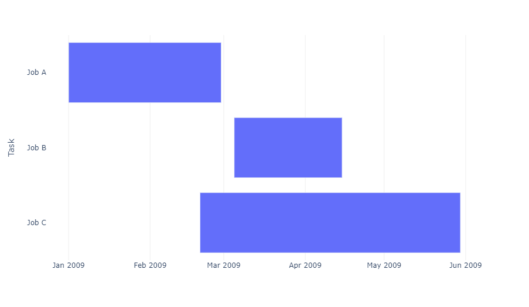
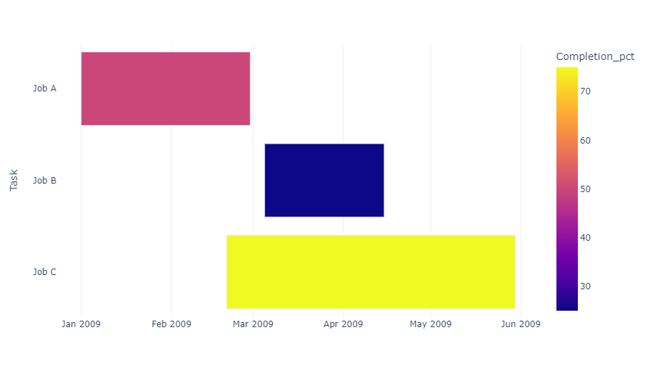
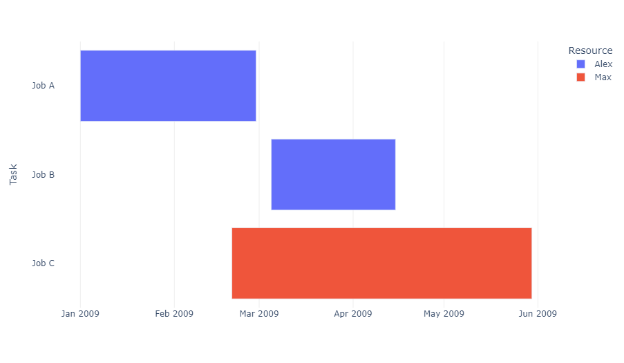
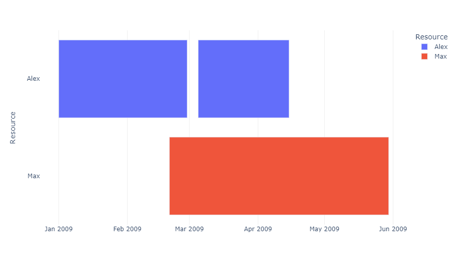
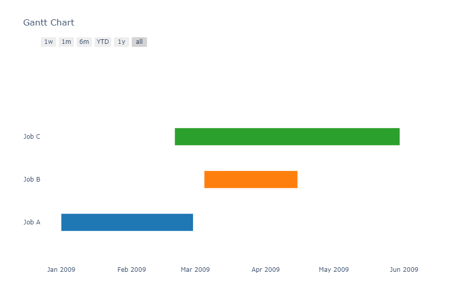
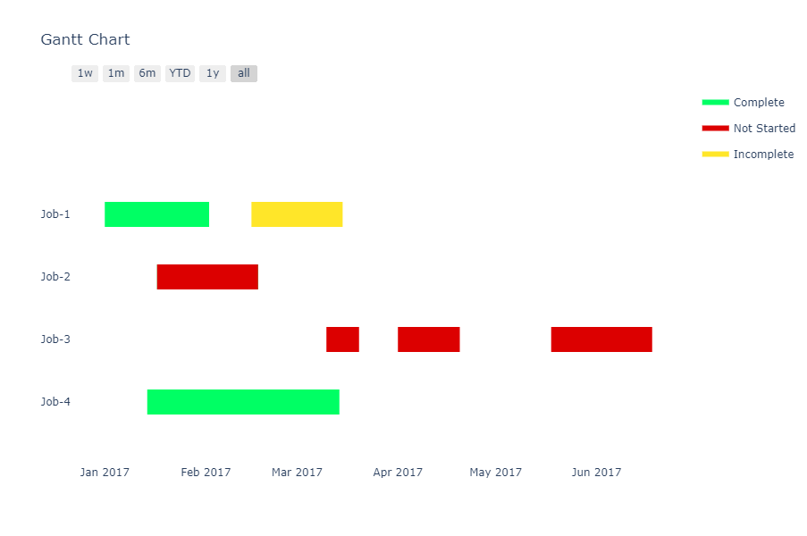
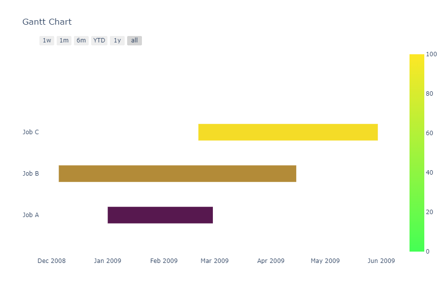

## 前言

在这一章节中，我们将讲解如何使用 Plotly 在 Python 中制作 **甘特图** 。

::: details 介绍
[甘特图](https://wiki.mbalib.com/wiki/%E7%94%98%E7%89%B9%E5%9B%BE) 是一种用于说明项目进度的水平条形图。该图表在纵轴上列出要执行的任务，在横轴上列出时间间隔，图中水平条的宽度显示了每个活动的持续时间。
:::

## 用 Plotly Express 绘制甘特图与时间线

借助`px.timeline`（在版本 4.9 中引入），所有数据都会被解释为带有指定起始日期点和结束日期点的水平条形图。

`px.timeline`函数默认将横坐标轴设置为`type=date`，因此它可以像其他任何时间序列图表一样被设置。

*Plotly Express* 同样支持用于绘制柱状图的通用 [`px.bar`](/bar-charts/) 函数。

```python
from plotly import express as px
import pandas as pd

df = pd.DataFrame([
    dict(Task="Job A", Start='2009-01-01', Finish='2009-02-28'),
    dict(Task="Job B", Start='2009-03-05', Finish='2009-04-15'),
    dict(Task="Job C", Start='2009-02-20', Finish='2009-05-30')
])
fig = px.timeline(df, x_start="Start", x_end="Finish", y="Task")
fig.update_yaxes(autorange="reversed") # otherwise tasks are listed from the bottom up
fig.show()
```

::: center

:::

```python
from plotly import express as px
import pandas as pd

df = pd.DataFrame([
    dict(Task="Job A", Start='2009-01-01', Finish='2009-02-28', Completion_pct=50),
    dict(Task="Job B", Start='2009-03-05', Finish='2009-04-15', Completion_pct=25),
    dict(Task="Job C", Start='2009-02-20', Finish='2009-05-30', Completion_pct=75)
])
fig = px.timeline(df, x_start="Start", x_end="Finish", y="Task", color="Completion_pct")
fig.update_yaxes(autorange="reversed")
fig.show()
```

::: center

:::

`px.timeline`同时支持 [离散色彩](https://plotly.com/python/discrete-color/) （上图）和 [连续色彩](https://plotly.com/python/colorscales/) （下图）。

```python
from plotly import express as px
import pandas as pd

df = pd.DataFrame([
    dict(Task="Job A", Start='2009-01-01', Finish='2009-02-28', Resource="Alex"),
    dict(Task="Job B", Start='2009-03-05', Finish='2009-04-15', Resource="Alex"),
    dict(Task="Job C", Start='2009-02-20', Finish='2009-05-30', Resource="Max")
])

fig = px.timeline(df, x_start="Start", x_end="Finish", y="Task", color="Resource")
fig.update_yaxes(autorange="reversed")
fig.show()
```

::: center

:::

你还可以在同一水平行中绘制多个矩形：

::: warning
当色彩与纵轴标签值相同时，`autorange`不应该被设置为`reverse`，这样能够保证纵坐标轴标签值的顺序与图例的顺序一致。
:::

```python
from plotly import express as px
import pandas as pd

df = pd.DataFrame([
    dict(Task="Job A", Start='2009-01-01', Finish='2009-02-28', Resource="Alex"),
    dict(Task="Job B", Start='2009-03-05', Finish='2009-04-15', Resource="Alex"),
    dict(Task="Job C", Start='2009-02-20', Finish='2009-05-30', Resource="Max")
])

fig = px.timeline(df, x_start="Start", x_end="Finish", y="Resource", color="Resource")
fig.show()
```

::: center

:::

## 已弃用的 Figure Factory

在版本号 4.9 及前序版本中，`plotly.express.timeline()`函数不可用，创建甘特图的推荐方式是使用`create_gantt()` [图表工厂](https://plotly.com/python/figure-factories/) 函数。

```python
from plotly import figure_factory as ff

df = [dict(Task="Job A", Start='2009-01-01', Finish='2009-02-28'),
      dict(Task="Job B", Start='2009-03-05', Finish='2009-04-15'),
      dict(Task="Job C", Start='2009-02-20', Finish='2009-05-30')]

fig = ff.create_gantt(df)
fig.show()
```

::: center

:::

### 任务组

下面这个例子展示了如何使用`create_gantt()`图表工厂函数，为特定的任务指定颜色形成任务组。

```python
from plotly import figure_factory as ff

df = [dict(Task="Job-1", Start='2017-01-01', Finish='2017-02-02', Resource='Complete'),
      dict(Task="Job-1", Start='2017-02-15', Finish='2017-03-15', Resource='Incomplete'),
      dict(Task="Job-2", Start='2017-01-17', Finish='2017-02-17', Resource='Not Started'),
      dict(Task="Job-2", Start='2017-01-17', Finish='2017-02-17', Resource='Complete'),
      dict(Task="Job-3", Start='2017-03-10', Finish='2017-03-20', Resource='Not Started'),
      dict(Task="Job-3", Start='2017-04-01', Finish='2017-04-20', Resource='Not Started'),
      dict(Task="Job-3", Start='2017-05-18', Finish='2017-06-18', Resource='Not Started'),
      dict(Task="Job-4", Start='2017-01-14', Finish='2017-03-14', Resource='Complete')]
colors = {'Not Started': 'rgb(220, 0, 0)',
          'Incomplete': (1, 0.9, 0.16),
          'Complete': 'rgb(0, 255, 100)'}
fig = ff.create_gantt(df, colors=colors, index_col='Resource', 
                      show_colorbar=True, group_tasks=True)
fig.show()
```

::: center

:::

### 指定数值色彩值

```python
from plotly import figure_factory as ff

df = [dict(Task="Job A", Start='2009-01-01', Finish='2009-02-28', Complete=10),
      dict(Task="Job B", Start='2008-12-05', Finish='2009-04-15', Complete=60),
      dict(Task="Job C", Start='2009-02-20', Finish='2009-05-30', Complete=95)]
fig = ff.create_gantt(df, colors='Viridis', index_col='Complete', show_colorbar=True)
fig.show()
```

::: center

:::

## 参考

- 想要了解更多关于 `ff.create_gantt()` 函数的信息，请查阅 [Python API 函数大全](https://plotly.com/python-api-reference/generated/plotly.figure_factory.create_gantt.html) 。
