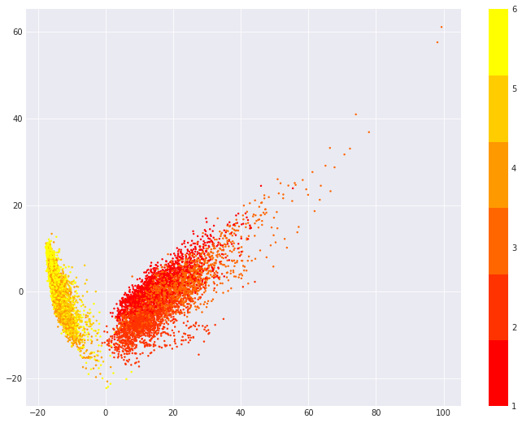

---
author:
  name: Dragon1573
  link: https://github.com/Dragon1573
permalink: /ml/lanaiqo-1283/challange/7
title: 挑战七
date: 2021-09-28 19:31:34
---

# 非监督学习应用练习

- 问题：如果使用 PCA 降维，并使得缩减后的数据保留原始数据 90% 的方差，那么得到的特征数量是多少个？

  > ```python
  > pca = PCA()
  > pca.fit(X_scaled)
  > info_kept = np.cumsum(pca.explained_variance_ratio_)
  > plt.plot(range(1, X_scaled.shape[1] + 1), info_kept)
  > index = np.argmin(np.abs(info_kept - 0.9))
  > plt.plot(index + 1, info_kept[index], 'ms', ms=5, color='red')
  > plt.text(index + 6, info_kept[index] + 0.02, f'({index + 1}, {info_kept[index]})', fontsize=14)
  > ```
  >
  > 根据图表交点坐标，我们至少需要 65 个特征才能保留原始数据 90% 的方差。

- 问题：降维后的第一主成分涵盖了多大比例的方差？舍入到最接近的百分比。

  > ```python
  > round(100 * pca.explained_variance_ratio_[0])
  > ```
  >
  > 它涵盖了约 51% 的方差。

- 问题：请绘制前两个主成分特征的二维散点图，并使用数据已知类别进行着色。通过肉眼观察，上图大致分为几个聚类簇？不同簇中又包含哪些类型的活动？

  > ```python
  > X_trans = pca.transform(X_scaled)
  > plt.scatter(X_trans[:, 0], X_trans[:, 1], c=y, cmap=plt.cm.get_cmap('autumn', 6), s=2)
  > plt.colorbar()
  > ```
  >
  > 
  >
  > 分析上图，我们可以大致看出两个簇。

- 问题：请计算各原始类别聚类后的分散程度，并按照分散程度由大到小排序。

  > ```python
  > pd.DataFrame(
  >     tab.drop(
  >         index='all',
  >         columns='all'
  >     ).max(axis=1) / tab['all'].drop(index='all'),
  >     columns=['Dispersion']
  > ).sort_values(by='Dispersion', ascending=False)
  > ```
  >
  > 通过分散度排序，我们发现「上楼梯」和「躺卧」的分散度最高（80%），「行走」的分散度最低（52.44%）

- 问题：选择 KMeans 聚类合适的聚类 K 值。

  > ```python
  > inertia = [np.sqrt(
  >     KMeans(
  >         n_clusters=k,
  >         random_state=RANDOM_STATE
  >     ).fit(X_scaled).inertia_
  > ) for k in range(1, 7)]
  > plt.plot(range(1, 7), inertia, marker='s')
  > plt.xlabel('$k$')
  > plt.ylabel('$J(C_k)$')
  > ```
  >
  > 从图像中可知，最佳聚类为两类。

- 问题：接下来，尝试使用 Agglomerative 聚类，并计算二者（KMeans）的兰德指数 ARI 值。

  > ```python
  > ac = AgglomerativeClustering(n_clusters=n_classes).fit(X_scaled)
  > (metrics.adjusted_rand_score(y, ac.labels_),
  >  metrics.adjusted_rand_score(y, kmeans.labels_))
  > ```
  >
  > 可以看到， Agglomerative 聚类（0.46）的效果更好（KMeans 为 0.42）。
