## 使用 Plotly Express 绘制柱状图

借助 `px.bar` ，`DataFrame` 中的每一行记录都会被解释为一个矩形的标记。

```python
from plotly import express as px

data_canada = px.data.gapminder().query("country == 'Canada'")
fig = px.bar(data_canada, x='year', y='pop')
fig.show()
```

::: center
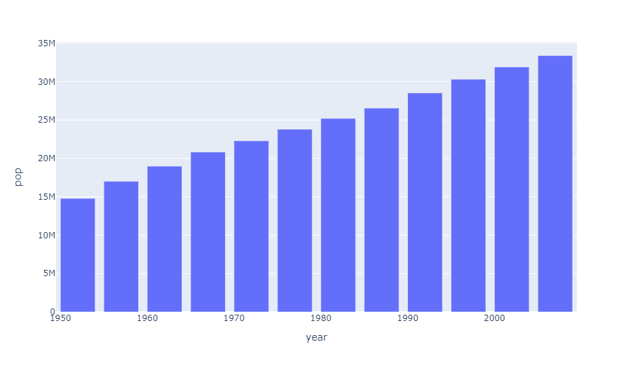
:::

### 长格式数据集的柱状图

**长格式数据集** 的每一个观察值独占一行，每个变量独占一列，这种方式适合存储和展示多变量数据（数据维度大于2）。这种格式有时也被称为『tidy（整洁）』格式。

::: details 更多资料
要学习更多关于如何为诸如 `px.bar` 等二维笛卡尔坐标系 *Plotly Express* 函数提供特殊形式的列式存储数据集，请查阅 [『Python 中的 Plotly Express 宽格式支持』文档](https://plotly.com/python/wide-form/) 。

关于更详细的列式输入格式文档，请查阅 [Plotly Express 参数文档](https://plotly.com/python/px-arguments/) 。
:::

```python
long_df = px.data.medals_long()
fig = px.bar(long_df, x="nation", y="count", color="medal", title="Long-Form Input")
fig.show()

long_df
```

::: center
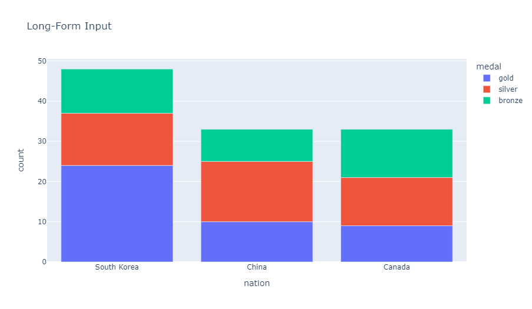
:::

|       | **nation**  | **medal** | **count** |
| :---: | :---------: | :-------: | :-------: |
| **0** | South Korea |   gold    |    24     |
| **1** |    China    |   gold    |    10     |
| **2** |   Canada    |   gold    |     9     |
| **3** | South Korea |  silver   |    13     |
| **4** |    China    |  silver   |    15     |
| **5** |   Canada    |  silver   |    12     |
| **6** | South Korea |  bronze   |    11     |
| **7** |    China    |  bronze   |     8     |
| **8** |   Canada    |  bronze   |    12     |

### 宽格式数据集的柱状图

宽格式数据集首个变量的每一个值独占一行，第二个变量的每一个值独占一列。这适用于存储和展示二维数据。

```python
wide_df = px.data.medals_wide()
fig = px.bar(wide_df, x="nation", y=["gold", "silver", "bronze"], title="Wide-Form Input")
fig.show()

wide_df
```

::: center

:::

|       | **nation**  | **gold** | **silver** | **bronze** |
| :---: | :---------: | :------: | :--------: | :--------: |
| **0** | South Korea |    24    |     13     |     11     |
| **1** |    China    |    10    |     15     |     8      |
| **2** |   Canada    |    9     |     12     |     12     |

## 使用 Plotly Express 个性化柱状图

柱状图可以借助关键字参数进行个性化，例如像下面这样使用 [连续色彩](https://plotly.com/python/colorscales/) ，或是像上面那样使用 [离散色彩](https://plotly.com/python/discrete-color/) 。

```python
data = px.data.gapminder()
data_canada = data[data.country == 'Canada']

fig = px.bar(data_canada, x='year', y='pop',
             # 指定悬浮标签中的数据和柱条的色彩值
             hover_data=['lifeExp', 'gdpPercap'], color='lifeExp',
             # 修改悬浮标签中数据标题，指定图表高度
             labels={'pop':'population of Canada'}, height=400)
fig.show()
```

::: center
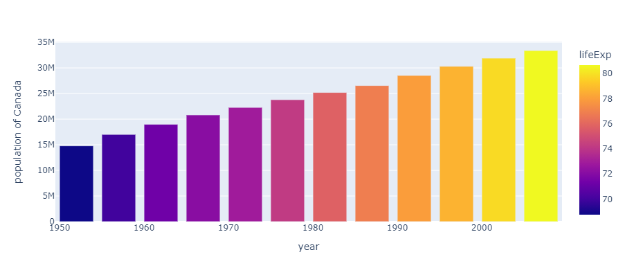
:::

当多个数据行拥有相同的 `x` 值时（此处为性别），默认矩形条会依次向上堆叠。

```python
df = px.data.tips()
fig = px.bar(df, x="sex", y="total_bill", color='time')
fig.show()
```

::: center
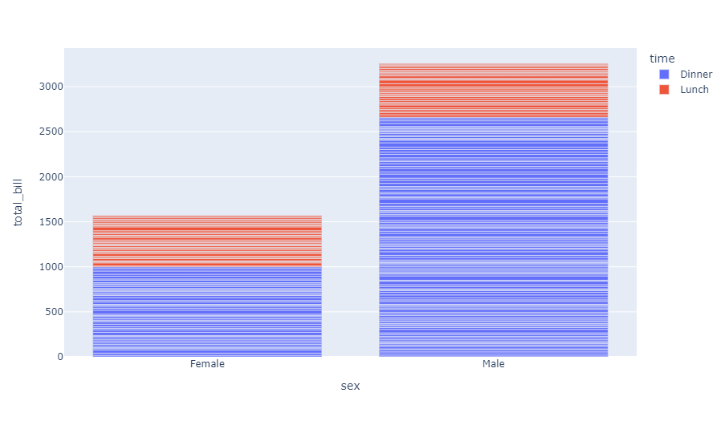
:::

默认的 **堆叠柱状图** 行为可以通过 `barmode` 参数切换为 **分组柱状图** （也就是 **聚集柱状图** ）模式。

```python
fig = px.bar(df, x="sex", y="total_bill",
             # 色彩、分组模式、图表高度
             color='smoker', barmode='group', height=400)
fig.show()
```

::: center
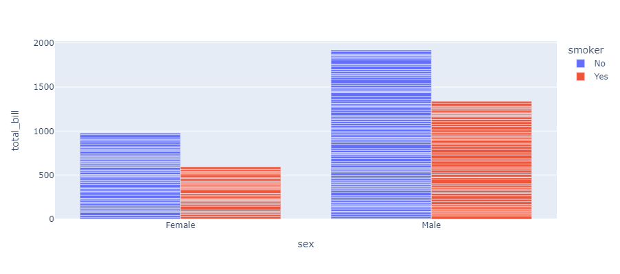
:::

::: details v5.0 新功能
柱状图支持使用 [模式（也称为晕滃或材质）](https://plotly.com/python/pattern-hatching-texture/) 取代色彩。

```python
df = px.data.medals_long()
fig = px.bar(df, x="medal", y="count", color="nation",
             # 模式值和模式映射表
             pattern_shape="nation", pattern_shape_sequence=[".", "x", "+"])
fig.show()
```

::: center
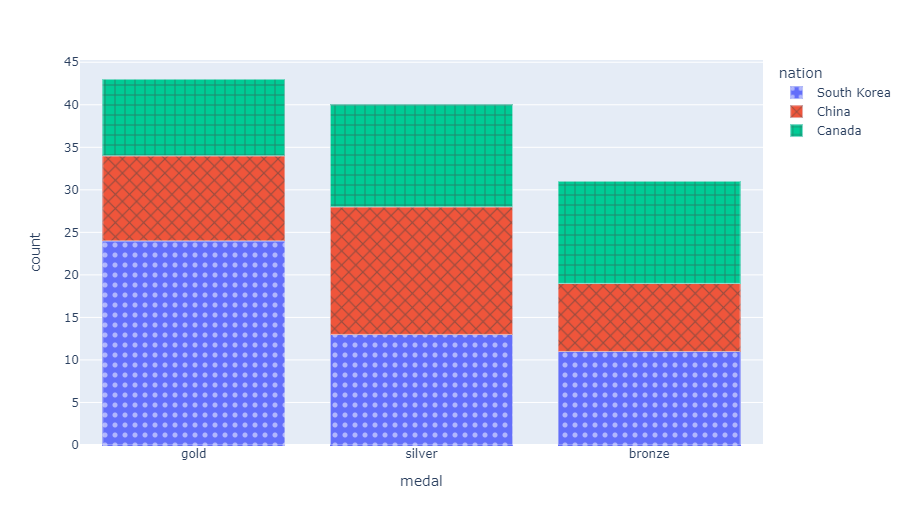
:::

### 分面子图

使用关键字参数 `facet_row` （以及 `facet_col` ）来创建分面子图，其中不同的行（或者列）对应了数据表中给定行（或者列）的值。

```python
df = px.data.tips()
fig = px.bar(df, x="sex", y="total_bill", color="smoker",
             barmode="group", facet_row="time", facet_col="day",
             category_orders={
               "day": ["Thur", "Fri", "Sat", "Sun"],
               "time": ["Lunch", "Dinner"]
             }
            )
fig.show()
```

::: center
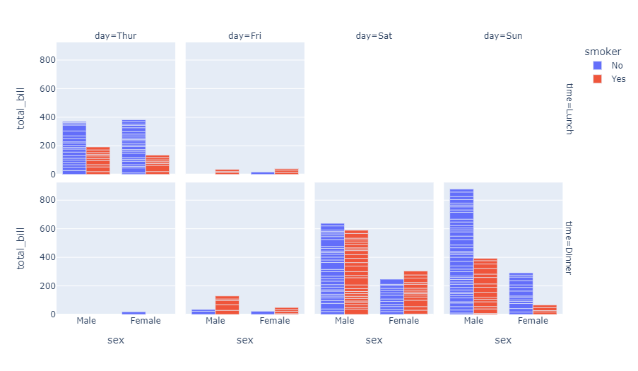
:::

::: details 更多内容
更多学习内容，请查阅 `px.bar` 参考页。
:::

## 使用 Plotly Graph Objects 绘制柱状图

如果 *Plotly Express* 无法提供很好的起始点，也可以使用来自 [`go.graph_objects`](https://plotly.com/python/graph-objects/) 中更为通用的 `go.Bar` 类。

### 基础柱状图

```python
from plotly import graph_objects as go

animals=['giraffes', 'orangutans', 'monkeys']
fig = go.Figure([go.Bar(x=animals, y=[20, 14, 23])])
fig.show()
```

::: center

:::

### 分组柱状图

使用 `fig.update` 对图表进行个性化。

```python
animals=['giraffes', 'orangutans', 'monkeys']

fig = go.Figure(data=[
    go.Bar(name='SF Zoo', x=animals, y=[20, 14, 23]),
    go.Bar(name='LA Zoo', x=animals, y=[12, 18, 29])
])
fig.update_layout(barmode='group')    # 修改数据柱模式
fig.show()
```

::: center
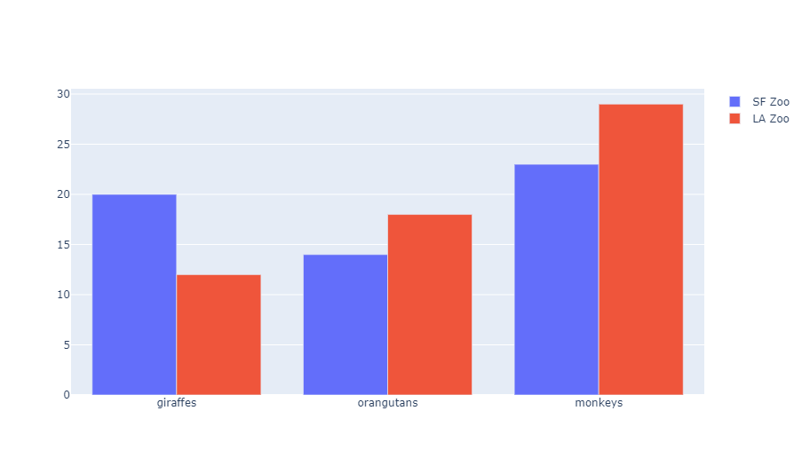
:::

### 堆叠柱状图

```python
animals=['giraffes', 'orangutans', 'monkeys']

fig = go.Figure(data=[
    go.Bar(name='SF Zoo', x=animals, y=[20, 14, 23]),
    go.Bar(name='LA Zoo', x=animals, y=[12, 18, 29])
])
fig.update_layout(barmode='stack')    # 修改模式
fig.show()
```

::: center
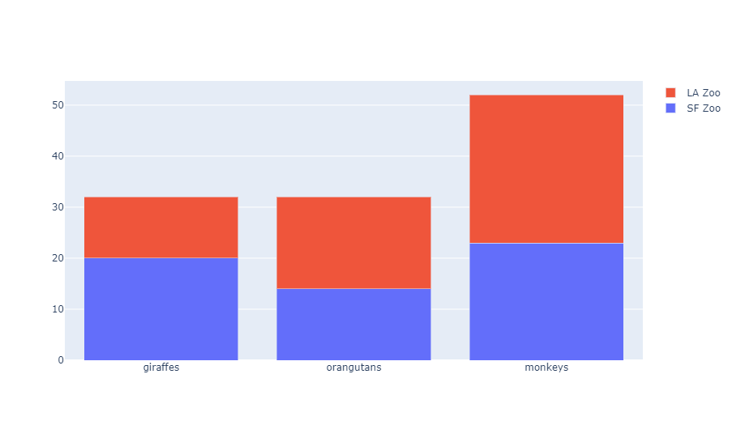
:::

### 带有悬浮文本的柱状图

```python
x = ['Product A', 'Product B', 'Product C']
y = [20, 14, 23]

# 使用 `hovertext` 关键字参数指定悬浮文本内容
fig = go.Figure(data=[go.Bar(x=x, y=y, hovertext=[
    '27% market share', '24% market share', '19% market share'
])])
# Customize aspect
fig.update_traces(marker_color='rgb(158,202,225)',
                  marker_line_color='rgb(8,48,107)',
                  marker_line_width=1.5, opacity=0.6)
fig.update_layout(title_text='January 2013 Sales Report')
fig.show()
```

::: center
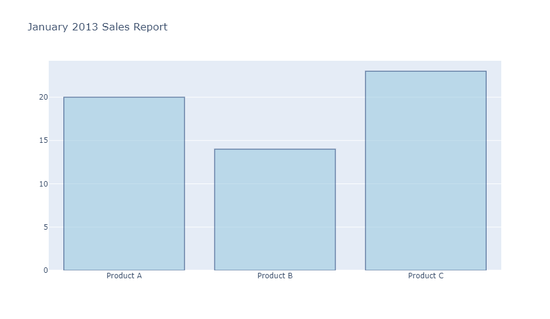
:::

### 带有直接标签的柱状图

```python
x = ['Product A', 'Product B', 'Product C']
y = [20, 14, 23]
fig = go.Figure(data=[go.Bar(
            x=x, y=y,
            text=y,                 # 设置 `text` 关键字参数以直接显示标签
            textposition='auto',    # 将位置设置为 `auto` 以自适应图表
        )])
fig.show()
```

::: center
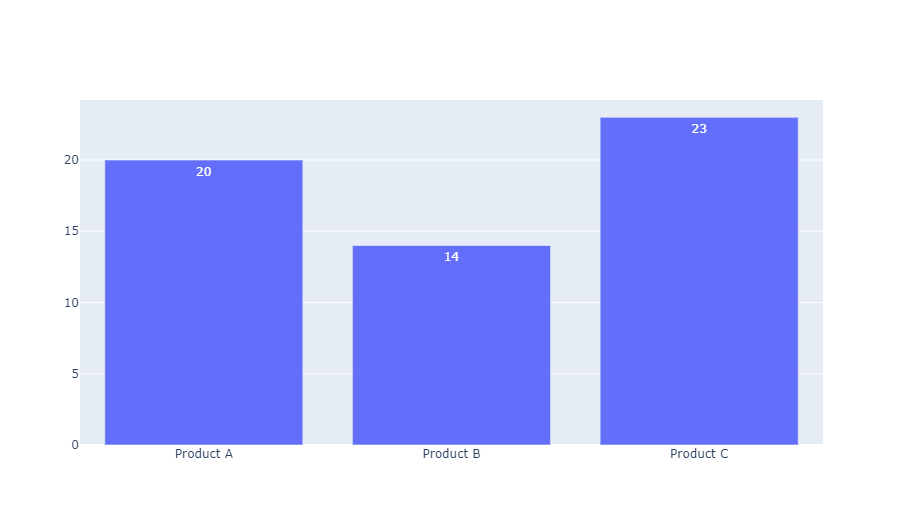
:::

### 旋转柱状图标签

```python
months = ['Jan', 'Feb', 'Mar', 'Apr', 'May', 'Jun',
          'Jul', 'Aug', 'Sep', 'Oct', 'Nov', 'Dec']

fig = go.Figure()
fig.add_trace(go.Bar(
    x=months, y=[20, 14, 25, 16, 18, 22, 19, 15, 12, 16, 14, 17],
    name='Primary Product', marker_color='indianred'
))
fig.add_trace(go.Bar(
    x=months, y=[19, 14, 22, 14, 16, 19, 15, 14, 10, 12, 12, 16],
    name='Secondary Product', marker_color='lightsalmon'
))
# 我们修改了横坐标轴刻度的角度，让标签文字发生旋转
# 正值为顺时针旋转，负值为逆时针旋转
fig.update_layout(barmode='group', xaxis_tickangle=-45)
fig.show()
```

::: center
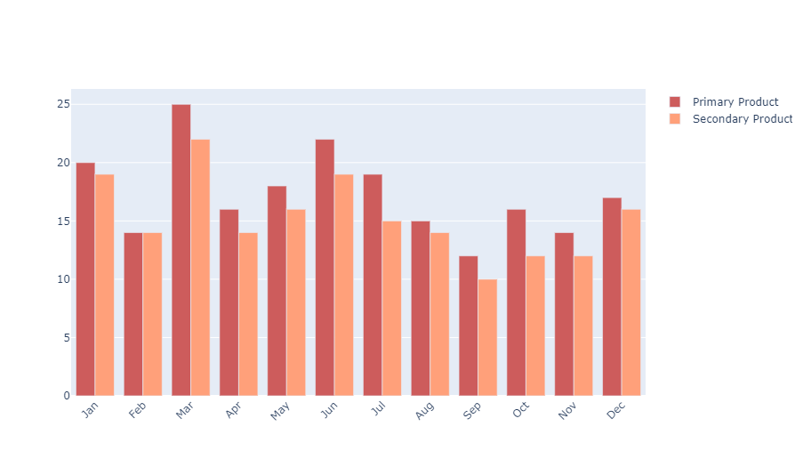
:::

### 自定义单个数据柱的颜色

```python
# 构造颜色表
colors = ['lightslategray'] * 5; colors[1] = 'crimson'

fig = go.Figure(data=[go.Bar(
    x=['Feature A', 'Feature B', 'Feature C', 'Feature D', 'Feature E'],
    # `marker_color` 既可以是单个颜色值，也可以是一个数组
    y=[20, 14, 23, 25, 22], marker_color=colors
)])
fig.update_layout(title_text='Least Used Feature')
```

::: center
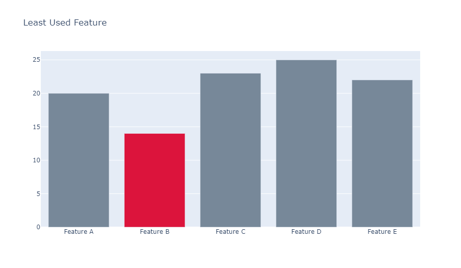
:::

### 自定义单个数据柱的宽度

```python
fig = go.Figure(data=[go.Bar(
    x=[1, 2, 3, 5.5, 10], y=[10, 8, 6, 4, 2],
    # 在此处定义宽度
    # 数据柱会以指定刻度为中轴线进行对齐
    width=[0.8, 0.8, 0.8, 3.5, 4]
    # 例如，最后一个柱会占据 8 ≤ x ≤ 12 的部分
)])
fig.show()
```

::: center

:::

### 自定义单个数据柱的基准刻度

在 *Plotly* 中，所有的数据柱统一以 $y=0$ 为基准进行绘制，我们可以通过 `base` 关键字设置其『零刻度』绝对基准值。在下面的例子中，我们修改了基准值，使得赤红色柱变成了相反数的效果。

```python
years = ['2016','2017','2018']

fig = go.Figure()
fig.add_trace(go.Bar(
    x=years, y=[500, 600, 700], base=[-500,-600,-700],
    marker_color='crimson', name='expenses'
))
fig.add_trace(go.Bar(
    x=years, y=[300, 400, 700], base=0,
    marker_color='lightslategrey', name='revenue'
))
fig.show()
```

::: center
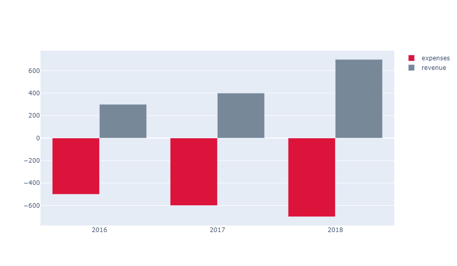
:::

### 柱状图的色彩与样式

在这个例子中，一些布局参数被自定义了，因此直接使用 `go.Layout(...)` 构造函数会比调用 `fig.update` 更为方便。

```python
# 构造数据集
years = [1995, 1996, 1997, 1998, 1999, 2000, 2001, 2002, 2003,
         2004, 2005, 2006, 2007, 2008, 2009, 2010, 2011, 2012]
# 绘制图表
fig = go.Figure()
fig.add_trace(go.Bar(
    x=years, y=[219, 146, 112, 127, 124, 180, 236, 207, 236, 263,
                350, 430, 474, 526, 488, 537, 500, 439],
  name='Rest of world', marker_color='rgb(55, 83, 109)'
))
fig.add_trace(go.Bar(
    x=years, y=[16, 13, 10, 11, 28, 37, 43, 55, 56, 88, 105, 156, 270,
                299, 340, 403, 549, 499],
    name='China', marker_color='rgb(26, 118, 255)'
))
# 更新布局
fig.update_layout(
    title='US Export of Plastic Scrap', xaxis_tickfont_size=14,
    yaxis=dict( title='USD (millions)', titlefont_size=16, tickfont_size=14),
    legend=dict(x=0, y=1.0, bgcolor='rgba(255, 255, 255, 0)',
                bordercolor='rgba(255, 255, 255, 0)'), barmode='group',
    bargap=0.15,        # 相邻数据组之间的间隔
    bargroupgap=0.1     # 相同数据组各柱之间的间隔
)
fig.show()
```

::: center
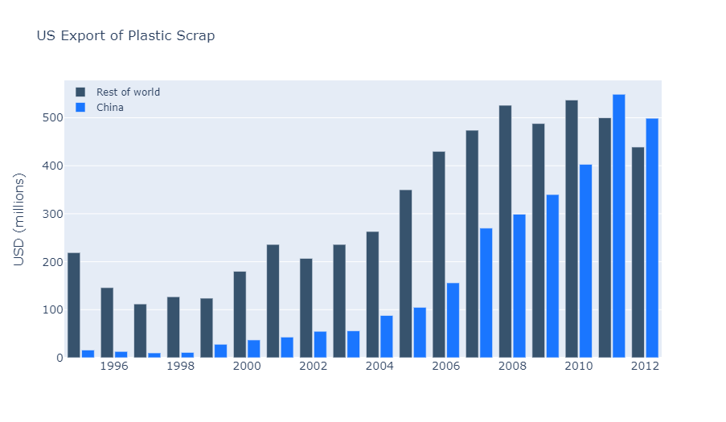
:::

### 带有『相对』模式的柱状图

在『相对（relative）』模式下，柱形将堆叠在一起，其中负值在横坐标轴以下堆叠，正值在横坐标轴以上堆叠。

```python
x = [1, 2, 3, 4]

fig = go.Figure()
fig.add_trace(go.Bar(x=x, y=[1, 4, 9, 16]))
fig.add_trace(go.Bar(x=x, y=[6, -8, -4.5, 8]))
fig.add_trace(go.Bar(x=x, y=[-15, -3, 4.5, -8]))
fig.add_trace(go.Bar(x=x, y=[-1, 3, -3, -4]))
fig.update_layout(barmode='relative', title_text='Relative Barmode')
fig.show()
```

::: center
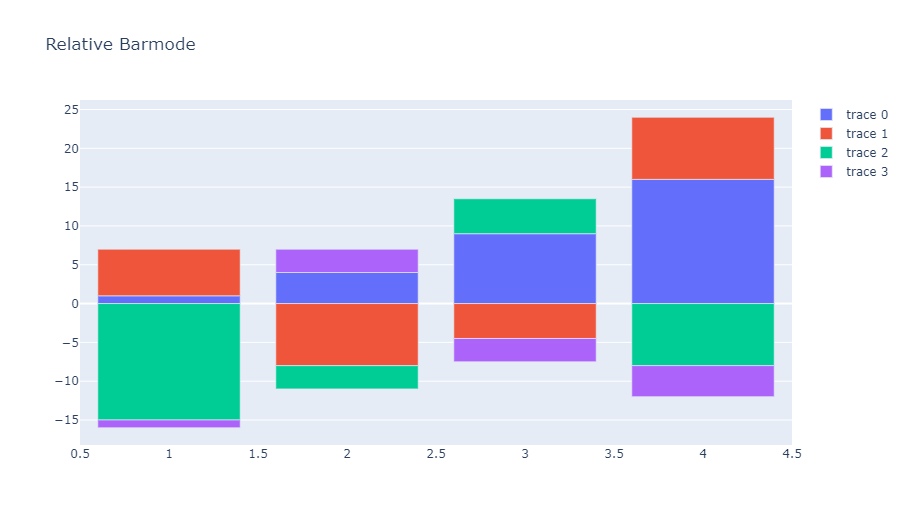
:::

### 带有有序类别的柱状图

设置 `categoryorder` 参数为 `"category ascending"` 或 `"category descending"` 以（逆）字典序排列类别名称，又或是设置为 `"total ascending"` 或 `"total descending"` 以升（降）序排列类别值。

::: details 更多信息
有关更多信息，请查阅 [`categoryorder`](https://plotly.com/python/reference/layout/xaxis/#layout-xaxis-categoryorder) 参数配置。
:::

::: warning 注意
按给定的图线进行排序在当前是不可能的，它只能够按照总数进行排序。当然，如果你需要更多的自定义，你总是能够在绘图**之前**对数据进行排序。
:::

这个例子通过指定 `categoryorder: 'category ascending'` 将柱状图按字典序进行排列。

```python
x = ['b', 'a', 'c', 'd']
fig = go.Figure(go.Bar(x=x, y=[2,5,1,9], name='Montreal'))
fig.add_trace(go.Bar(x=x, y=[1, 4, 9, 16], name='Ottawa'))
fig.add_trace(go.Bar(x=x, y=[6, 8, 4.5, 8], name='Toronto'))
fig.update_layout(barmode='stack', xaxis={'categoryorder': 'category ascending'})
fig.show()
```

::: center
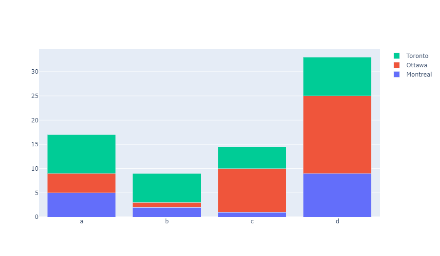
:::

下面另一个例子展示了如何通过将 `categoryorder` 设置为 `"array"` ，并根据 `categoryarray` 的值进行自定义排序。

```python
x = ['b', 'a', 'c', 'd']
fig = go.Figure(go.Bar(x=x, y=[2,5,1,9], name='Montreal'))
fig.add_trace(go.Bar(x=x, y=[1, 4, 9, 16], name='Ottawa'))
fig.add_trace(go.Bar(x=x, y=[6, 8, 4.5, 8], name='Toronto'))
fig.update_layout(barmode='stack', xaxis={
  'categoryorder':'array', 'categoryarray':['d','a','c','b']
})
fig.show()
```

::: center
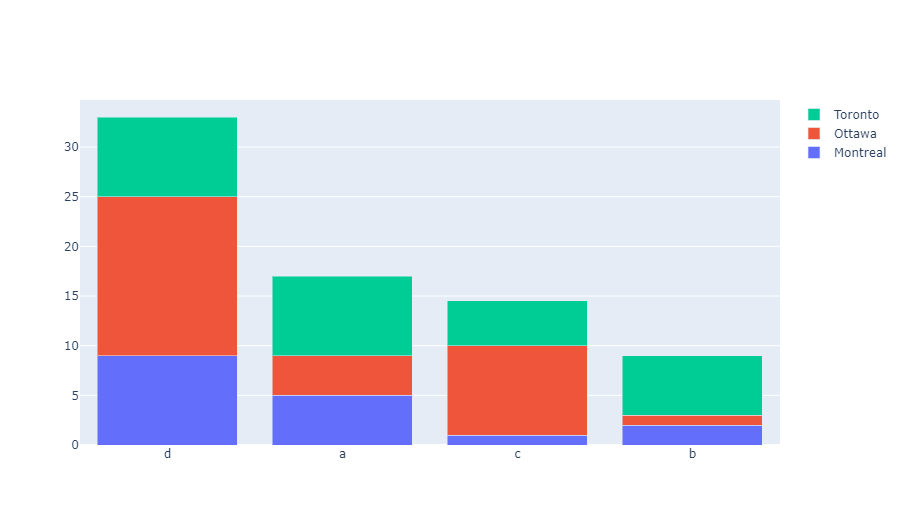
:::

第三个例子通过指定 `categoryorder: 'total descending'` 对柱状图按总数值降序排列。

```python
x = ['b', 'a', 'c', 'd']
fig = go.Figure(go.Bar(x=x, y=[2,5,1,9], name='Montreal'))
fig.add_trace(go.Bar(x=x, y=[1, 4, 9, 16], name='Ottawa'))
fig.add_trace(go.Bar(x=x, y=[6, 8, 4.5, 8], name='Toronto'))
fig.update_layout(barmode='stack', xaxis={'categoryorder':'total descending'})
fig.show()
```

::: center

:::

### 具有多重类别坐标轴的柱状图

如果你的图线拥有数组形式的 `x` 或 `y` 数据，那么相应坐标轴的类型会自动设置为 `multicategory` 。

```python
x = [["BB+", "BB+", "BB+", "BB", "BB", "BB"],
     [16, 17, 18, 16, 17, 18]]
fig = go.Figure()
fig.add_bar(x=x, y=[1, 2, 3, 4, 5, 6])
fig.add_bar(x=x, y=[6, 5, 4, 3, 2, 1])
fig.update_layout(barmode="relative")
fig.show()
```

::: center
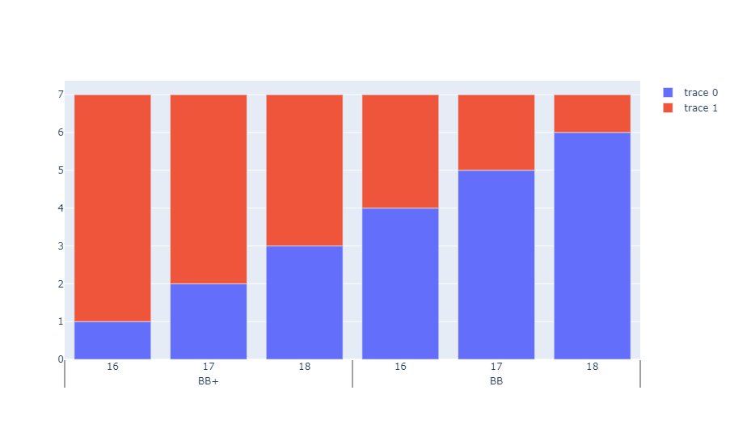
:::

## 水平条形统计图

::: tip 那图呢？
你可以在 [这里](https://plotly.com/python/horizontal-bar-charts/) 找到关于水平条形统计图的示例。
:::

## 用 uniformtext 控制字体大小

如果你希望所有的文本标签具有相同的大小，你可以使用 `uniformtext` 布局参数。`minsize` 属性设置字体大小，`mode` 参数决定标签无法适应指定字体大小时的行为：在超出边框时 `hide` 或 `show` 。下面这个例子，我们还借助 `textposition` 参数强制让标签显示在数据柱以外。

```python
df = px.data.gapminder().query("continent == 'Europe' and year == 2007 and pop > 2.e6")
fig = px.bar(df, y='pop', x='country', text='pop')
# `texttemplate` 指定标签生成模板
fig.update_traces(texttemplate='%{text:.2s}', textposition='outside')
fig.update_layout(uniformtext_minsize=8, uniformtext_mode='hide')
fig.show()
```

::: center
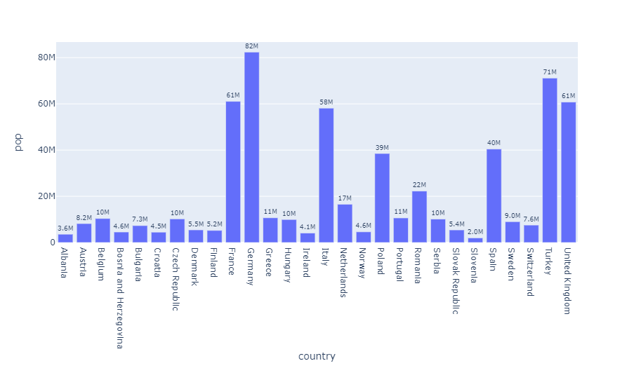
:::

## 参考

- [`px.bar()` 函数参考](https://plotly.com/python-api-reference/generated/plotly.express.bar)
- [`Bar` 图线参考](https://plotly.com/python/reference/bar/)
