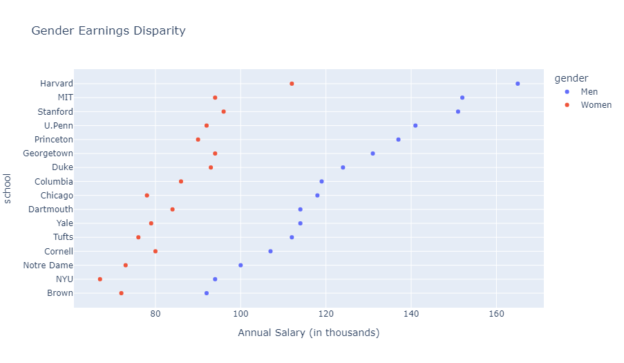
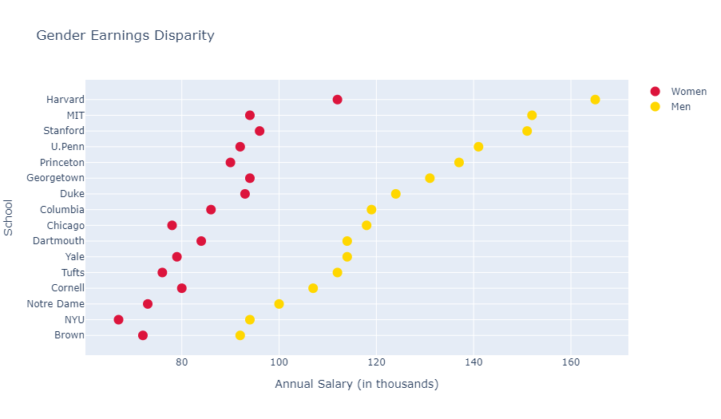
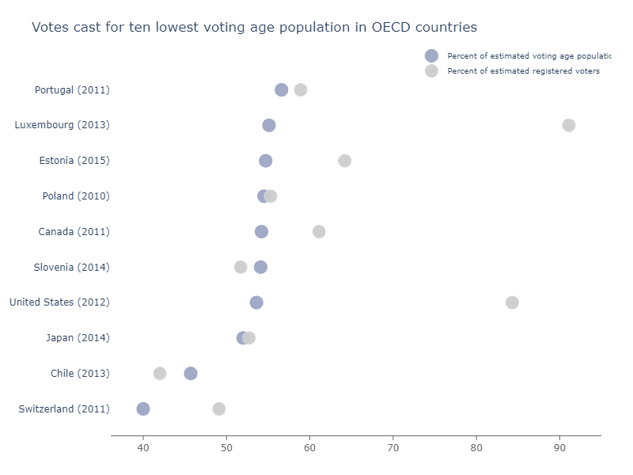

## 基础圆点图

**圆点图** （也被称为 **克利夫兰圆点图** ）是一种 [散点图](/line-and-scatter/) ，它拥有一条类别坐标轴和一条连续值坐标轴。圆点图可以展现两个（或更多）点在时间上的变化，或是两个条件的差异。与 [柱状图](/bar-charts/) 不同，圆点图没有那么混乱，能够更好地对条件进行比较。

对于相同的数据集，我们将展示如何使用 `px.scatter` 或 `go.Scatter` 创建圆点图。

```python
from plotly import express as px

df = px.data.medals_long()
fig = px.scatter(df, y="nation", x="count", color="medal", symbol="medal")
fig.update_traces(marker_size=10)
fig.show()
```

::: center

:::

```python
import pandas as pd

schools = ["Brown", "NYU", "Notre Dame", "Cornell", "Tufts", "Yale",
           "Dartmouth", "Chicago", "Columbia", "Duke", "Georgetown",
           "Princeton", "U.Penn", "Stanford", "MIT", "Harvard"]
n_schools = len(schools)
women_salary = [72, 67, 73, 80, 76, 79, 84, 78, 86, 93, 94, 90, 92, 96, 94, 112]
men_salary = [92, 94, 100, 107, 112, 114, 114, 118, 119, 124, 131, 137, 141, 151, 152, 165]
df = pd.DataFrame(dict(school=schools * 2, salary=men_salary + women_salary,
                       gender=["Men"] * n_schools + ["Women"] * n_schools))

# 使用数据表的列名指定不同的参数
fig = px.scatter(df, x="salary", y="school", color="gender",
                 title="Gender Earnings Disparity",
                 # 自定义坐标轴标签
                 labels={"salary":"Annual Salary (in thousands)"}
                )
fig.show()
```

::: center

:::

```python
from plotly import graph_objects as go

schools = ["Brown", "NYU", "Notre Dame", "Cornell", "Tufts", "Yale",
           "Dartmouth", "Chicago", "Columbia", "Duke", "Georgetown",
           "Princeton", "U.Penn", "Stanford", "MIT", "Harvard"]

fig = go.Figure()
fig.add_trace(go.Scatter(
    x=[72, 67, 73, 80, 76, 79, 84, 78, 86, 93, 94, 90, 92, 96, 94, 112],
    y=schools, marker=dict(color="crimson", size=12),
    mode="markers", name="Women",
))

fig.add_trace(go.Scatter(
    x=[92, 94, 100, 107, 112, 114, 114, 118, 119, 124, 131, 137, 141, 151, 152, 165],
    y=schools, marker=dict(color="gold", size=12), mode="markers", name="Men",
))

fig.update_layout(title="Gender Earnings Disparity",
                  xaxis_title="Annual Salary (in thousands)",
                  yaxis_title="School")
fig.show()
```

::: center

:::

## 个性化类别圆点图

```python
country = ['Switzerland (2011)', 'Chile (2013)', 'Japan (2014)',
           'United States (2012)', 'Slovenia (2014)', 'Canada (2011)',
           'Poland (2010)', 'Estonia (2015)', 'Luxembourg (2013)', 'Portugal (2011)']
voting_pop = [40, 45.7, 52, 53.6, 54.1, 54.2, 54.5, 54.7, 55.1, 56.6]
reg_voters = [49.1, 42, 52.7, 84.3, 51.7, 61.1, 55.3, 64.2, 91.1, 58.9]

fig = go.Figure()
fig.add_trace(go.Scatter(
    x=voting_pop,y=country,
    name='Percent of estimated voting age population',
    marker=dict(
        color='rgba(156, 165, 196, 0.95)',
        line_color='rgba(156, 165, 196, 1.0)'
    )
))
fig.add_trace(go.Scatter(
    x=reg_voters, y=country,
    name='Percent of estimated registered voters',
    marker=dict(
        color='rgba(204, 204, 204, 0.95)',
        line_color='rgba(217, 217, 217, 1.0)'
    )
))
fig.update_traces(mode='markers', marker=dict(line_width=1, symbol='circle', size=16))
fig.update_layout(
    title="Votes cast for ten lowest voting age population in OECD countries",
    xaxis=dict(
        showgrid=False, showline=True, linecolor='rgb(102, 102, 102)',
        tickfont_color='rgb(102, 102, 102)', showticklabels=True,
        dtick=10, ticks='outside', tickcolor='rgb(102, 102, 102)',
    ), margin=dict(l=140, r=40, b=50, t=80), plot_bgcolor='white',
    legend=dict(font_size=10, yanchor='middle', xanchor='right'),
    width=800, height=600, paper_bgcolor='white', hovermode='closest'
)
fig.show()
```

::: center

:::

## 参考

- [散点图 - Python 图表参考](https://plotly.com/python/reference/scatter/)
