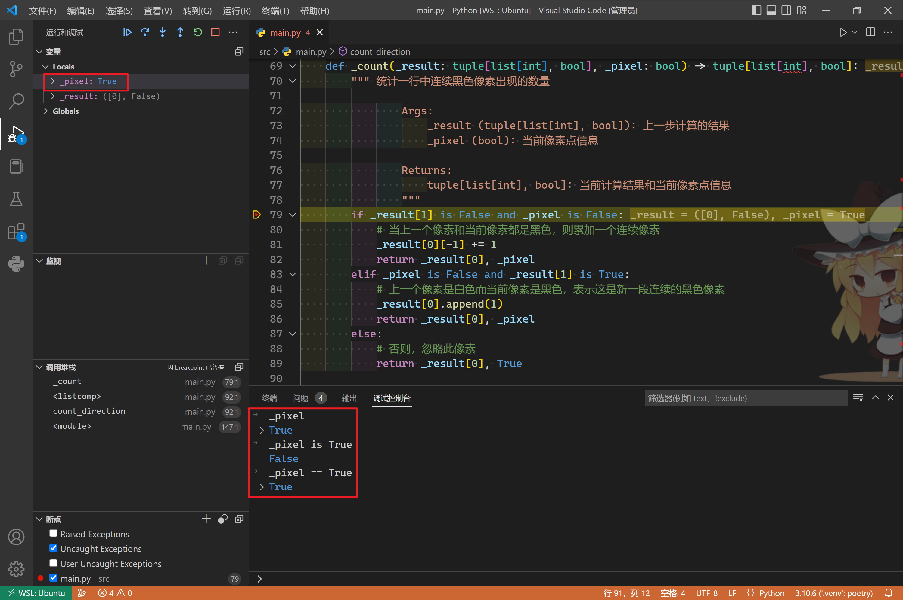
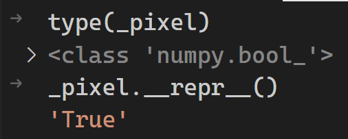

## :question: True is NOT  True

在尝试使用 Python 3.10 制作一个简易的数织（Nonogram）生成器时，需要对一张 `PIL.Image.Image` 任意格式图像执行 `.convert(mode="1", dither=PIL.Image.Dither.NONE)` 方法转换为黑白二值图像，再传入 `numpy.array()` 转换为 NumPy 的 ndarray 二维数组，用于后续从每行（列）中提取连续的像素点。

在执行提取操作时用到了 `functools.reduce` ，规约过程较为复杂因此专门定义了一个函数，内容大致如下：

```python
def _count(_result: tuple[list[int], bool], _pixel: bool) -> tuple[list[int], bool]:
    """ 统计一行中连续黑色像素出现的数量

            Args:
                _result (tuple[list[int], bool]): 上一步计算的结果
                _pixel (bool): 当前像素点信息

            Returns:
                tuple[list[int], bool]: 当前计算结果和当前像素点信息
            """
    if _result[1] is False and _pixel is False:
        # 当上一个像素和当前像素都是黑色，则累加一个连续像素
        _result[0][-1] += 1
        return _result[0], _pixel
    elif _pixel is False and _result[1] is True:
        # 上一个像素是白色而当前像素是黑色，表示这是新一段连续的黑色像素
        _result[0].append(1)
        return _result[0], _pixel
    else:
        # 否则，忽略此像素
        return _result[0], True
```

但是在实际运行的时候，发现上面这个函数只会经过 `else` 分支。这就很奇怪了，在 VSCode 中打断点，可以看到左上部分 `_pixel` 变量显示的值是 `True` ，调试控制台输入 `_pixel` 得到的也是 `True` ，但为什么 `_pixel is True` 的结果是 `False` 而 `_pixel == True` 才是 `True` ？难道这里 `True` 并不是 `True` 么？

:::center

:::

## :warning: 阴险的 `numpy.bool_` 与狡猾的 `__repr__`

在反复调试了 $n$ 次之后，我选择去看看 `_pixel` 究竟是什么。

:::center

:::

好家伙，又被表象忽悠了。`_pixel` 是一个 `numpy.bool_` 而不是 Python 内置的 `bool` ，VSCode 变量视图和调试控制台输出的 `True` 或者 `False` 都是其魔法函数 `__repr__` 的结果，而这个 `True` 或者 `False` 都是字符串表象而已，`_pixel` 也更不可能会 `is True` ！

## :heavy_check_mark: 认知与改进

在这种场景下，我们其实不应该明确地使用 `is True` 、 `is not False` 这样的判断，因为我们很容易被 `__repr__` 输出的表象值欺骗。更好的做法是直接将变量本身用作判断，像下面这样：

```python
def _count(_result: tuple[list[int], bool], _pixel: numpy.bool_) -> tuple[list[int], bool]:
    if not _result[1] and not _pixel:
        pass	# 中间部分省略
    elif not _pixel and _result[1]:
        pass
    else:
        pass
```

`if obj: pass` 的写法其实与 `if bool(obj) is True: pass` 等价，Python 解释器会隐式调用对象的 `__bool__` 方法，将对象自身转换为内置的 `True` 或 `False` 对象，而他们俩都是单例对象（Singleton），就可以使用 `is` 来进行判断了。
