## 简介

Dev Containers 插件是 Microsoft Visual Studio Code 为开发者提供的一个方便快捷的功能扩展。它让开发者可以在一个 Docker 或 Kubenates 容器中挂载并打开自己的项目，为项目提供一个隔离于宿主环境的专属工作空间。

:::center
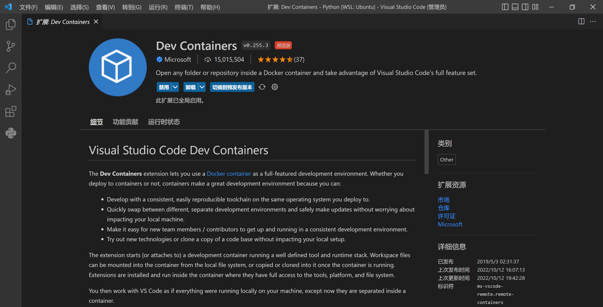
:::

最近正好遇到有网友询问 PHP 相关的内容，由于本地没有安装相关环境，于是打算用 Dev Containers 插件，配合 Docker Desktop for Windows 和 WSL2 Backend 环境来搭建一个 PHP 项目测试环境。

## Windows Subsystem Linux (Version 2)

WSL2 是 Microsoft 为 Windows 10 及以上用户提供的全新虚拟化技术、相比于 WSL1 ，它采用了 VM 技术、与标准 Linux 更为相像，且 Docker Desktop for Windows 官方推荐用它作为 Linux Container 的运行引擎。

我们首先需要为自己的 Windows 启用 WSL 功能。

1. 在 Windows 的开始菜单搜索图示关键词
   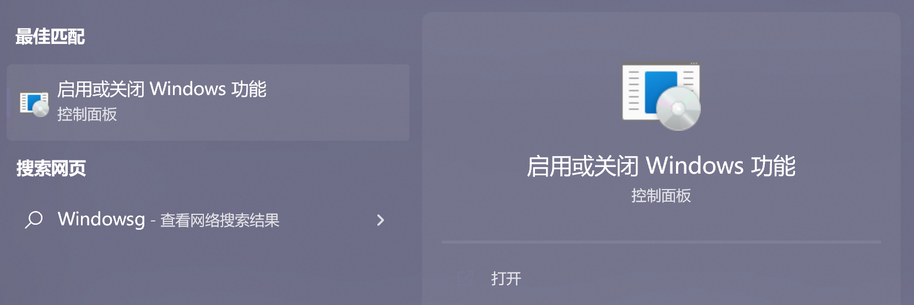
2. 勾选「适用于 Linux 的 Windows 子系统」，点击「确定」并等待安装完成，根据系统引导完成可能的重启操作
   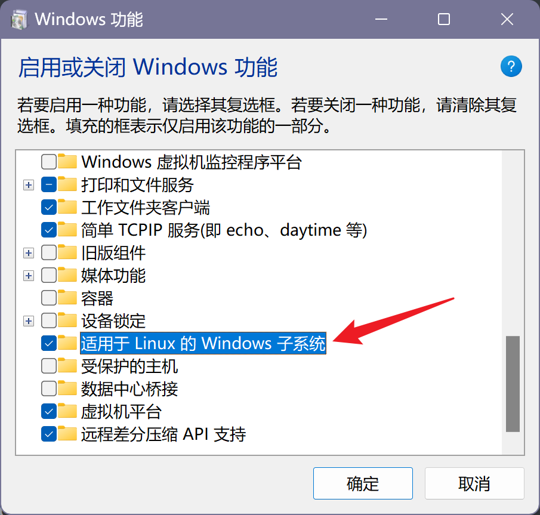
3. 系统重启完成后，执行 `wsl --set-default-version 2` 将后续所有 WSL 发行版本全部修改为 WSL 2

## Docker Desktop for Windows

Docker Desktop for Windows 是 Docker 官方为 Windows 用户提供的、易于上手使用、方便管理维护的 Docker GUI 客户端应用程序，我们可以非常方便地使用它来管理我们的 Docker 磁盘卷（Volume）、镜像（Image）和容器（Container）。

Docker Desktop for Windows 已被收录到 `winget.exe` 软件库中，通过以下命令可以快速完成安装：

```powershell
winget install Docker.DockerDesktop
```

由于一些不明的原因，WSL2 会自动启用一个被称为 LSP 的功能，导致基于 WSL2 Backend 的 Docker Engine 无法正常启动。我们可以借助 Proxifier 官方团队提供的 [`NoLsp.exe`](http://www.proxifier.com/tmp/Test20200228/NoLsp.exe) 关闭此功能：

```powershell
NoLsp.exe "C:\windows\system32\wsl.exe"
```

## VSCode 项目设置

前置环境准备就绪，可以让我们创建一个 PHP 项目了！

:::warning
在使用 Docker Desktop for Windows 之前，我已经有一个 Ubuntu 22.04 LTS 的 WSL2 实例。后续的个别操作步骤都会默认在它上面执行，Windows 实际操作大同小异，但需要执行的命令可能有所不同。
:::

这个 PHP 项目很简单，只有一个独立的 `index.php` 文件。让我们看一下这个项目的结构：

```bash
➜  Php tree -pa $PWD
[drwxr-xr-x]  /root/Documents/Playground/Php
├── [drwxr-xr-x]  .devcontainer
│   ├── [-rw-r--r--]  devcontainer.json
│   └── [drwxr-xr-x]  php
│       └── [-rw-r--r--]  Dockerfile
└── [drwxr-xr-x]  html
    ├── [-rw-r--r--]  index.php
    └── [drwxrwxrwx]  uploads

4 directories, 3 files
```

除了用于实际存放 HTML 和 PHP 内容的 `html/` 目录外，还有一个 `.devcontainer` 目录，这个目录就是用来指定 Dev Containers 开发环境容器配置的。

在 VSCode 中打开这个本地项目，按照如下步骤完成 Dev Containers 相关配置。

:::center
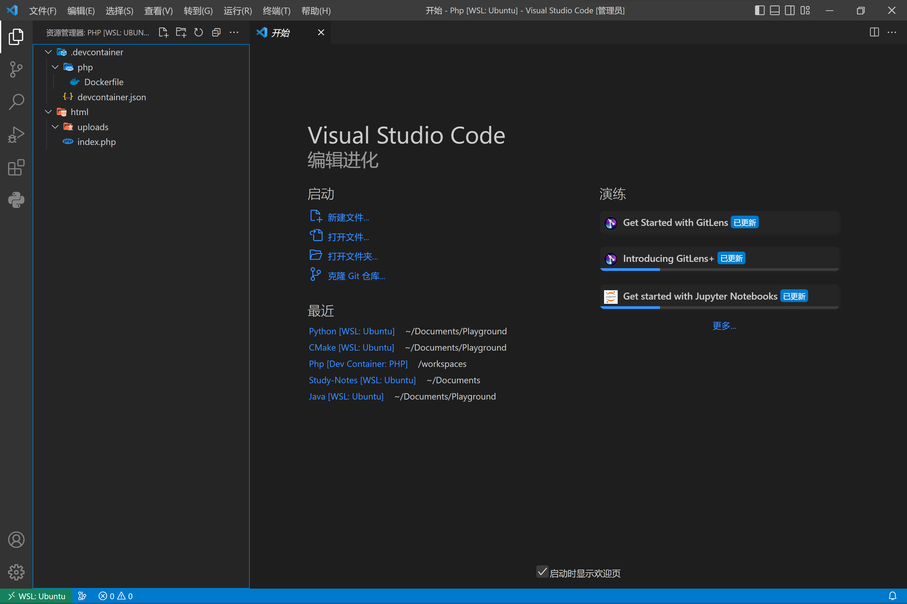
:::

### PHP 运行时（Dockerfile）

为了能够顺利运行 PHP 脚本并呈现页面，我们需要使用 `.devcontainer/php/Dockerfile` 文件来说明创建容器的详细过程。在这个项目中，我们选择使用由 Microsoft 提供的 Dev Containers 定制 PHP 镜像。

```dockerfile
# 使用下面的链接查看关于这个 Dockerfile 的更多内容：
# https://github.com/microsoft/vscode-dev-containers/tree/v0.245.2/containers/php/.devcontainer/base.Dockerfile

# [选项] PHP 版本
# 在本地 ARM64 或 Apple Silicon 设备上，请使用 -bullseye 系列版本
# 可选版本号如下：
# 	8, 8.1, 8.0, 7, 7.4, 7.3,
#	8-bullseye, 8.1-bullseye, 8.0-bullseye, 7-bullseye, 7.4-bullseye, 7.3-bullseye,
#	8-buster, 8.1-buster, 8.0-buster, 7-buster, 7.4-buster
ARG VARIANT="8.1-apache-bullseye"
FROM mcr.microsoft.com/vscode/devcontainers/php:0-${VARIANT}
```

### Dev Containers 插件配置

为了正确配置 Dev Containers 插件，使其能够正确构建镜像、启动容器、打开项目，我们还需要 `.devcontainer/devcontainer.json` 配置文件。

```json
// 关于配置文件的格式信息请查阅 https://aka.ms/devcontainer.json
// 关于配置项，请查看如下链接的 README 文档
// https://github.com/microsoft/vscode-dev-containers/tree/v0.245.2/containers/php
{
    "name": "PHP",
    "build": {
        "dockerfile": "php/Dockerfile",
        "args": {
            // 更新 VARIANT 变量以选择一个 PHP 版本: 8, 8.1, 8.0, 7, 7.4
            // 添加 -bullseye 或 -buster 后缀以固定操作系统版本.
            // 在 ARM64 或 Apple Silicon 设备上请使用 -bullseye 后缀
            "VARIANT": "8"
        }
    },
    // 工具相关的特定配置
    "customizations": {
        // 特定于 VSCode 的配置信息
        "vscode": {
            // 在容器创建时，生成与容器相对应的 settings.json 项目配置文件
            "settings": {
                "php.validate.executablePath": "/usr/local/bin/php"
            },
            // 在此添加你想要在容器创建时就完成安装的插件 ID
            "extensions": [
                "xdebug.php-debug",
                "bmewburn.vscode-intelephense-client",
                "mrmlnc.vscode-apache"
            ]
        }
    },
    // 使用此设置项将一组容器端口映射到本地
    // 这个镜像使用 Apache2 作为 HTTP 服务器
    // 后面的配置会使其自动启动并建立端口映射，不必额外配置
    "forwardPorts": [],
    // 使用此设置在容器创建完成后执行命令
    // 如果这是独立的字符串，那么 Docker 容器会以启动 Shell 的方式执行它
    // 如果这是由字符串组成的数组，那么 Docker 容器不会启动 Shell 去执行
    // 数组中的每一个字符串会被当成是一条命令的各个参数部分
    "postStartCommand": [
        "apache2ctl",
        "start"
    ],
    // 指定登录容器使用的身份，将其注释则默认使用 root 身份
    // 更多信息请参阅 https://aka.ms/vscode-remote/containers/non-root
    "remoteUser": "root",
	// 将本地目录挂载到容器中
    "mounts": [
    	"source=${localWorkspaceFolder}/html,target=/var/www/html,type=bind,consistency=cached"
    ]
}
```

## 启动 Dev Containers

现在，Dev Containers 环境已经配置完成。使用快捷键 `Ctrl + Shift + P` 打开命令面板，选择 「Dev Containers: Rebuild and Reopen in Container」，启动容器构建并在容器中打开此项目。

:::center
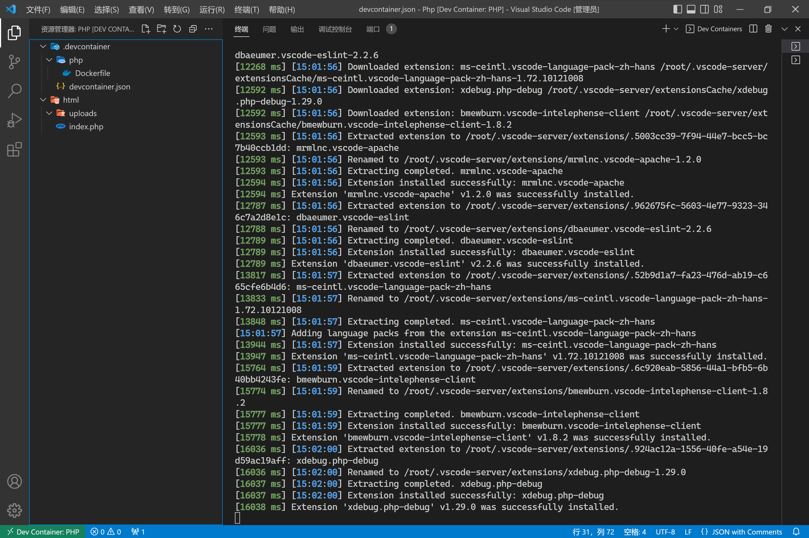
:::

:::center
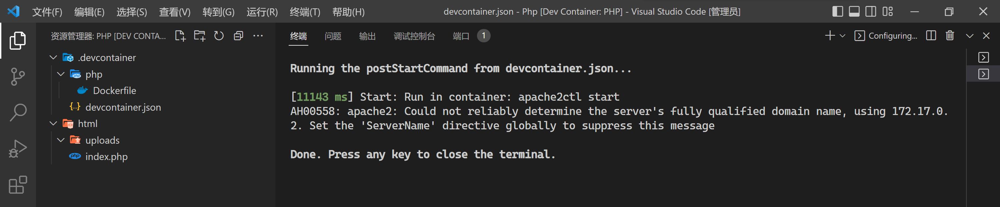
:::

:::center
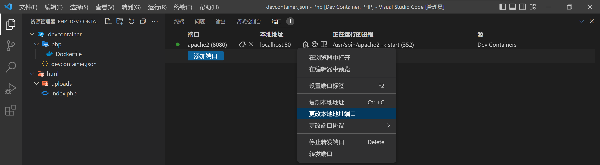
:::

在「端口」面板，可以看到一个正在进行的端口转发，对其右键可以修改端口转发对应的本地端口号并为其设置标签。

## 编写 PHP 页面

让我们做一个简单的文件（图片）上传界面。

```php+HTML
<?php
if (!empty($_FILES['myphoto'])) {
  $temp = $_FILES['myphoto']['tmp_name'];
  $target = './uploads/' . $_FILES['myphoto']['name'];
  move_uploaded_file($temp, $target);
}
?>

<!DOCTYPE html>
<html lang="en">

<head>
  <meta charset="UTF-8">
  <meta http-equiv="X-UA-Compatible" content="IE=edge">
  <meta name="viewport" content="width=device-width, initial-scale=1.0">
  <title>文件上传</title>
</head>

<body>
  <div style="text-align: center;">
    <div style="padding: 25px 0px;">
      " alt="Error!" />
    </div>
    <div>
      <form action="./index.php" method="post" enctype="multipart/form-data">
        <input type="file" name="myphoto" />
        <input type="submit" value="上传" />
      </form>
    </div>
  </div>
</body>

</html>
```

:::center
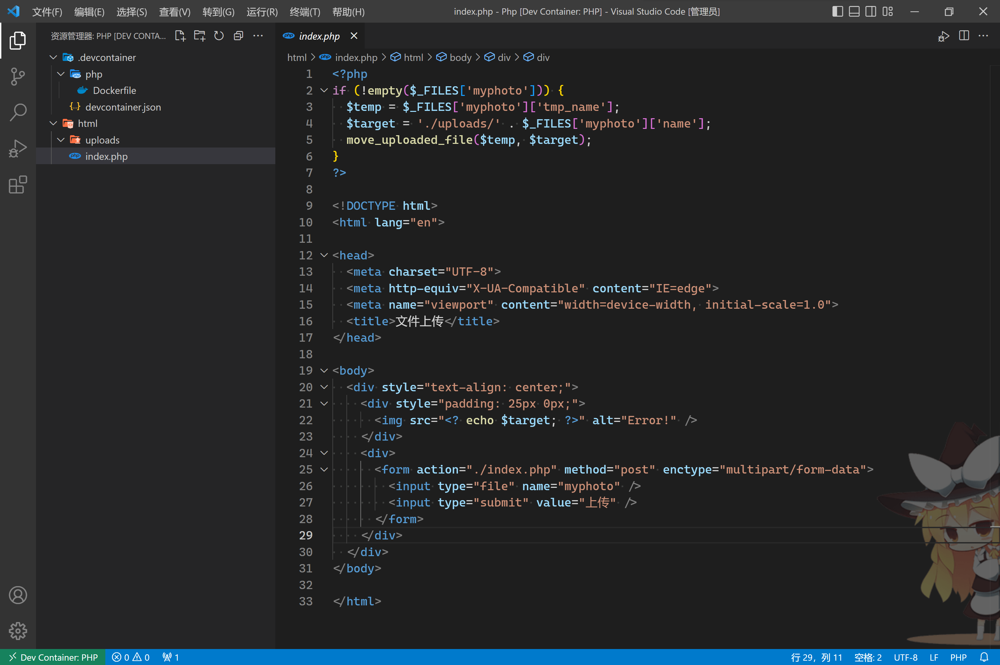
:::

保存文件后，访问 `http://localhost/` ，应该能够正常看到 `index.php` 解析后的页面内容了。

:::center
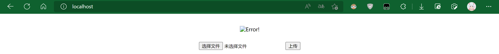
:::

让我们上传一张图片试试？

:::center
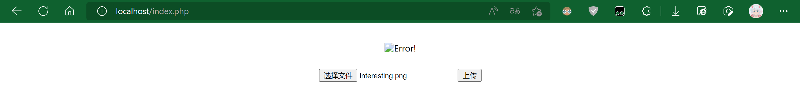
:::

:::center
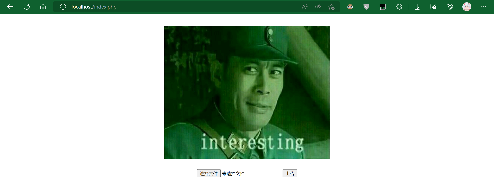
:::

## 总结

Docker / Kubernates 容器技术和 Dev Containers 插件给我们的软件开发提供了极大的便利，我们可以将项目借助 GitHub / GitLab / Gitee / GitCode 等各种在线 Git 平台实现多人协作和资源共享，同时还能借助项目中的 `.devcontainers/` 目录和相关配置文件让所有开发者能够获得相同的开发环境。开发者不需要再为复杂的开发环境配置而烦恼，也不会因为大家开发环境不同产生玄学异常而变得暴躁。

Dev Containers 是一个好东西，用好了会让我们的开发效率显著提升。
