## 使用 Plotly Express 绘制饼图

在`px.pie`中，饼图的可视化数值由`values`参数指定，扇区标签由`names`参数指定。

```python
from plotly import express as px

df = px.data.gapminder().query("year == 2007").query("continent == 'Europe'")
# 仅展示人口数量较多（200万以上）的国家
df.loc[df['pop'] < 2e6, 'country'] = 'Other countries'
fig = px.pie(df, values='pop', names='country', title='Population of European continent')
fig.show()
```

::: center
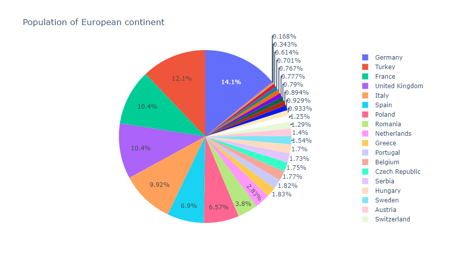
:::

### 带有重复标签的饼图

*DataFrame* 的数据行会将指定标签列按照相同的标签值聚集到同一个扇区中（数值默认是求和）。

```python
# 这个数据集有 244 行，但只有 4 个互不相同的 'day' 值
df = px.data.tips()
fig = px.pie(df, values='tip', names='day')
fig.show()
```

::: center
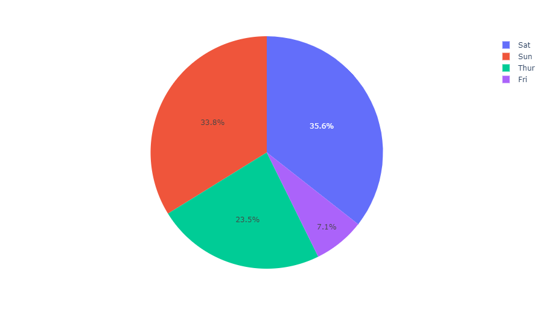
:::

### 设置饼图扇区的颜色

```python
fig = px.pie(df, values='tip', names='day',
             color_discrete_sequence=px.colors.sequential.RdBu)
fig.show()
```

::: center
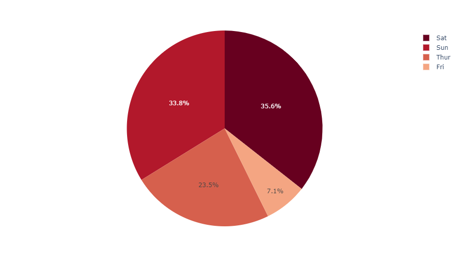
:::

### 对离散色彩使用显式映射

::: tips 更多信息
更多有关离散色彩的信息，请查阅[此页面](https://plotly.com/python/discrete-color)。
:::

```python
fig = px.pie(df, values='tip', names='day', color='day',
             color_discrete_map={
               'Thur':'lightcyan', 'Fri':'cyan',
               'Sat':'royalblue', 'Sun':'darkblue'
             })
fig.show()
```

::: center
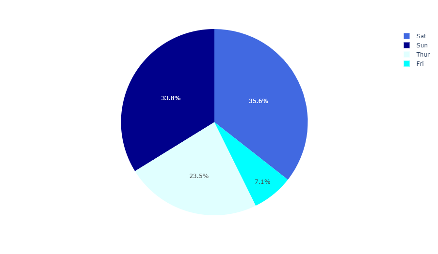
:::

### 自定义使用 px.pie 创建的饼图

下面这个例子，我们首先用`px.pie`创建了一张饼图，使用了诸如`hover_data`（应该在悬浮状态下显示的数据列）和`labels`（重命名列）的选项，对于后续的调整，我们调用`fig.update_traces`去设置关于图表的其他参数（你还可以使用`fig.update_layout`去变更布局）。

```python
df = px.data.gapminder().query("year == 2007").query("continent == 'Americas'")
fig = px.pie(df, values='pop', names='country
             # 图表标题
             title='Population of American continent',
             # 悬浮数据栏，重命名数据列
             hover_data=['lifeExp'], labels={'lifeExp':'life expectancy'})
fig.update_traces(
  textposition='inside',        # 数据标签位置
  textinfo='percent+label'      # 百分比＋标签显示模式
)
fig.show()
```

::: center
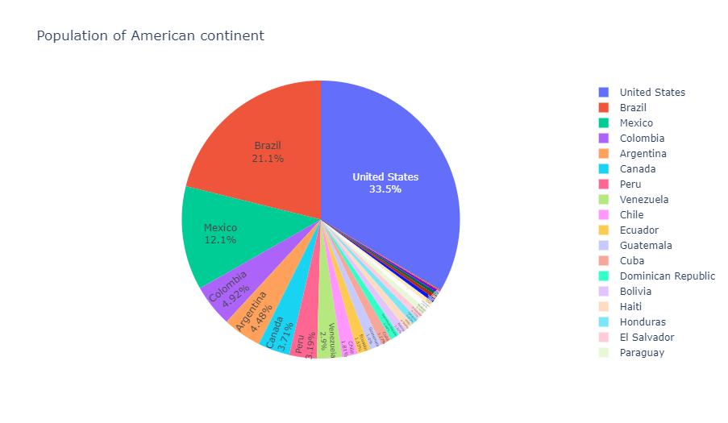
:::

### 控制文本字体大小

如果你希望所有的文字标签都有相同的大小，你可以使用`uniformtext`布局参数。`minsize`属性设置字号，`mode`参数设置标签无法适应指定字号时的行为：隐藏（`hide`）或是以溢出边界的形式显示（`show`）它们。下面这个例子中，我们还借助`textposition`强制文本显示在扇区内部，否则无法适应扇区大小的文字标签将显示在扇区以外。

```python
df = px.data.gapminder().query("continent == 'Asia'")
fig = px.pie(df, values='pop', names='country')
fig.update_traces(textposition='inside')
fig.update_layout(uniformtext_minsize=12, uniformtext_mode='hide')
fig.show()
```

::: center
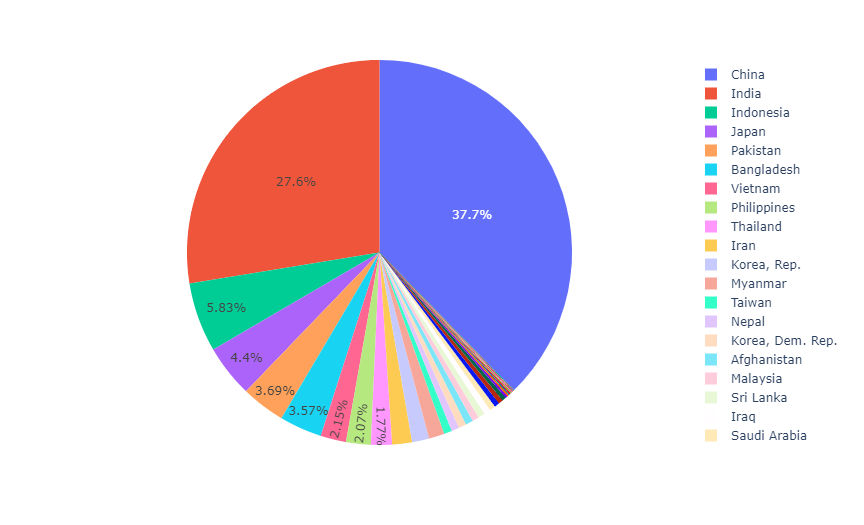
:::

## 使用 Graph Objects 绘制饼图

如果 *Plotly Express* 不太行，也可以选择[`plotly.graph_objects`](https://plotly.com/python/graph-objects/)中更为通用的`go.Pie`类。

在`go.Pie`中，数据可视化时的扇区借助`values`参数进行设置，各扇区的标签由`labels`参数设置，各扇区的颜色由`marker.colors`设置。

::: tip
如果你在寻找多级分层饼式图表，请前往[旭日图教程](https://plotly.com/python/sunburst-charts/)。
:::

### 基础饼图

```python
from plotly import graph_objects as go

labels = ['Oxygen','Hydrogen','Carbon_Dioxide','Nitrogen']
values = [4500, 2500, 1053, 500]

fig = go.Figure(data=[go.Pie(labels=labels, values=values)])
fig.show()
```

::: center
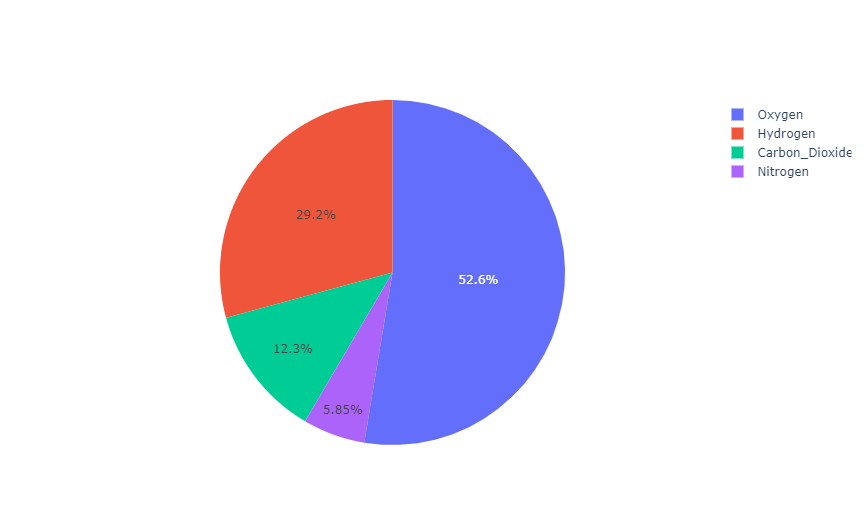
:::

### 自定义样式的饼图

饼图的色彩可以使用 RGB 三元组或十六进制字符串指定，也可以像下面这样使用[CSS 色彩名称](https://www.w3schools.com/cssref/css_colors.asp)。

```python
colors = ['gold', 'mediumturquoise', 'darkorange', 'lightgreen']

fig = go.Figure(data=[go.Pie(labels=['Oxygen','Hydrogen','Carbon_Dioxide','Nitrogen'],
                             values=[4500,2500,1053,500])])
fig.update_traces(hoverinfo='label+percent', textinfo='value', textfont_size=20,
                  marker=dict(colors=colors, line=dict(color='#000000', width=2)))
fig.show()
```

::: center
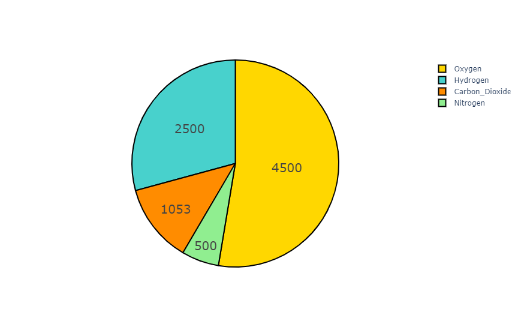
:::

### 控制扇区内的文本方向

`insidetextorientation`属性控制扇区中文本的方向。设置为`auto`时，文本会自动旋转到可用字号最大的角度。使用`horizontal`（水平方向）（或`radial`半径方向、`tangental`切线方向）强制指定方向。

对于使用 *Plotly Express* 创建的图表`fig`，使用`fig.update_trace(insidetextorientation='...')`来更改文本方向。

```python
labels = ['Oxygen','Hydrogen','Carbon_Dioxide','Nitrogen']
values = [4500, 2500, 1053, 500]

fig = go.Figure(data=[go.Pie(
    labels=labels, values=values,
    textinfo='label+percent',
    insidetextorientation='radial'
)])
fig.show()
```

::: center
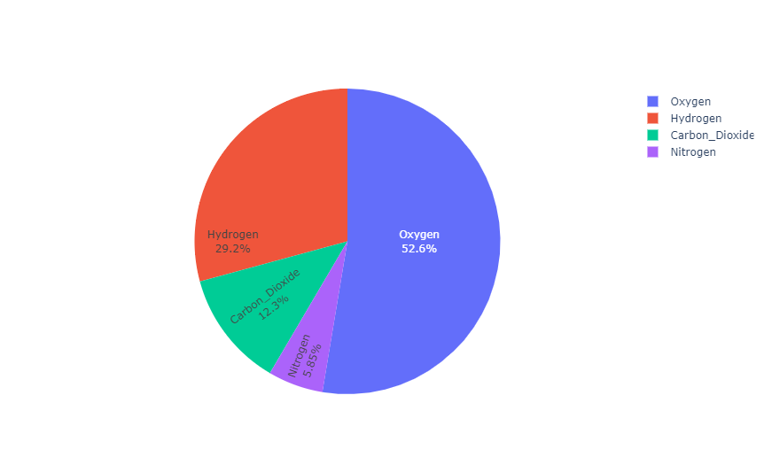
:::

### 从饼图中心拉出扇区

对于一个『拉出』或『散开』布局的饼图，请使用`pull`参数。它可以是一个标量值，将所有扇区向外拉开，也可以是一个数组，将特定的扇区拉开。

```python
labels = ['Oxygen','Hydrogen','Carbon_Dioxide','Nitrogen']
values = [4500, 2500, 1053, 500]

fig = go.Figure(data=[
    # 'pull' 参数以饼图半径的百分比表示
    go.Pie(labels=labels, values=values, pull=[0, 0, 0.2, 0])
])
fig.show()
```

::: center
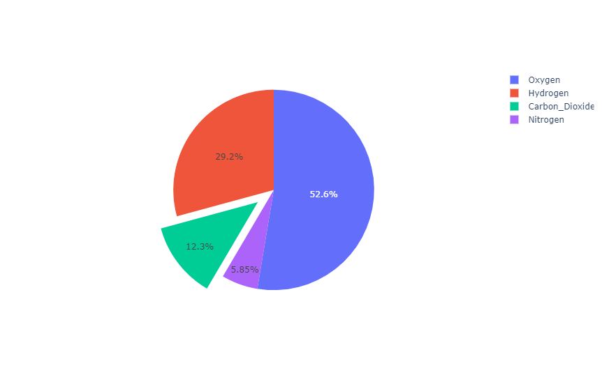
:::

### 圆环图

```python
labels = ['Oxygen','Hydrogen','Carbon_Dioxide','Nitrogen']
values = [4500, 2500, 1053, 500]

# 使用 'hole' 参数创建一个圆环图，靠近圆心的 30% 半径范围被留空
fig = go.Figure(data=[go.Pie(labels=labels, values=values, hole=0.3)])
fig.show()
```

::: center
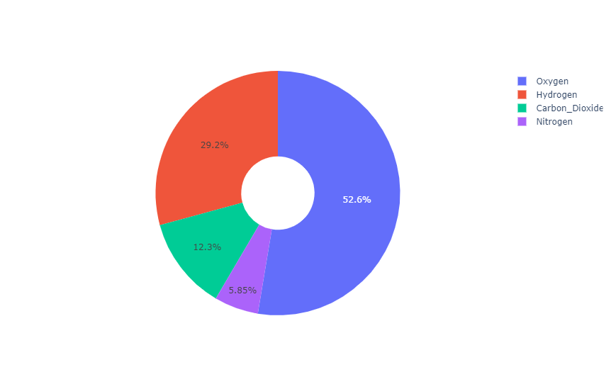
:::

### 子图中的饼图

```python
from plotly.subplots import make_subplots

labels = ["US", "China", "European Union",
          "Russian Federation", "Brazil",
          "India", "Rest of World"]
# 创建子图
fig = make_subplots(
    rows=1, cols=2,
    # 对包含饼图的子图使用 'domain' 类型
    specs=[[{'type': 'domain'}, {'type': 'domain'}]]
)
fig.add_trace(go.Pie(
    labels=labels, name="GHG Emissions",
    values=[16, 15, 12, 6, 5, 4, 42]
), 1, 1)      # 指定子图位置（行/列）
fig.add_trace(go.Pie(
    labels=labels, name="CO2 Emissions",
    values=[27, 11, 25, 8, 1, 3, 25]
), 1, 2)
# 更新图线
fig.update_traces(
    hole=0.4,                           # 使用 'hole' 参数创建圆环图
    hoverinfo="label+percent+name"      # 指定悬浮标签中的信息
)
# 更新布局
fig.update_layout(
    title_text="Global Emissions 1990-2011",
    # 在圆环图中心添加子图标记
    annotations=[
        # 将 'showarrow' 设置为 'False' 关闭标签指示线
        dict(text='GHG', x=0.18, y=0.5, font_size=20, showarrow=False),
        dict(text='CO2', x=0.82, y=0.5, font_size=20, showarrow=False)
    ]
)
fig.show()
```

::: center
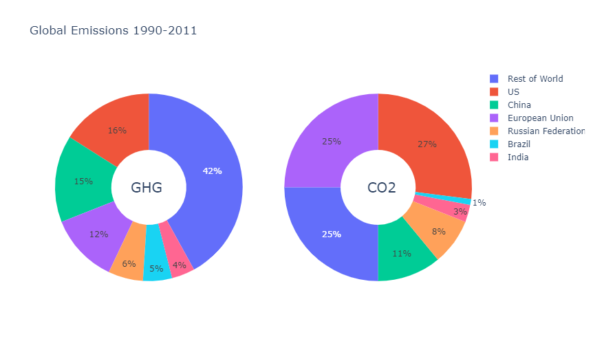
:::

```python
labels = ['1st', '2nd', '3rd', '4th', '5th']
# 定义子图的色彩组
night_colors = ['rgb(56, 75, 126)', 'rgb(18, 36, 37)', 'rgb(34, 53, 101)',
                'rgb(36, 55, 57)', 'rgb(6, 4, 4)']
sunflowers_colors = ['rgb(177, 127, 38)', 'rgb(205, 152, 36)',
                     'rgb(99, 79, 37)', 'rgb(129, 180, 179)',
                     'rgb(124, 103, 37)']
irises_colors = ['rgb(33, 75, 99)', 'rgb(79, 129, 102)',
                 'rgb(151, 179, 100)', 'rgb(175, 49, 35)',
                 'rgb(36, 73, 147)']
cafe_colors =  ['rgb(146, 123, 21)', 'rgb(177, 180, 34)',
                'rgb(206, 206, 40)', 'rgb(175, 51, 21)',
                'rgb(35, 36, 21)']
# 创建子图
specs = [[{'type':'domain'}, {'type':'domain'}],
         [{'type':'domain'}, {'type':'domain'}]]
fig = make_subplots(rows=2, cols=2, specs=specs)
# 定义饼图
fig.add_trace(go.Pie(
    labels=labels, values=[38, 27, 18, 10, 7],
    name='Starry Night', marker_colors=night_colors
), 1, 1)
fig.add_trace(go.Pie(
    labels=labels, values=[28, 26, 21, 15, 10],
    name='Sunflowers', marker_colors=sunflowers_colors
), 1, 2)
fig.add_trace(go.Pie(
    labels=labels, values=[38, 19, 16, 14, 13],
    name='Irises', marker_colors=irises_colors
), 2, 1)
fig.add_trace(go.Pie(
    labels=labels, values=[31, 24, 19, 18, 8],
    name='The Night Café', marker_colors=cafe_colors
), 2, 2)

# 调整布局和悬浮信息
fig.update_traces(hoverinfo='label+percent+name', textinfo='none')
fig.update(
    layout_title_text='Van Gogh: 5 Most Prominent' +
                      'Colors Shown Proportionally',
    layout_showlegend=False
)
fig = go.Figure(fig)
fig.show()
```

::: center
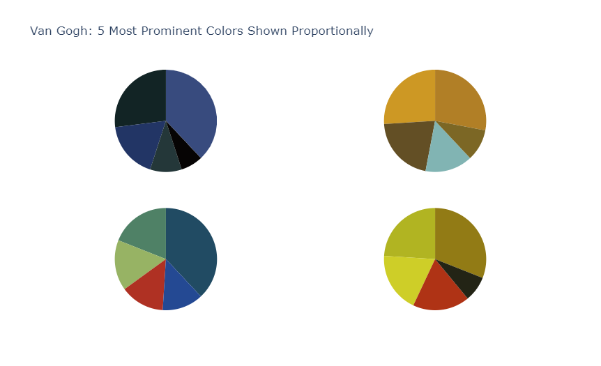
:::

### 绘制面积与总数成正比的图表

同一`scalegroup`中的图用与其总大小成正比的面积表示。

```python
labels = ["Asia", "Europe", "Africa", "Americas", "Oceania"]
fig = make_subplots(
    specs=[[{'type':'domain'}, {'type':'domain'}]],
    subplot_titles=['1980', '2007'], rows=1, cols=2
)
fig.add_trace(go.Pie(
    labels=labels, values=[4, 7, 1, 7, 0.5],
    scalegroup='one', name="World GDP 1980"
), 1, 1)
fig.add_trace(go.Pie(
    labels=labels, values=[21, 15, 3, 19, 1],
    scalegroup='one', name="World GDP 2007"
), 1, 2)
fig.update_layout(title_text='World GDP')
fig.show()
```

::: center
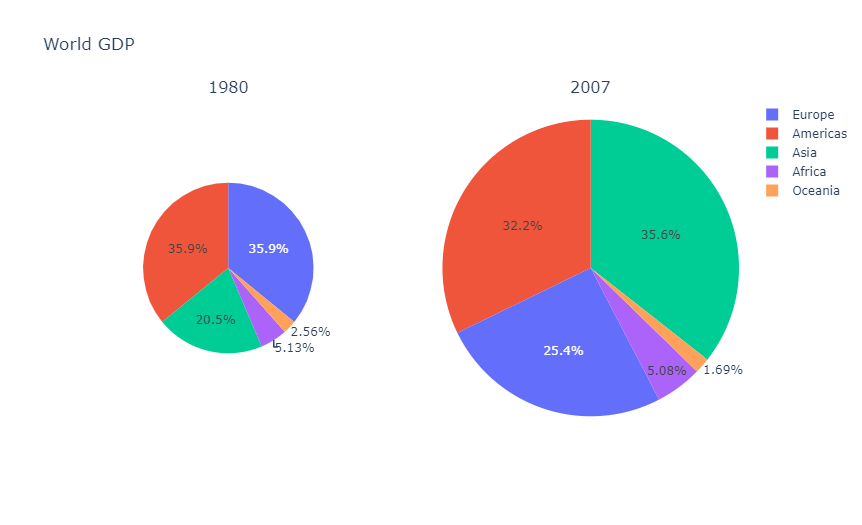
:::

## 另请参阅：旭日图

对于表示分层数据的多级饼图，您可以使用**旭日图**，下面给出了一个简单的示例。

::: tip
有关更多信息，请查阅[旭日图教程](https://plotly.com/python/sunburst-charts/)。
:::

```python
fig =go.Figure(go.Sunburst(
    labels=["Eve", "Cain", "Seth", "Enos", "Noam",
            "Abel", "Awan", "Enoch", "Azura"],
    parents=["", "Eve", "Eve", "Seth", "Seth",
             "Eve", "Eve", "Awan", "Eve" ],
    values=[10, 14, 12, 10, 2, 6, 6, 4, 4],
))
fig.update_layout(margin = dict(t=0, l=0, r=0, b=0))
fig.show()
```

::: center
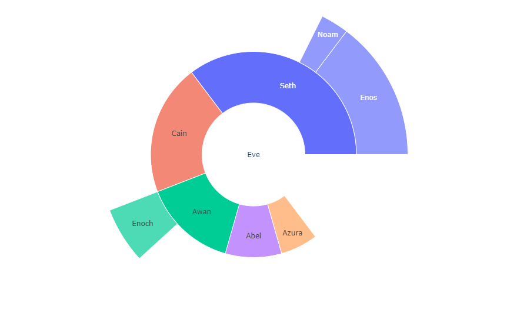
:::

## 参考

获取更多信息和图表属性选项，请查阅：

- [`px.pie()`函数参考](https://plotly.com/python-api-reference/generated/plotly.express.pie)
- [Python 图表参考：饼图](https://plotly.com/python/reference/pie/)
