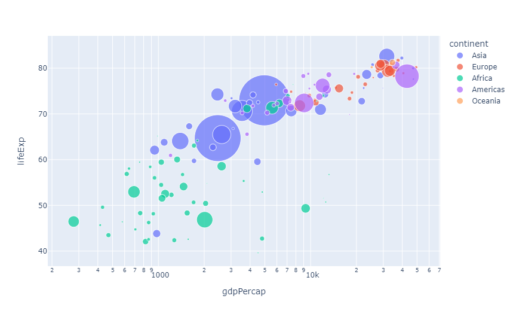
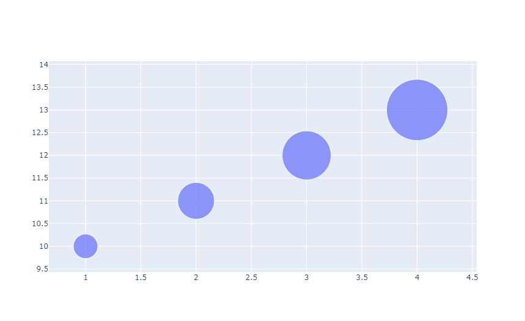
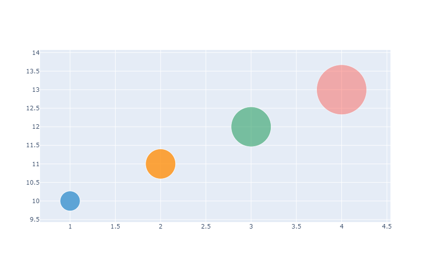
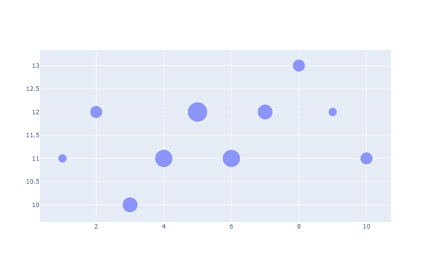
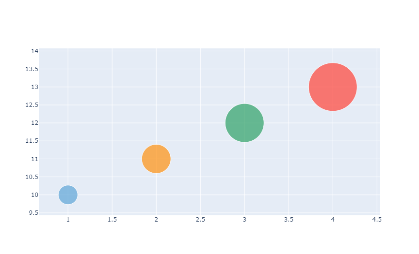
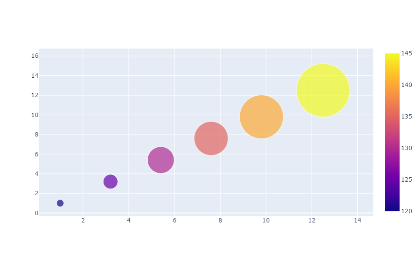
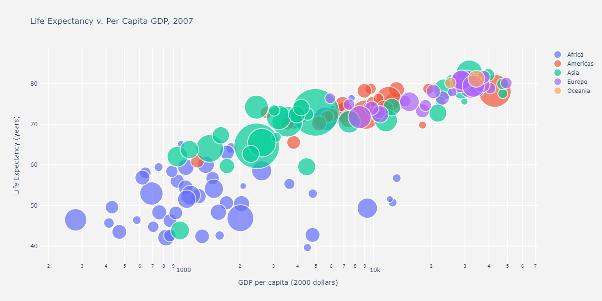

## 用 Plotly Express 绘制气泡图

[气泡图](https://baike.baidu.com/item/%E6%B0%94%E6%B3%A1%E5%9B%BE/10816649)是一种将第三维度以标记大小展示的散点图，对于其他类型的散点图，请查阅[散点图文档](/visualization/plotly/line-and-scatter/)。

我们先展示一个使用 *Plotly Express* 绘制的气泡图，标签的大小由`size`参数指定的数据列决定。

```python
from plotly import express as px

df = px.data.gapminder()
fig = px.scatter(df.query("year==2007"), x="gdpPercap", y="lifeExp",
	               size="pop", color="continent",
                 hover_name="country", log_x=True, size_max=60)
fig.show()
```

::: center

:::

## 用 Graph Objects 绘制气泡图

如果 *Plotly Express* 没法让你很好地上手，也可以使用[`plotly.graph_objects`](https://plotly.com/python/graph-objects/)中更通用的`go.Scatter`类，指定标记的大小来创建气泡图。所有可用的选项都在[参考手册 - 散点图](https://plotly.com/python/reference#scatter)中有所描述。

### 简单气泡图

```python
from plotly import graph_objects as go

fig = go.Figure(data=[go.Scatter(
    x=[1, 2, 3, 4], y=[10, 11, 12, 13],
    mode='markers', marker_size=[40, 60, 80, 100])
])
fig.show()
```

::: center

:::

### 设置标签大小与颜色

```python
fig = go.Figure(data=[go.Scatter(
    x=[1, 2, 3, 4], y=[10, 11, 12, 13],
    mode='markers', marker=dict(
        # 以 RGB 三元组形式指定颜色
        color=['rgb(93, 164, 214)', 'rgb(255, 144, 14)',
               'rgb(44, 160, 101)', 'rgb(255, 65, 54)'],
        # 指定标记透明度和大小
        opacity=[1, 0.8, 0.6, 0.4], size=[40, 60, 80, 100],
    )
)])
fig.show()
```

::: center

:::

### 缩放气泡图的大小

为了对气泡的大小进行缩放，请使用`sizeref`属性。我们建议使用以下公式来计算`sizeref`值，其中 $S$ 是计算得到的`sizeref`值，$s_{\max}$ 是指定`size`数组中的最大值：

$$
S = \frac{2 s_{\max}}{(s_{\max})^2}
$$

::: warning
请注意，将`sizeref`值设置为大于 $1$ 的值会减小渲染后标记的大小，设置为小于 $1$ 的值会增大标记的大小[^1]。除此之外，我们还建议将`sizemode`属性设置为`area`[^2]。
:::

[^1]: 请查阅[属性参考手册](https://plotly.com/python/reference/scatter/#scatter-marker-sizeref)以获取更多信息。
[^2]: 请查阅[属性参考手册](https://plotly.com/python/reference/scatter/#scatter-marker-sizemode)。

```python
size = [20, 40, 60, 80, 100, 80, 60, 40, 20, 40]
fig = go.Figure(data=[go.Scatter(
    x=[1, 2, 3, 4, 5, 6, 7, 8, 9, 10],
    y=[11, 12, 10, 11, 12, 11, 12, 13, 12, 11],
    mode='markers', marker=dict(
        size=size,
        sizemode='area',
        sizeref=2.*max(size)/(40.**2),
        sizemin=4
    )
)])
fig.show()
```

::: center

:::

### 气泡图上的悬浮文本

```python
fig = go.Figure(data=[go.Scatter(
    x=[1, 2, 3, 4], y=[10, 11, 12, 13], mode='markers',
    text=['A<br />size: 40', 'B<br />size: 60', 'C<br />size: 80', 'D<br />size: 100'],
    marker=dict(color=['rgb(93, 164, 214)', 'rgb(255, 144, 14)',
                       'rgb(44, 160, 101)', 'rgb(255, 65, 54)'],
                size=[40, 60, 80, 100])
)])
fig.show()
```

::: center

:::

### 带有色阶的气泡图

```python
fig = go.Figure(data=[go.Scatter(
    x=[1, 3.2, 5.4, 7.6, 9.8, 12.5],
    y=[1, 3.2, 5.4, 7.6, 9.8, 12.5],
    mode='markers', marker=dict(
        color=[120, 125, 130, 135, 140, 145],
        size=[15, 30, 55, 70, 90, 110],
        showscale=True      # 在侧边显示色阶柱
    )
)])
fig.show()
```

::: center

:::

### 分类气泡图

```python
import pandas as pd
import math

# 加载数据集
data = px.data.gapminder()
df_2007 = data[data['year'] == 2007]
df_2007 = df_2007.sort_values(['continent', 'country'])

# 定义悬浮文本和气泡大小
hover_text = []
bubble_size = []
for index, row in df_2007.iterrows():
    hover_text.append(
        f"Country: {row['country']}<br />"
        f"Life Expectancy: {row['lifeExp']}<br />"
        f"GDP per capita: {row['gdpPercap']}<br />"
        f"Population: {row['pop']}<br />"
        f"Year: {row['year']}"
    )
    bubble_size.append(math.sqrt(row['pop']))
df_2007['text'] = hover_text
df_2007['size'] = bubble_size
sizeref = 2.0 * max(df_2007['size']) / (100 ** 2)

# 与各大陆对应的数据集
continent_names = ['Africa', 'Americas', 'Asia', 'Europe', 'Oceania']
continent_data = {
    continent: df_2007.query(f"continent == '{continent}'")
    for continent in continent_names
}

# 创建图表
fig = go.Figure()
for continent_name, continent in continent_data.items():
    fig.add_trace(go.Scatter(
        x=continent['gdpPercap'], y=continent['lifeExp'],
        name=continent_name, text=continent['text'],
        marker_size=continent['size'],
    ))

# 调整气泡外观和布局
fig.update_traces(mode='markers', marker=dict(
    sizemode='area', sizeref=sizeref, line_width=2
))
fig.update_layout(
    title='Life Expectancy v. Per Capita GDP, 2007',
    xaxis=dict(title='GDP per capita (2000 dollars)',
               gridcolor='white', type='log', gridwidth=2),
    yaxis=dict(title='Life Expectancy (years)',
               gridcolor='white', gridwidth=2),
    paper_bgcolor='rgb(243, 243, 243)',
    plot_bgcolor='rgb(243, 243, 243)'
)
fig.show()
```

::: center

:::

## 参考

请参阅[散点图 - Python 图表参考](https://plotly.com/python/reference/scatter/)获取更多信息和图表属性选项。
