**旭日图** 能够可视化从根到叶径向外扩的分层数据。与 [冰柱图](https://plotly.com/python/icicle-charts/) 和 [树状图](https://plotly.com/python/treemaps/) 类似，分层结构由`labels`（`px.icircle`则叫做`names`）和`parents`定义。图表的根从圆心出发，其子项目则被添加在外圈上。

## 使用 Plotly Express 绘制旭日图

借助`px.sunburst`，`DataFrame`的每一行将被视为旭日图的一个分区。

```python
from plotly import express as px

data = dict(
    character=["Eve", "Cain", "Seth", "Enos", "Noam", "Abel", "Awan", "Enoch", "Azura"],
    parent=["", "Eve", "Eve", "Seth", "Seth", "Eve", "Eve", "Awan", "Eve" ],
    value=[10, 14, 12, 10, 2, 6, 6, 4, 4]
)
fig =px.sunburst(data, names='character', parents='parent', values='value')
fig.show()
```

::: center
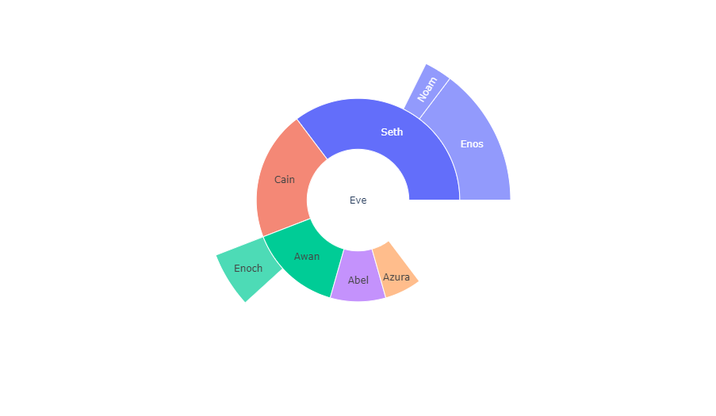
:::

### 绘制矩形数据表的旭日图

分级数据有时会以矩形数据表的形式排列，不同的数据列对应不同的层级。`px.sunburst`可以传入一个`path`参数，用来对应数据表中的表头列表。

::: warning
如果提供了`path`参数，则`id`和`parent`参数不应该被提供。
:::

```python
from plotly import express as px

df = px.data.tips()
fig = px.sunburst(df, path=['day', 'time', 'sex'], values='total_bill')
fig.show()
```

::: center
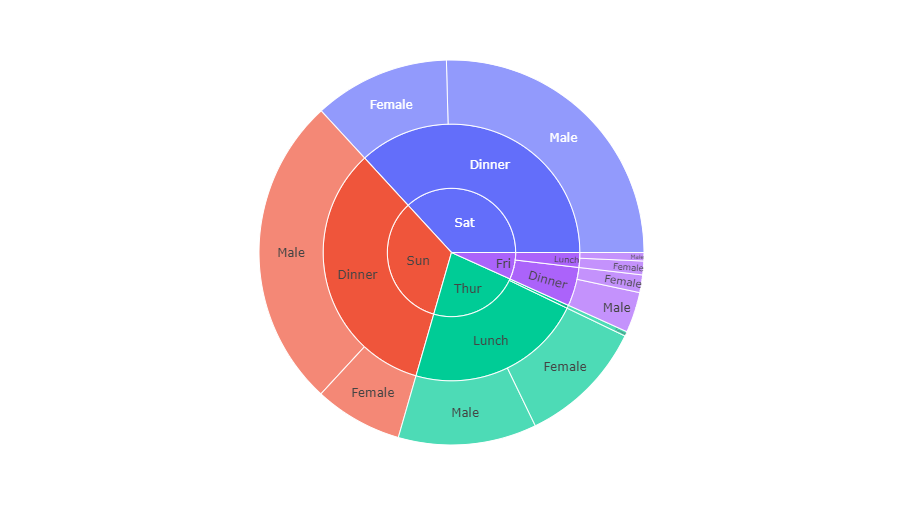
:::

### 连续色彩参数

如果`color`参数被指定，则每个节点的颜色由其下属子节点的平均色彩值决定，色彩深度由节点的数据值决定。

```python
from plotly import express as px
import numpy as np

df = px.data.gapminder().query("year == 2007")
fig = px.sunburst(df, path=['continent', 'country'], values='pop', color='lifeExp',
                  hover_data=['iso_alpha'], color_continuous_scale='RdBu',
                  color_continuous_midpoint=np.average(df['lifeExp'], weights=df['pop']))
fig.show()
```

::: center
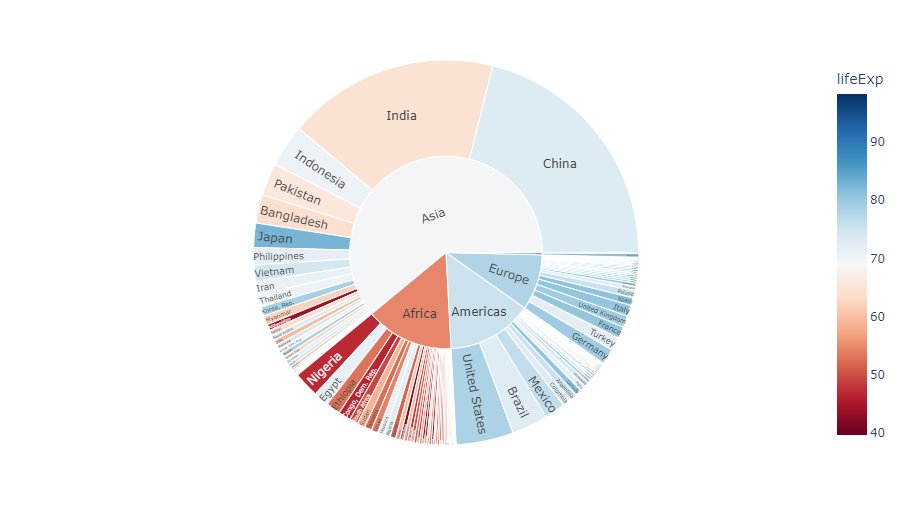
:::

### 离散色彩参数

当`color`参数指定的是非数值类型的数据时，*Plotly* 会自动使用离散色彩模式。如果一个扇区拥有与所有子扇区相同的色彩值，则会使用给定的色彩值染色，否则会使用首个子扇区的色彩值。

```python
from plotly import express as px

df = px.data.tips()
fig = px.sunburst(df, path=['sex', 'day', 'time'], values='total_bill', color='day')
fig.show()
```

::: center
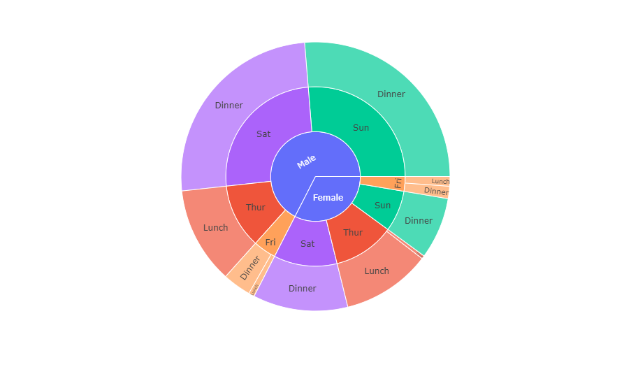
:::

在下面这个例子中，`Saturday`和`Sunday`扇区的颜色与`Dinner`的颜色相同，因为这两天之下的数据只包含`Dinner`。然而，`Female -> Friday`分区下同时包含了`lunch`和`dinner`的数据，所以此处使用了『混合』色彩。

```python
from plotly import express as px

df = px.data.tips()
fig = px.sunburst(df, path=['sex', 'day', 'time'], values='total_bill', color='time')
fig.show()
```

::: center
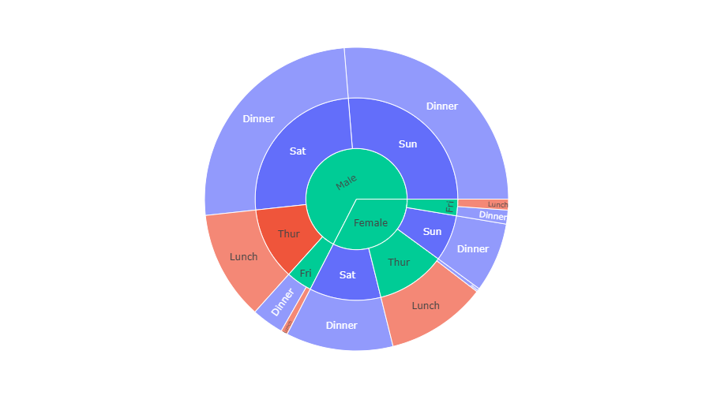
:::

### 离散色彩的显式映射

::: details 更多信息
想要获取关于 **离散色彩** 的更多信息，请查阅此 [相关页面](https://plotly.com/python/discrete-color) 。
:::

```python
from plotly import express as px

df = px.data.tips()
fig = px.sunburst(df, path=['sex', 'day', 'time'], values='total_bill', color='time',
                  color_discrete_map={'(?)':'black', 'Lunch':'gold', 'Dinner':'darkblue'})
fig.show()
```

::: center
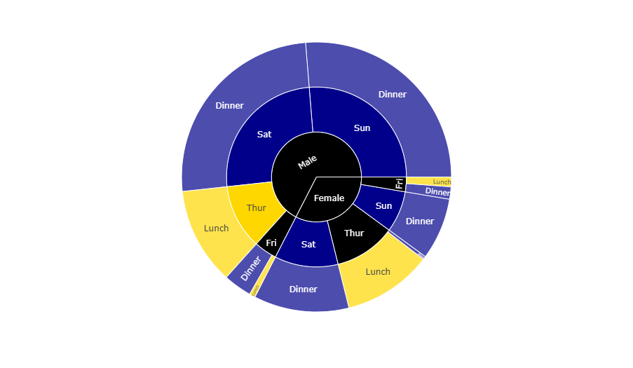
:::

### 带有缺失值的矩形数据表

如果数据集并不是完整的矩形，缺失值应当用`None`填充。

::: warning
`None`的父扇区必须是叶子扇区，它不能拥有除了`None`之外的其他子扇区（否则抛出`ValueError`）。
:::

```python
from plotly import express as px
import pandas as pd

vendors = ["A", "B", "C", "D", None, "E", "F", "G", "H", None]
sectors = ["Tech", "Tech", "Finance", "Finance", "Other",
           "Tech", "Tech", "Finance", "Finance", "Other"]
regions = ["North", "North", "North", "North", "North",
           "South", "South", "South", "South", "South"]
sales = [1, 3, 2, 4, 1, 2, 2, 1, 4, 1]
df = pd.DataFrame(dict(vendors=vendors, sectors=sectors, regions=regions, sales=sales))
fig = px.sunburst(df, path=['regions', 'sectors', 'vendors'], values='sales')
fig.show()
```

|       | **vendors** | **sectors** | **regions** | **sales** |
| :---: | :---------: | :---------: | :---------: | :-------: |
| **0** |      A      |    Tech     |    North    |     1     |
| **1** |      B      |    Tech     |    North    |     3     |
| **2** |      C      |   Finance   |    North    |     2     |
| **3** |      D      |   Finance   |    North    |     4     |
| **4** |    None     |    Other    |    North    |     1     |
| **5** |      E      |    Tech     |    South    |     2     |
| **6** |      F      |    Tech     |    South    |     2     |
| **7** |      G      |   Finance   |    South    |     1     |
| **8** |      H      |   Finance   |    South    |     4     |
| **9** |    None     |    Other    |    South    |     1     |

::: center
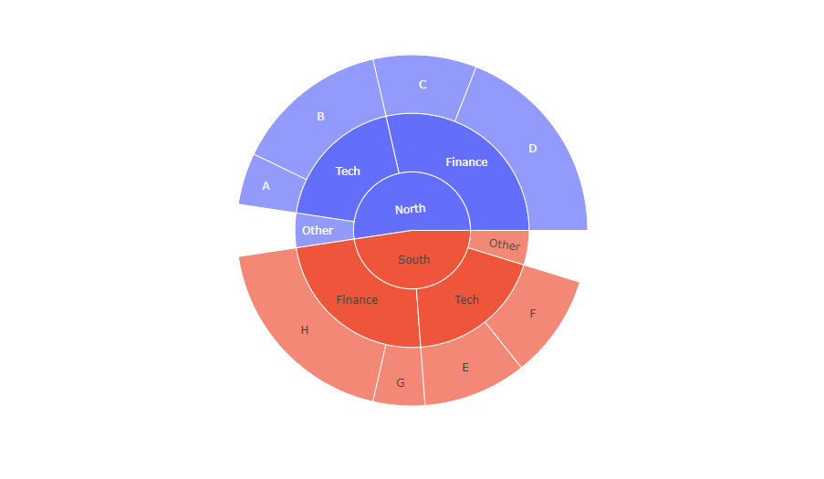
:::

## 使用 Graph Objects 绘制基础旭日图

如果 *Plotly Express* 无法很好地提供绘图服务，你也可以使用[`plotly.graph_objects`](https://plotly.com/python/graph-objects/)中更加通用的`go.Sunburst`类。

主要参数：

1. `labels`（在`px.sunburst`中叫`names`，因为`labels`被用于覆盖列名了）：设置旭日图各扇区的标签；
2. `parents`：设置旭日图各扇区的父扇区。在分组中，根节点会用一个空字符串`""`表示，在这个例子中，根节点是`"Eve"`；
3. `values`：设置旭日图各扇区的值，并决定扇区大小。

```python
from plotly import graph_objects as go

fig =go.Figure(go.Sunburst(
    labels=["Eve", "Cain", "Seth", "Enos", "Noam", "Abel", "Awan", "Enoch", "Azura"],
    parents=["", "Eve", "Eve", "Seth", "Seth", "Eve", "Eve", "Awan", "Eve" ],
    values=[10, 14, 12, 10, 2, 6, 6, 4, 4]
))
# 使用紧凑布局
fig.update_layout(margin=dict(t=0, l=0, r=0, b=0))
fig.show()
```

::: center
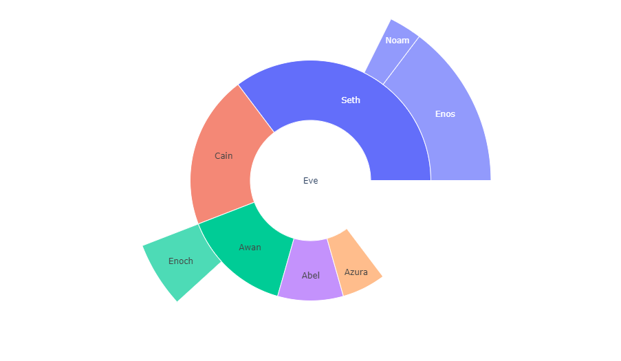
:::

### 带有重复标签的旭日图

```python
from plotly import graph_objects as go

fig =go.Figure(go.Sunburst(
 ids=[
    "North America", "Europe", "Australia", "North America - Football", "Soccer",
    "North America - Rugby", "Europe - Football", "Rugby",
    "Europe - American Football","Australia - Football", "Association",
    "Australian Rules", "Autstralia - American Football", "Australia - Rugby",
    "Rugby League", "Rugby Union"
  ],
  labels= [
    "North<br>America", "Europe", "Australia", "Football", "Soccer", "Rugby",
    "Football", "Rugby", "American<br>Football", "Football", "Association",
    "Australian<br>Rules", "American<br>Football", "Rugby", "Rugby<br>League",
    "Rugby<br>Union"
  ],
  parents=[
    "", "", "", "North America", "North America", "North America", "Europe",
    "Europe", "Europe","Australia", "Australia - Football", "Australia - Football",
    "Australia - Football", "Australia - Football", "Australia - Rugby",
    "Australia - Rugby"
  ]
))
fig.update_layout(margin=dict(t=0, l=0, r=0, b=0))
fig.show()
```

::: center
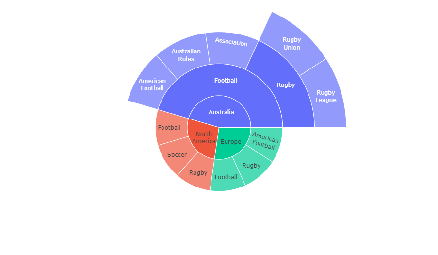
:::

### Branchvalues

通过将`branchvalues`设置为`total`，父扇区的值将指定扇区的大小。在下面这个例子中，`Enoch`是4、`Awan`是6，因此`Enoch`的宽度应当是`Awans`的 $\frac{2}{3}$ 。将`branchvalues`设置为`remainder`，则父节点的宽度将取决于它自己的值与所有子扇区值的总和，因此`Enoch`的宽度是`Awans`的 $\frac{2}{5}$ 。

::: warning
这说明：

- 当`branchvalues`设置为`total`时，所有子扇区的数值综合不能大于其父扇区数值；
- 当`branchvalues`设置为`remainder`（默认）时，子扇区不会占据父扇区对应的全部空间（除非其父扇区是根扇区，且数值为0）。

```python
from plotly import graph_objects as go

fig =go.Figure(go.Sunburst(
    labels=[ "Eve", "Cain", "Seth", "Enos", "Noam", "Abel", "Awan", "Enoch", "Azura"],
    parents=["", "Eve", "Eve", "Seth", "Seth", "Eve", "Eve", "Awan", "Eve"],
    values=[65, 14, 12, 10, 2, 6, 6, 4, 4], branchvalues="total"
))
fig.update_layout(margin = dict(t=0, l=0, r=0, b=0))
fig.show()
```

::: center
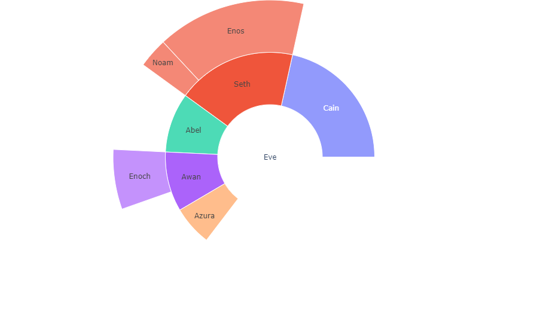
:::

### 大量扇区

这个例子为子图使用了 [*Plotly* 网格参数](https://plotly.com/python/reference/layout/#layout-grid) ，用[`domain`](https://plotly.com/python/reference/sunburst/#sunburst-domain)参数指定行列。

```python
from plotly import graph_objects as go
import pandas as pd

df1 = pd.read_csv('https://raw.githubusercontent.com/plotly/datasets/'
                  '718417069ead87650b90472464c7565dc8c2cb1c/'
                  'sunburst-coffee-flavors-complete.csv')
df2 = pd.read_csv('https://raw.githubusercontent.com/plotly/datasets/'
                  '718417069ead87650b90472464c7565dc8c2cb1c/coffee-flavors.csv')

fig = go.Figure()
fig.add_trace(go.Sunburst(
    ids=df1.ids, labels=df1.labels,
    parents=df1.parents, domain=dict(column=0)
))
fig.add_trace(go.Sunburst(
    ids=df2.ids, labels=df2.labels, parents=df2.parents,
    domain=dict(column=1), maxdepth=2
))
fig.update_layout(grid=dict(columns=2, rows=1), margin=dict(t=0, l=0, r=0, b=0))
fig.show()
```

::: center
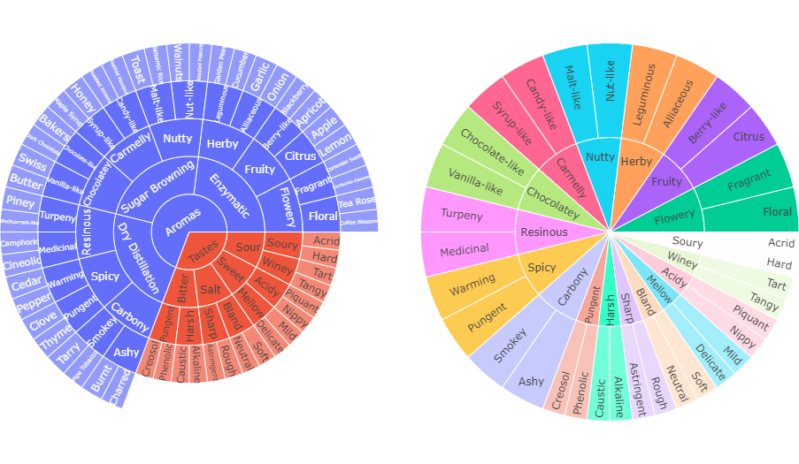
:::

## 控制旭日图扇区中的文本旋转

`insidetextorientation`参数控制扇区内文本的旋转。设置为`auto`，文本会自动被旋转到容纳范围最大的方向，使用`horizontal`（还有`radial`和`tangential`）强制让文字旋转到特定的方向。

::: warning
为了能在强制指定的方向上足够放下文字，*Plotly* 可能会减小字号。
:::

::: tip 
对于使用 *Plotly Express* 创建的图表，可以使用`figure.update_traces(insidetextorientation='...')`修改文字方向。
:::

```python
from plotly import graph_objects as go
import pandas as pd

df = pd.read_csv('https://raw.githubusercontent.com/plotly/datasets/'
                 '718417069ead87650b90472464c7565dc8c2cb1c/coffee-flavors.csv')
fig = go.Figure()
fig.add_trace(go.Sunburst(
    ids=df.ids, labels=df.labels, parents=df.parents, 
    domain=dict(column=1), maxdepth=2,
    insidetextorientation='radial'
))
fig.update_layout(margin=dict(t=10, l=10, r=10, b=10))
fig.show()
```

::: center
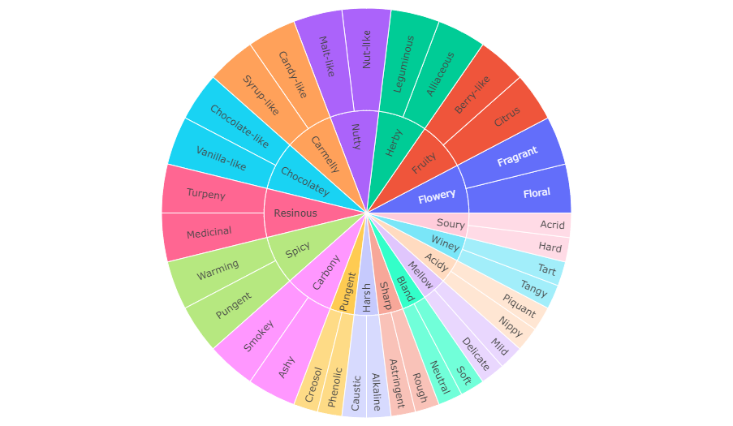
:::

## 控制文本大小

如果你希望所有的标签都拥有相同的大小，你可以使用`uniformtext`布局参数。`minsize`属性设置字号，`mode`属性则设置它们在无法适应指定字号时的行为：隐藏（`hide`）或以超出边界的形式显示（`show`）。

::: warning
在设置了`uniformtext`参数的情况下，动画过渡效果不可用。
:::

```python
from plotly import graph_objects as go
import pandas as pd

df = pd.read_csv('https://raw.githubusercontent.com/plotly/datasets/'
                 '718417069ead87650b90472464c7565dc8c2cb1c/'
                 'sunburst-coffee-flavors-complete.csv')
fig = go.Figure(go.Sunburst(ids = df.ids, labels = df.labels, parents = df.parents))
fig.update_layout(uniformtext=dict(minsize=10, mode='hide'))
fig.show()
```

::: center
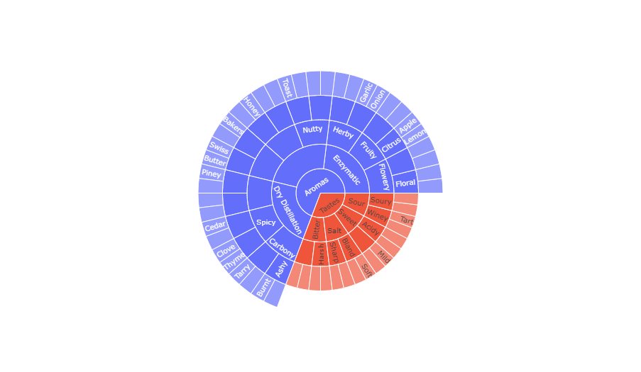
:::

## 带有连续色彩范围的旭日图

下面的示例展示了按地区、县和销售人员级别划分的销售明细（对应于部门宽度）和呼叫成功率（对应于部门颜色）。例如，在浏览数据时您可以看到，虽然东部地区表现不佳，但泰勒县仍高于平均水平——但是，销售人员`GT`的成功率较低，降低了其表现。

在最大深度为两个级别的右侧子图中，单击一个扇区以查看其细分为较低的级别。

```python
from plotly import graph_objects as go
from plotly.subplots import make_subplots
import pandas as pd

df = pd.read_csv('https://raw.githubusercontent.com/plotly/datasets/master/sales_success.csv')
print(df.head())

levels = ['salesperson', 'county', 'region']    # 用于绘制分级旭日图
color_columns = ['sales', 'calls']
value_column = 'calls'

def build_hierarchical_dataframe(df, levels, value_column, color_columns=None):
    """
    Build a hierarchy of levels for Sunburst or Treemap charts.

    Levels are given starting from the bottom to the top of the hierarchy,
    ie the last level corresponds to the root.
    """
    df_all_trees = pd.DataFrame(columns=['id', 'parent', 'value', 'color'])
    for i, level in enumerate(levels):
        df_tree = pd.DataFrame(columns=['id', 'parent', 'value', 'color'])
        dfg = df.groupby(levels[i:]).sum()
        dfg = dfg.reset_index()
        df_tree['id'] = dfg[level].copy()
        if i < len(levels) - 1:
            df_tree['parent'] = dfg[levels[i + 1]].copy()
        else:
            df_tree['parent'] = 'total'
        df_tree['value'] = dfg[value_column]
        df_tree['color'] = dfg[color_columns[0]] / dfg[color_columns[1]]
        df_all_trees = df_all_trees.append(df_tree, ignore_index=True)
    total = pd.Series(dict(id='total', parent='', value=df[value_column].sum(),
                           color=df[color_columns[0]].sum() / df[color_columns[1]].sum()))
    df_all_trees = df_all_trees.append(total, ignore_index=True)
    return df_all_trees

df_all_trees = build_hierarchical_dataframe(df, levels, value_column, color_columns)
average_score = df['sales'].sum() / df['calls'].sum()

fig = make_subplots(1, 2, specs=[[{"type": "domain"}, {"type": "domain"}]],)
fig.add_trace(go.Sunburst(
    labels=df_all_trees['id'], parents=df_all_trees['parent'],
    values=df_all_trees['value'], branchvalues='total',
    marker=dict(colors=df_all_trees['color'], colorscale='RdBu', cmid=average_score),
    hovertemplate='<b>%{label} </b> <br> Sales: %{value}<br> Success rate: %{color:.2f}',
    name=''
), 1, 1)
fig.add_trace(go.Sunburst(
    labels=df_all_trees['id'], parents=df_all_trees['parent'],
    values=df_all_trees['value'], branchvalues='total',
    marker=dict(colors=df_all_trees['color'], colorscale='RdBu', cmid=average_score),
    hovertemplate='<b>%{label} </b> <br> Sales: %{value}<br> Success rate: %{color:.2f}',
    maxdepth=2
), 1, 2)
fig.update_layout(margin=dict(t=10, b=10, r=10, l=10))
fig.show()
```

|       | **Unnamed: 0** | **region** | **country** | **salesperson** | **calls** | **sales** |
| :---: | :------------: | :--------: | :---------: | :-------------: | :-------: | :-------: |
| **0** |       0        |   North    |   Dallam    |       JE        |    35     |    23     |
| **1** |       1        |   North    |   Dallam    |       ZQ        |    49     |    13     |
| **2** |       2        |   North    |   Dallam    |       IJ        |    20     |     6     |
| **3** |       3        |   North    |   Hartley   |       WE        |    39     |    37     |
| **4** |       4        |   North    |   Hartley   |       PL        |    42     |    37     |

::: center
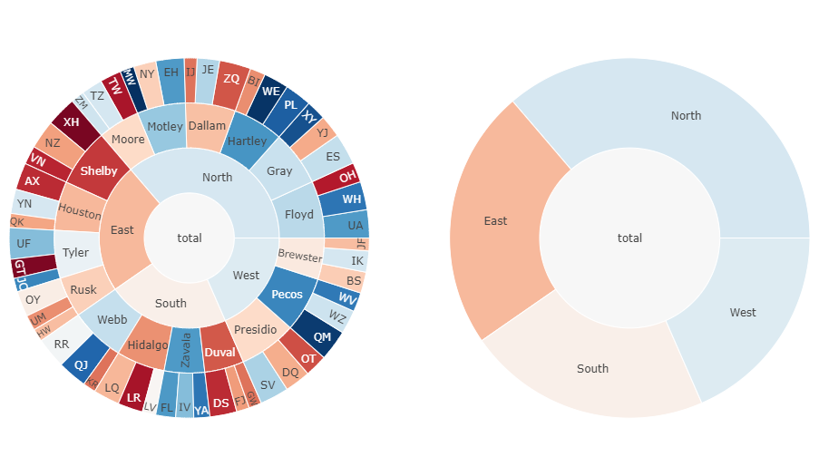
:::

## 参考

- [`px.sunburst()`函数参考](https://plotly.com/python-api-reference/generated/plotly.express.sunburst)
- [旭日图 - Python 图表参考](https://plotly.com/python/reference/sunburst/)

