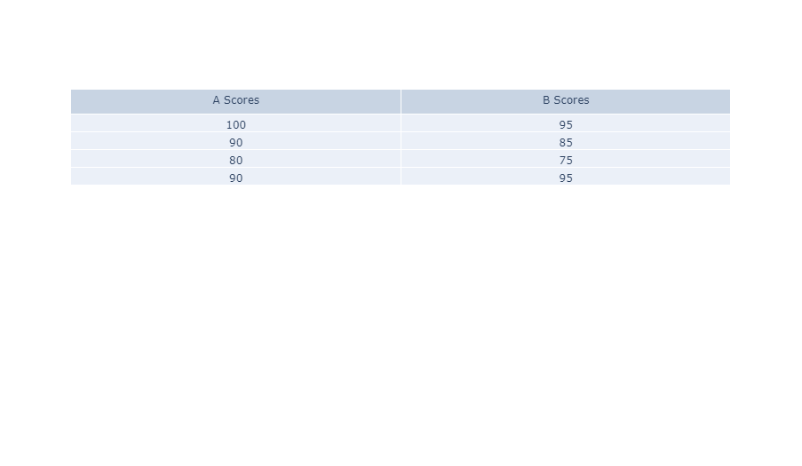
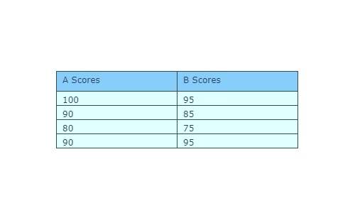
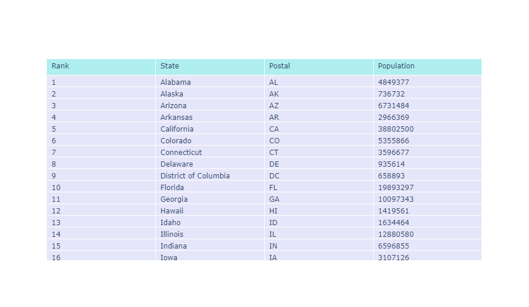
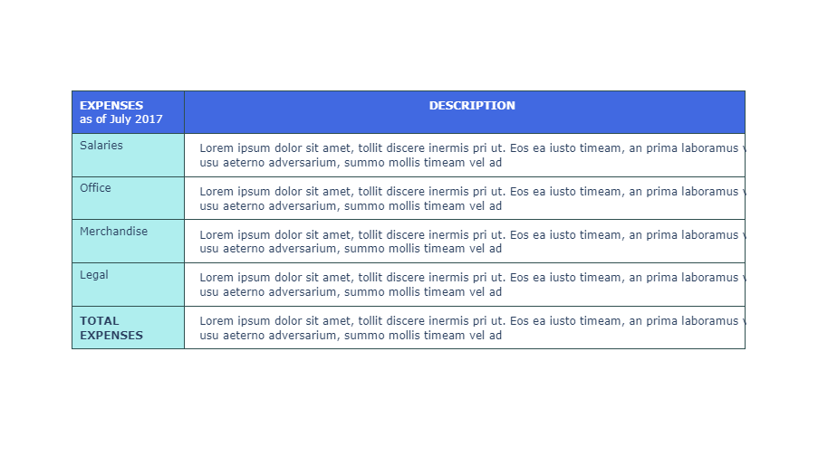
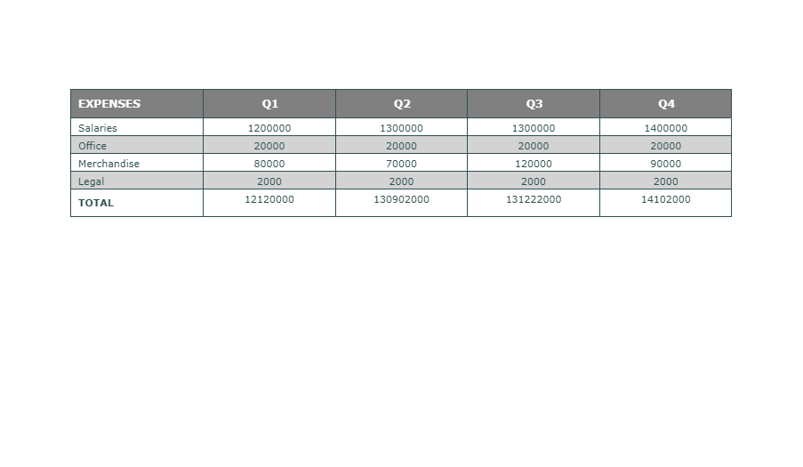
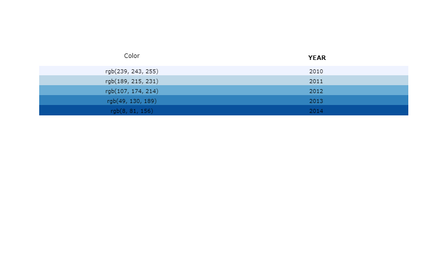

## 前言

`go.Table`提供了一种查看详细数据的表格对象，数据以行列的形式组成网格。多数的样式定义与表头、列、行或特定单元格相关。表格使用的是 **列优先** 顺序，视为由列向量组成的列表。

::: warning
[Dash of Plotly](https://dash.plotly.com/) 提供了另一种 [DataTable](https://dash.plotly.com/datatable) 数据类型的表格，它与 *Graph Objects* 中的`go.Table`有所区别。
:::

## 基础表格

```python
from plotly import graph_objects as go

fig = go.Figure(data=[go.Table(
    header=dict(values=['A Scores', 'B Scores']),
    cells=dict(values=[[100, 90, 80, 90], [95, 85, 75, 95]])
)])
fig.show()
```

::: center

:::

## 样式化表格

```python
from plotly import graph_objects as go

fig = go.Figure(data=[go.Table(
    header=dict(values=['A Scores', 'B Scores'],
                line_color='darkslategray',     # 表格线色彩
                fill_color='lightskyblue',      # 填充色彩
                align='left'),                  # 文本对齐方式
    cells=dict(values=[[100, 90, 80, 90],       # 第1列数据
                       [95, 85, 75, 95]],       # 第2列数据
               line_color='darkslategray', fill_color='lightcyan', align='left'))
])
fig.update_layout(width=500, height=300)
fig.show()
```

::: center

:::

## 使用 Pandas 数据表

```python
from plotly import graph_objects as go
import pandas as pd

df = pd.read_csv('https://raw.githubusercontent.com/plotly/datasets/master/2014_usa_states.csv')
fig = go.Figure(data=[go.Table(
    header=dict(values=list(df.columns), fill_color='paleturquoise', align='left'),
    cells=dict(values=[df.Rank, df.State, df.Postal, df.Population],
               fill_color='lavender', align='left')
)])
fig.show()
```

::: center

:::

## 修改行宽/列高

```python
from plotly import graph_objects as go

values = [
    ['Salaries', 'Office', 'Merchandise', 'Legal', '<b>TOTAL<br>EXPENSES</b>'],     # 第1列
    ["Lorem ipsum dolor sit amet, tollit discere inermis pri ut. Eos ea iusto timeam,"
     " an prima laboramus vim. Id usu aeterno adversarium, summo mollis timeam vel ad"] * 5]


fig = go.Figure(data=[go.Table(
    columnorder = [1,2], columnwidth = [80,400],
    header = dict(values = [['<b>EXPENSES</b><br>as of July 2017'], ['<b>DESCRIPTION</b>']],
                  line_color='darkslategray', fill_color='royalblue', align=['left','center'],
                  font=dict(color='white', size=12), height=40),
    cells=dict(values=values, line_color='darkslategray',
               fill=dict(color=['paleturquoise', 'white']), 
               align=['left', 'center'], font_size=12, height=30)
)])
fig.show()
```

::: center

:::

## 行色彩镶嵌

```python
from plotly import graph_objects as go

headerColor, rowEvenColor, rowOddColor = 'grey', 'lightgrey', 'white'
fig = go.Figure(data=[go.Table(
    header=dict(values=['<b>EXPENSES</b>','<b>Q1</b>','<b>Q2</b>','<b>Q3</b>','<b>Q4</b>'],
                line_color='darkslategray', fill_color=headerColor, align=['left','center'],
                font=dict(color='white', size=12)),
    cells=dict(
        values=[['Salaries', 'Office', 'Merchandise', 'Legal', '<b>TOTAL</b>'],
                [1200000, 20000, 80000, 2000, 12120000],
                [1300000, 20000, 70000, 2000, 130902000],
                [1300000, 20000, 120000, 2000, 131222000],
                [1400000, 20000, 90000, 2000, 14102000]],
        line_color='darkslategray',
        # 二维列优先列表，指定各单元格的填充色彩
        fill_color = [[rowOddColor, rowEvenColor, rowOddColor, rowEvenColor, rowOddColor] * 5],
        align = ['left', 'center'], font = dict(color = 'darkslategray', size = 11)
    )
)])
fig.show()
```

::: center

:::

## 基于变量值的行色彩

```python
from plotly import graph_objects as go
import pandas as pd

colors = ['rgb(239, 243, 255)', 'rgb(189, 215, 231)', 'rgb(107, 174, 214)',
          'rgb(49, 130, 189)', 'rgb(8, 81, 156)']
data = {'Year' : [2010, 2011, 2012, 2013, 2014], 'Color' : colors}
df = pd.DataFrame(data)

fig = go.Figure(data=[go.Table(
    header=dict(values=["Color", "<b>YEAR</b>"], line_color='white', fill_color='white',
                align='center', font=dict(color='black', size=12)),
    cells=dict(values=[df.Color, df.Year], line_color=[df.Color], fill_color=[df.Color],
               align='center', font=dict(color='black', size=11))
)])
fig.show()
```

::: center

:::

## 基于变量值的单元格色彩

```python
from plotly import graph_objects as go
from plotly.colors import n_colors
import numpy as np
np.random.seed(1)

colors = n_colors('rgb(255, 200, 200)', 'rgb(200, 0, 0)', 9, colortype='rgb')
a = np.random.randint(low=0, high=9, size=10)
b = np.random.randint(low=0, high=9, size=10)
c = np.random.randint(low=0, high=9, size=10)

fig = go.Figure(data=[go.Table(
    header=dict(values=['<b>Column A</b>', '<b>Column B</b>', '<b>Column C</b>'],
                line_color='white', fill_color='white', align='center',
                font=dict(color='black', size=12)),
    cells=dict(values=[a, b, c], align='center', font=dict(color='white', size=11),
               line_color=[np.array(colors)[a], np.array(colors)[b], np.array(colors)[c]],
               fill_color=[np.array(colors)[a], np.array(colors)[b], np.array(colors)[c]])
)])
fig.show()
```

::: center

:::

## 参考

关于表格和表格属性的更多信息，请查阅 [表格 - Python 图表参考](https://plotly.com/python/reference/table/) 。