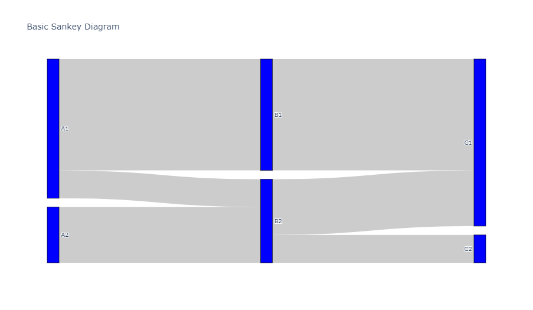
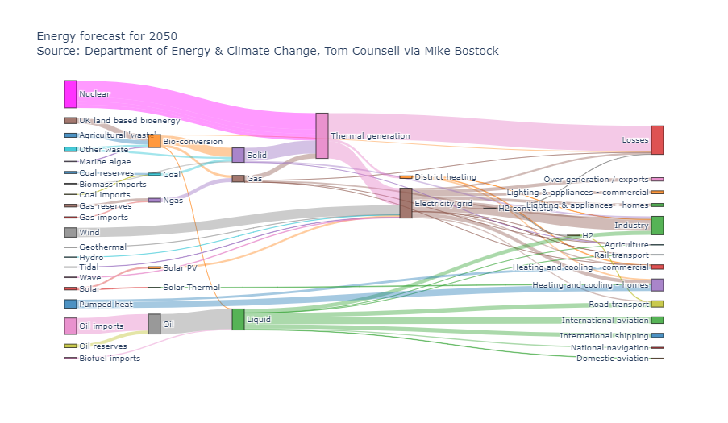
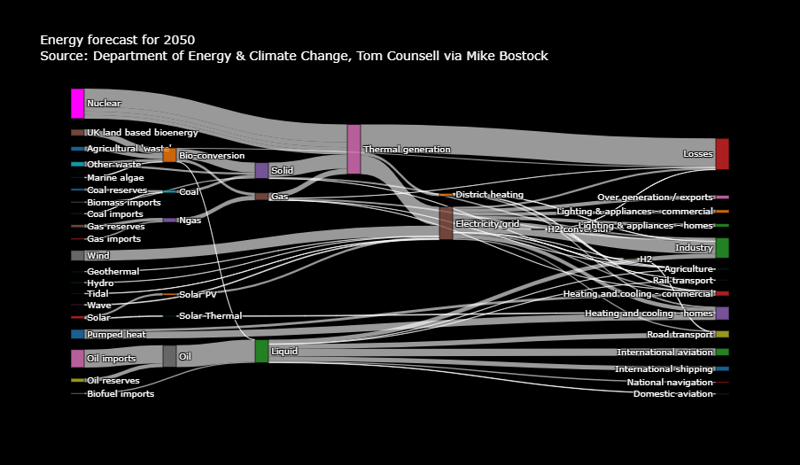
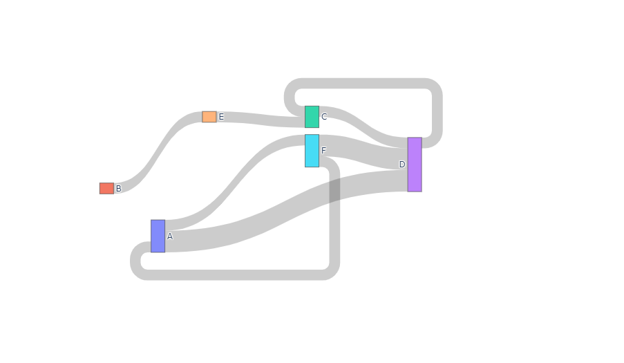

## 前言

[桑基图](https://zhuanlan.zhihu.com/p/26897906) 是一种特殊类型的流程图，分支箭头的宽度对应了数据流量的大小。

## 基础桑基图

桑基图通过定义[`source`](https://plotly.com/python/reference/sankey/#sankey-link-source)来表示数据源节点、定义[`target`](https://plotly.com/python/reference/sankey/#sankey-link-target)来表示数据目标节点、定义[`value`](https://plotly.com/python/reference/sankey/#sankey-link-value)表示数据流量、定义[`label`](https://plotly.com/python/reference/sankey/#sankey-node-label)表示节点名称，呈现了对流程的贡献。

```python
from plotly import graph_objects as go

fig = go.Figure(data=[go.Sankey(
    node=dict(pad=15, thickness=20, line=dict(color="black", width=0.5),
                label=["A1", "A2", "B1", "B2", "C1", "C2"], color="blue"),
    link=dict(
      source=[0, 1, 0, 2, 3, 3],      # 对应标签的下标索引值
      target=[2, 3, 3, 4, 4, 5], value=[8, 4, 2, 8, 4, 2]
    )
)])
fig.update_layout(title_text="Basic Sankey Diagram", font_size=10)
fig.show()
```

::: center

:::

## 带有彩色连接线的复杂桑基图

```python
from plotly import graph_objects as go
import urllib, json

url = 'https://raw.githubusercontent.com/plotly/plotly.js/master/test/image/mocks/sankey_energy.json'
response = urllib.request.urlopen(url)
data = json.loads(response.read())

# 用 Source 的颜色覆盖默认的灰色节点
opacity = 0.4
# 将 Magenta 转换为相应的 RGBA 色彩值以支持透明度
data['data'][0]['node']['color'] = [
    'rgba(255, 0, 255, 0.8)' if color == "magenta" else color
    for color in data['data'][0]['node']['color']
]
data['data'][0]['link']['color'] = [
    data['data'][0]['node']['color'][src].replace("0.8", str(opacity))
    for src in data['data'][0]['link']['source']
]

fig = go.Figure(data=[go.Sankey(
    valueformat=".0f", valuesuffix="TWh",     # 数据格式与后缀
    # 定义节点
    node=dict(pad=15, thickness=15, line=dict(color="black", width=0.5),
                label=data['data'][0]['node']['label'],
                color=data['data'][0]['node']['color']),
    # 添加连接线
    link=dict(source=data['data'][0]['link']['source'], target=data['data'][0]['link']['target'],
                value=data['data'][0]['link']['value'], label=data['data'][0]['link']['label'],
                color=data['data'][0]['link']['color'])
)])
fig.update_layout(title_text=
                  "Energy forecast for 2050<br>Source: Department of Energy & Climate Change, " +
                  "Tom Counsell via <a href='https://bost.ocks.org/mike/sankey/'>Mike Bostock</a>",
                  font_size=10)
fig.show()
```

::: center

:::

## 样式化的桑基图

这个例子展示了如何使用[`hovermode`](https://plotly.com/python/reference/layout/#layout-hovermode)启用多个浮动标签。

```python
from plotly import graph_objects as go
import urllib, json

url = 'https://raw.githubusercontent.com/plotly/plotly.js/master/test/image/mocks/sankey_energy.json'
response = urllib.request.urlopen(url)
data = json.loads(response.read())

fig = go.Figure(data=[go.Sankey(
    valueformat=".0f", valuesuffix="TWh",
    node=dict(pad=15, thickness=15, line=dict(color="black", width=0.5),
    label=data['data'][0]['node']['label'], color=data['data'][0]['node']['color']),
    link=dict(source=data['data'][0]['link']['source'], target=data['data'][0]['link']['target'],
              value=data['data'][0]['link']['value'], label=data['data'][0]['link']['label'])
)])
fig.update_layout(
    title="Energy forecast for 2050<br>Source: Department of Energy & Climate Change, " +
          "Tom Counsell via <a href='https://bost.ocks.org/mike/sankey/'>Mike Bostock</a>",
    font=dict(size=10, color='white'), hovermode='x', plot_bgcolor='black', paper_bgcolor='black'
)
fig.show()
```

::: center

:::

## 桑基图的悬浮文本模板和自定义数据

连接线和节点分别拥有自己的悬浮文本模板，他们分别在`link.hovertemplate`和`node.hovertemplate`下进行设置。为了在连接线和节点上添加更多的数据，你也可以使用`customdata`属性进行设置。

::: tip 帮助文档
关于`hovertemplate`与`customdata`的更多信息，请查阅 [悬浮文本教程](https://plotly.com/python/hover-text-and-formatting/) 。
:::

```python
from plotly import graph_objects as go

fig = go.Figure(data=[go.Sankey(
    node=dict(pad=15, thickness=20, line=dict(color="black", width=0.5), color="blue",
                label=["A1", "A2", "B1", "B2", "C1", "C2"],
                customdata=["Long name A1", "Long name A2",
                              "Long name B1", "Long name B2",
                              "Long name C1", "Long name C2"],
                hovertemplate='Node %{customdata} has total value %{value}<extra></extra>'),
    link=dict(source=[0, 1, 0, 2, 3, 3], target=[2, 3, 3, 4, 4, 5], 
                value=[8, 4, 2, 8, 4, 2], customdata=["q","r","s","t","u","v"],
                hovertemplate='Link from node %{source.customdata}<br />' +
                              'to node%{target.customdata}<br />has value %{value}' +
                              '<br />and data %{customdata}<extra></extra>')
)])
fig.update_layout(title_text="Basic Sankey Diagram", font_size=10)
fig.show()
```

::: center

:::

## 指定节点的位置

下面这个例子通过设置[`node.x`](https://plotly.com/python/reference/sankey/#sankey-node-x)和`node.y`将节点放置到指定的位置上，除非使用`snap`布局模式（`node.x`和`node.y`都未指定时的默认行为）避免节点重叠。因此，定义节点之间间隔的`snap`值会借助[`notepad`](https://plotly.com/python/reference/sankey/#sankey-node-pad)自动设置。其他可选的布局模式有`perpendicular`、`freeform`和`fixed`。

```python
from plotly import graph_objects as go

fig = go.Figure(go.Sankey(
    arrangement="snap",
    node={
        "label": ["A", "B", "C", "D", "E", "F"],
        "x": [0.2, 0.1, 0.5, 0.7, 0.3, 0.5],
        "y": [0.7, 0.5, 0.2, 0.4, 0.2, 0.3],
        'pad': 10
    }, link={
        "source": [0, 0, 1, 2, 5, 4, 3, 5],
        "target": [5, 3, 4, 3, 0, 2, 2, 3],
        "value": [1, 2, 1, 1, 1, 1, 1, 2]
    }
))
fig.show()
```

::: center

:::

## 参考

更多信息和选项，请查阅 [桑基图 - Python图表参考]([https://plotly.com/python/reference/sankey](https://plotly.com/python/reference/sankey/)) 。
