[矩形树状图](https://antv-2018.alipay.com/zh-cn/vis/chart/treemap.html) 用嵌套的矩形对具有层次结构的数据进行可视化。输入数据集的格式与 [旭日图](/visualization/plotly/sunburst-charts) 和 [冰柱图](https://plotly.com/python/icicle-charts/) 类似：层次结构由[`labels`](https://plotly.com/python/reference/treemap/#treemap-labels)属性（`px.treemap`中为`names`）和[`parents`](https://plotly.com/python/reference/treemap/#treemap-parents)属性定义。点击一个区域进行缩放，同时在图像左上角会显示出层次路径，可以使用路径回到上层中。

## 使用 Plotly Express 绘制树状图

### 基础树状图

使用`px.treemap`，数据表中的每一行都会被视为树状图中的一个扇区。

```python
from plotly import express as px

fig = px.treemap(
    names=["Eve","Cain", "Seth", "Enos", "Noam", "Abel", "Awan", "Enoch", "Azura"],
    parents=["", "Eve", "Eve", "Seth", "Seth", "Eve", "Eve", "Awan", "Eve"]
)
fig.update_traces(root_color="lightgrey")
fig.update_layout(margin=dict(t=50, l=25, r=25, b=25))
fig.show()
```

::: center
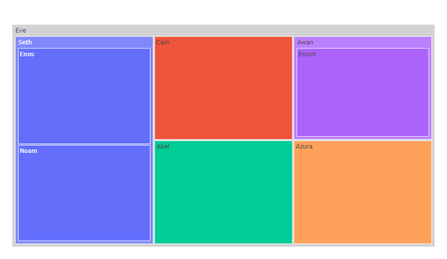
:::

### 矩形数据表

层次结构数据也经常以矩形数据表的形式存储，不同的列对应层次结构中的不同层级，`px.treemap`可以由`path`参数指定构建层次结构的一组数据列。

::: warning
如果提供了`path`参数，则`id`和`parent`参数不应该同时存在！
:::

```python
from plotly import express as px

df = px.data.tips()
fig = px.treemap(df, values='total_bill',
                 path=[px.Constant("all"), 'day', 'time', 'sex'])
fig.update_traces(root_color="lightgrey")
fig.update_layout(margin=dict(t=50, l=25, r=25, b=25))
fig.show()
```

::: center
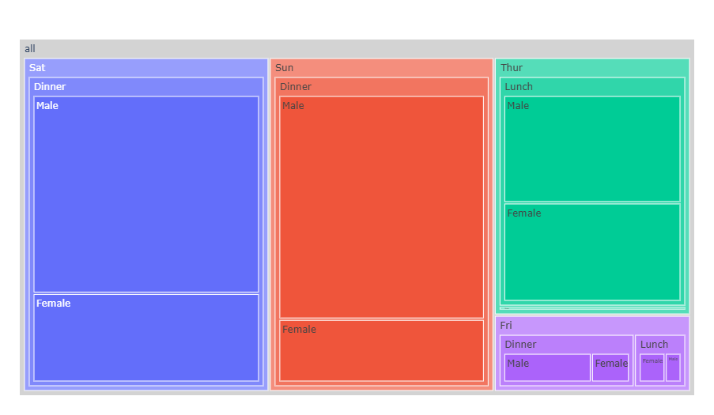
:::

### 连续色彩参数

当`color`参数被指定时，每一个结点的颜色由其所有子扇区的平均色彩决定，色彩浓度由它们的数值决定。

::: warning
为了产生最佳的效果，需要确保`path`参数中的首个元素是独立的根扇区。下面这个例子，我们创建了一个哑元列，让数据表中的所有记录具有相同的值，以达到这个目的。
:::

```python
from plotly import express as px
import numpy as np

df = px.data.gapminder().query("year == 2007")
fig = px.treemap(df, path=[px.Constant("world"), 'continent', 'country'], values='pop',
                 color='lifeExp', hover_data=['iso_alpha'], color_continuous_scale='RdBu',
                 color_continuous_midpoint=np.average(df['lifeExp'], weights=df['pop']))
fig.update_layout(margin=dict(t=50, l=25, r=25, b=25))
fig.show()
```

::: center
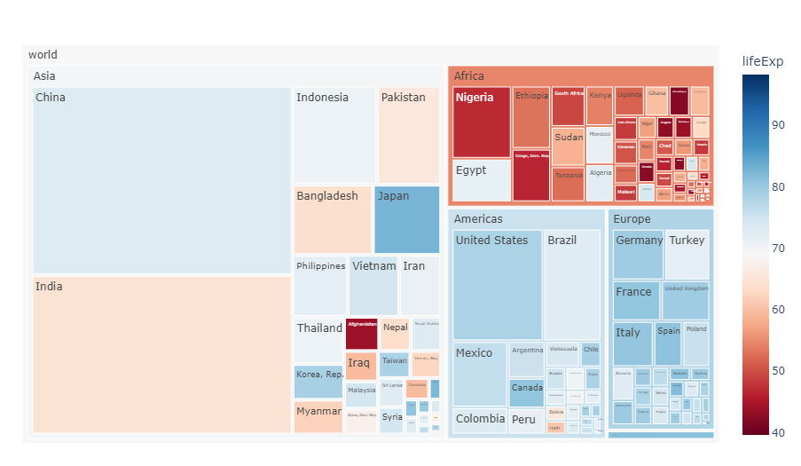
:::

### 离散色彩的显式映射

有关离散色彩的更多信息，请查看[此页面](https://plotly.com/python/discrete-color)。

```python
from plotly import express as px

df = px.data.tips()
fig = px.treemap(df, path=[px.Constant("all"), 'sex', 'day', 'time'], 
                 values='total_bill', color='time',
                  color_discrete_map={'(?)':'lightgrey', 'Lunch':'gold', 'Dinner':'darkblue'})
fig.update_layout(margin=dict(t=50, l=25, r=25, b=25))
fig.show()
```

::: center
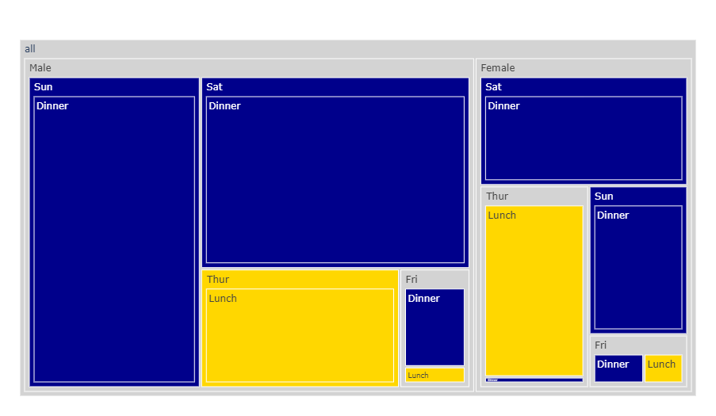
:::

### 带有缺失数据的矩形数据表

如果数据集不是完整的矩形，缺失值应该以`None`表示。

```python
from plotly import express as px
import pandas as pd

vendors = ["A", "B", "C", "D", None, "E", "F", "G", "H", None]
sectors = ["Tech", "Tech", "Finance", "Finance", "Other",
           "Tech", "Tech", "Finance", "Finance", "Other"]
regions = ["North", "North", "North", "North", "North",
           "South", "South", "South", "South", "South"]
sales = [1, 3, 2, 4, 1, 2, 2, 1, 4, 1]
df = pd.DataFrame(dict(vendors=vendors, sectors=sectors, regions=regions, sales=sales))
df["all"] = "all" # in order to have a single root node
df.show()
fig = px.treemap(df, path=['all', 'regions', 'sectors', 'vendors'], values='sales')
fig.update_traces(root_color="lightgrey")
fig.update_layout(margin=dict(t=50, l=25, r=25, b=25))
fig.show()
```

```
  vendors  sectors regions  sales  all
0       A     Tech   North      1  all
1       B     Tech   North      3  all
2       C  Finance   North      2  all
3       D  Finance   North      4  all
4    None    Other   North      1  all
5       E     Tech   South      2  all
6       F     Tech   South      2  all
7       G  Finance   South      1  all
8       H  Finance   South      4  all
9    None    Other   South      1  all
```

::: center
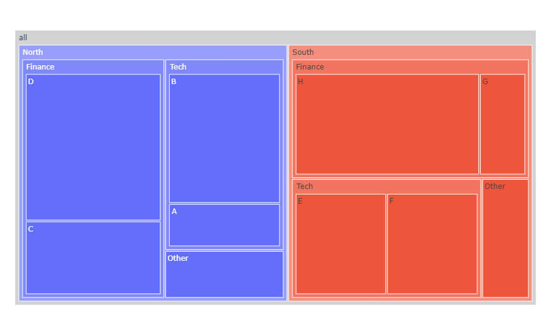
:::

## 使用 go.Treemap 绘制树状图

### 基础树状图

如果 *Plotly Express* 提供的交互入口不太行，也可以使用[`plotly.graph_objects`](https://plotly.com/python/graph-objects/)中更为通用的`go.Treemap`类。

```python
from plotly import graph_objects as go

fig = go.Figure(go.Treemap(
    labels=["Eve","Cain", "Seth", "Enos", "Noam", "Abel", "Awan", "Enoch", "Azura"],
    parents=["", "Eve", "Eve", "Seth", "Seth", "Eve", "Eve", "Awan", "Eve"],
    root_color="lightgrey"
))

fig.update_layout(margin=dict(t=50, l=25, r=25, b=25))
fig.show()
```

::: center

:::

### 设置不同的属性

下面的例子使用了如下属性：

1. [`values`](https://plotly.com/python/reference/treemap/#treemap-values)：设置与各节点关联的数值。
2. [textinfo](https://plotly.com/python/reference/treemap/#treemap-textinfo)：决定哪些文本信息会显示在图表中，可选的枚举值有`text`、`value`、`current path`、`percent root`、`percent entry`、`percent parent`，或上述枚举值的任意组合。
3. [pathbar](https://plotly.com/python/reference/treemap/#treemap-pathbar)：树状图独有的其中一个主要特性，能够显示当前节点在层次目录中的路径，它也经常用于缩小图表。
4. [branchvalues](https://plotly.com/python/reference/treemap/#treemap-branchvalues)：决定`values`中的数值如何被累加。
   - 当设置为`total`时，`values`中的元素将由其下属的所有节点值决定。下面这个例子中，`Eva == 65`，相当于`14 + 12 + 10 + 2 + 6 + 6 + 1 + 4`；
   - 当设置为`remainder`时，对应于根扇区和分支扇区中的项目被视为额外部分，而不是叶子扇区数值总和的一部分。

```python
from plotly import graph_objects as go
from ploty.subplots import make_subplots

labels = ["Eve", "Cain", "Seth", "Enos", "Noam", "Abel", "Awan", "Enoch", "Azura"]
parents = ["", "Eve", "Eve", "Seth", "Seth", "Eve", "Eve", "Awan", "Eve"]

fig = make_subplots(
    cols=2, rows=1, column_widths=[0.4, 0.4],
    subplot_titles=('branchvalues: <b>remainder<br />&nbsp;<br />',
                    'branchvalues: <b>total<br />&nbsp;<br />'),
    specs=[[{'type': 'treemap', 'rowspan': 1}, {'type': 'treemap'}]]
)
fig.add_trace(go.Treemap(
    labels=labels, parents=parents, root_color="lightgrey",
    values=[10, 14, 12, 10, 2, 6, 6, 1, 4],
    textinfo="label+value+percent parent+percent entry+percent root"
),row=1, col=1)
fig.add_trace(go.Treemap(
    branchvalues="total", labels=labels, parents=parents,
    values=[65, 14, 12, 10, 2, 6, 6, 1, 4], root_color="lightgrey",
    textinfo="label+value+percent parent+percent entry"
),row=1, col=2)
fig.update_layout(margin=dict(t=50, l=25, r=25, b=25))
fig.show()
```

::: center
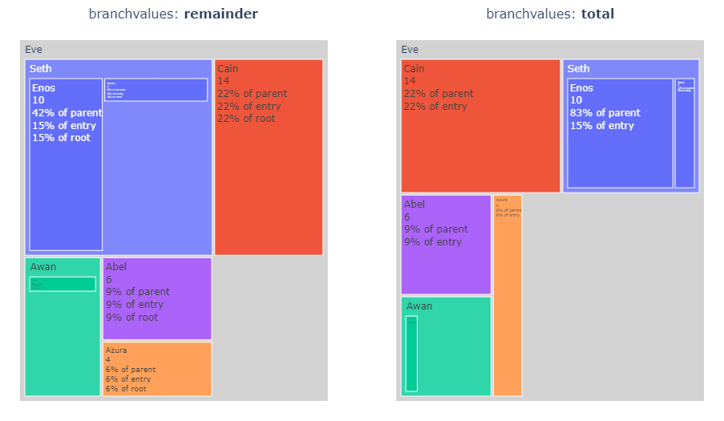
:::

### 设置扇区的颜色

更改树状图扇区色彩的方式有3种：[`marker.colors`](https://plotly.com/python/reference/treemap/#treemap-marker-colors)、[`colorway`](https://plotly.com/python/reference/treemap/#treemap-colorway)和[`colorscale`](https://plotly.com/python/reference/treemap/#treemap-colorscale)。下面的例子展示了具体用法：

```python
from plotly import graph_objects as go

values = [0, 11, 12, 13, 14, 15, 20, 30]
labels = ["container", "A1", "A2", "A3", "A4", "A5", "B1", "B2"]
parents = ["", "container", "A1", "A2", "A3", "A4", "container", "B1"]

fig = go.Figure(go.Treemap(
    labels=labels, values=values, parents=parents,
    marker_colors=["pink", "royalblue", "lightgray", "purple", 
                     "cyan", "lightgray", "lightblue", "lightgreen"]
))
fig.update_layout(margin=dict(t=50, l=25, r=25, b=25))
fig.show()
```

::: center
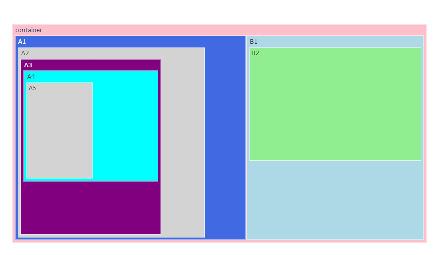
:::

下面这个例子使用了需要在布局样式中设置的`treemapcolorway`参数：

```python
from plotly import graph_objects as go

values = [0, 11, 12, 13, 14, 15, 20, 30]
labels = ["container", "A1", "A2", "A3", "A4", "A5", "B1", "B2"]
parents = ["", "container", "A1", "A2", "A3", "A4", "container", "B1"]

fig = go.Figure(go.Treemap(labels=labels, values=values, parents=parents, root_color="lightblue"))
fig.update_layout(treemapcolorway=["pink", "lightgray"], margin=dict(t=50, l=25, r=25, b=25))
fig.show()
```

::: center
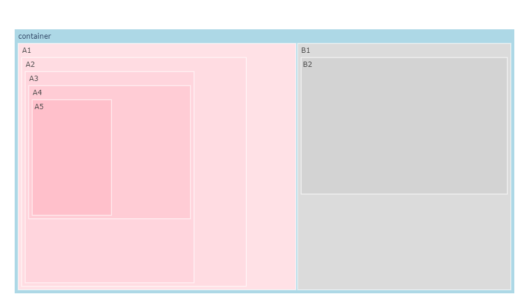
:::

```python
from plotly import graph_objects as go

values = [0, 11, 12, 13, 14, 15, 20, 30]
labels = ["container", "A1", "A2", "A3", "A4", "A5", "B1", "B2"]
parents = ["", "container", "A1", "A2", "A3", "A4", "container", "B1"]

fig = go.Figure(go.Treemap(labels=labels, values=values, parents=parents, marker_colorscale='Blues'))
fig.update_layout(margin=dict(t=50, l=25, r=25, b=25))
fig.show()
```

::: center
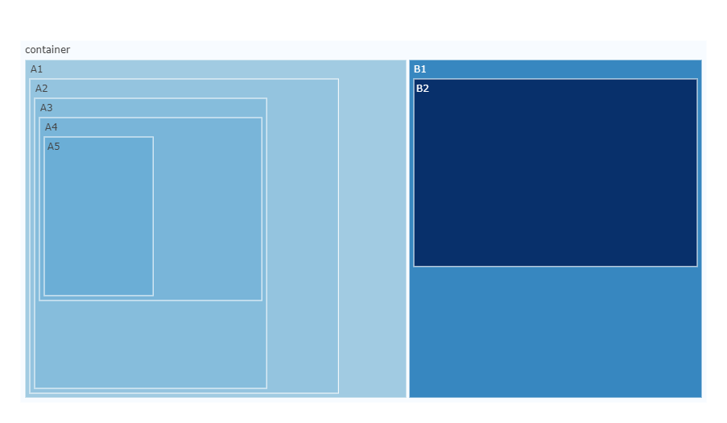
:::

### 连续色彩

下面的例子展示了按地区（县）和销售人员等级划分的销售明细（对应扇区宽度）和呼叫成功率（对应扇区颜色）。比如，在浏览数据时你能看到尽管东部地区表现不佳，但泰勒县仍高于平均水平——但销售人员 *GT* 的呼叫成功率较低，拉低了整体水平。

在最大层级深度为2的右侧子图中，单击任意一个扇区以查看更深层级的信息。

```python
from plotly import graph_objects as go
from plotly.subplots import make_subplots
import pandas as pd

df = pd.read_csv('https://raw.githubusercontent.com/plotly/datasets/master/sales_success.csv')
print(df.head())

levels = ['salesperson', 'county', 'region']      # 层次结构列
color_columns = ['sales', 'calls']                # 色彩列
value_column = 'calls'                            # 数值列

def build_hierarchical_dataframe(df, levels, value_column, color_columns=None):
    """
    为旭日图或树状图构造层次结构

    :param levels
        数组指定的层次顺序是从叶子节点到根节点的，最后一个元素被视为根节点
    """
    df_all_trees = pd.DataFrame(columns=['id', 'parent', 'value', 'color'])
    for i, level in enumerate(levels):
        df_tree = pd.DataFrame(columns=['id', 'parent', 'value', 'color'])
        dfg = df.groupby(levels[i:]).sum()
        dfg = dfg.reset_index()
        df_tree['id'] = dfg[level].copy()
        if i < len(levels) - 1:
            df_tree['parent'] = dfg[levels[i+1]].copy()
        else:
            df_tree['parent'] = 'total'
        df_tree['value'] = dfg[value_column]
        df_tree['color'] = dfg[color_columns[0]] / dfg[color_columns[1]]
        df_all_trees = df_all_trees.append(df_tree, ignore_index=True)
    total = pd.Series(dict(
        id='total', parent='', value=df[value_column].sum(),
        color=df[color_columns[0]].sum() / df[color_columns[1]].sum()
    ))
    df_all_trees = df_all_trees.append(total, ignore_index=True)
    return df_all_trees

df_all_trees = build_hierarchical_dataframe(df, levels, value_column, color_columns)
average_score = df['sales'].sum() / df['calls'].sum()

fig = make_subplots(1, 2, specs=[[{"type": "domain"}, {"type": "domain"}]],)
fig.add_trace(go.Treemap(
    labels=df_all_trees['id'], parents=df_all_trees['parent'],
    values=df_all_trees['value'], branchvalues='total', name='',
    marker=dict(colors=df_all_trees['color'], colorscale='RdBu', cmid=average_score),
    hovertemplate='<b>%{label} </b> <br> Sales: %{value}<br> Success rate: %{color:.2f}'
), 1, 1)
fig.add_trace(go.Treemap(
    labels=df_all_trees['id'], parents=df_all_trees['parent'],
    values=df_all_trees['value'], branchvalues='total', maxdepth=2,
    marker=dict(colors=df_all_trees['color'], colorscale='RdBu', cmid=average_score),
    hovertemplate='<b>%{label} </b> <br> Sales: %{value}<br> Success rate: %{color:.2f}'
), 1, 2)
fig.update_layout(margin=dict(t=50, l=25, r=25, b=25))
fig.show()
```

```
   Unnamed: 0 region   county salesperson  calls  sales
0           0  North   Dallam          JE     35     23
1           1  North   Dallam          ZQ     49     13
2           2  North   Dallam          IJ     20      6
3           3  North  Hartley          WE     39     37
4           4  North  Hartley          PL     42     37
```

::: center
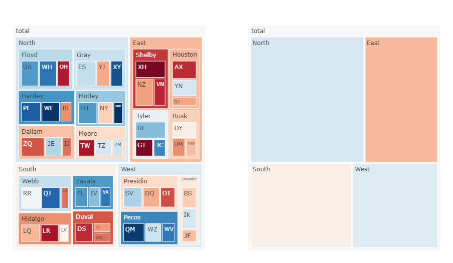
:::

### 嵌套图层

下面的例子使用了包含图层和分组的层次结构数据，树状图和[旭日图](/visualization/plotly/sunburst-charts)解释了对数据的洞察和分层数据的格式。[`maxdepth`](https://plotly.com/python/reference/treemap/#treemap-maxdepth)属性设置从给定级别渲染的扇区数量。

```python
from plotly import graph_objects as go
import pandas as pd

df = pd.read_csv('https://raw.githubusercontent.com/plotly/datasets/'
                 '96c0bd/sunburst-coffee-flavors-complete.csv')
fig = go.Figure()
fig.add_trace(go.Treemap(ids=df.ids, labels=df.labels, parents=df.parents,
                         maxdepth=3, root_color="lightgrey"))
fig.update_layout(margin=dict(t=50, l=25, r=25, b=25))
fig.show()
```

::: center
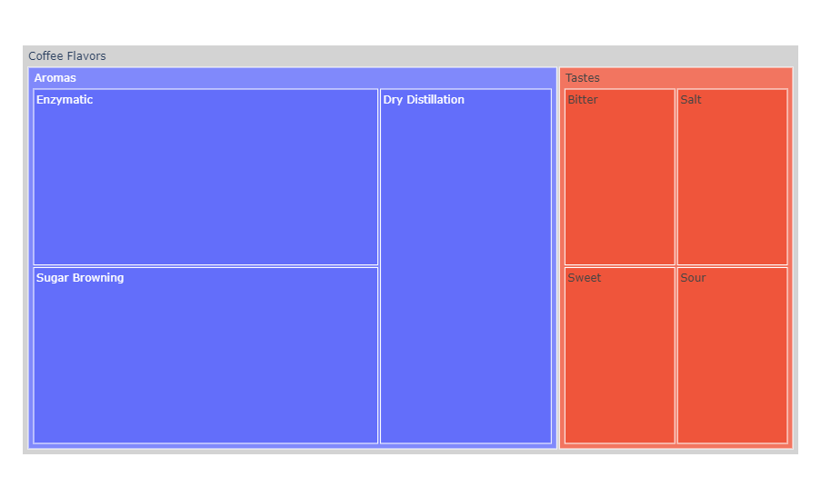
:::

### 控制文本字号

如果你希望所有的文字标签具有相同大小，你可以使用`uniformtext`布局参数。`minsize`参数指定字号，`mode`参数指明无法匹配给定字号时的行为——`hide`隐藏或`show`溢出式显示。

::: warning
现阶段尚未实现指定了`uniformtext`参数的动画过渡效果。
:::

```python
import plotly.graph_objects as go
import pandas as pd

df = pd.read_csv('https://raw.githubusercontent.com/plotly/datasets/'
                 '96c0bd/sunburst-coffee-flavors-complete.csv')
fig = go.Figure(go.Treemap(ids=df.ids, labels=df.labels, parents=df.parents,
                pathbar_textfont_size=15, root_color="lightgrey"))
fig.update_layout(uniformtext=dict(minsize=10, mode='hide'),
                  margin=dict(t=50, l=25, r=25, b=25))
fig.show()
```

::: center

:::

## 参考

- [`px.treemap()`函数参考](https://plotly.com/python-api-reference/generated/plotly.express.treemap)
- [树状图 - Python 图表参考](https://plotly.com/python/reference/treemap/)
