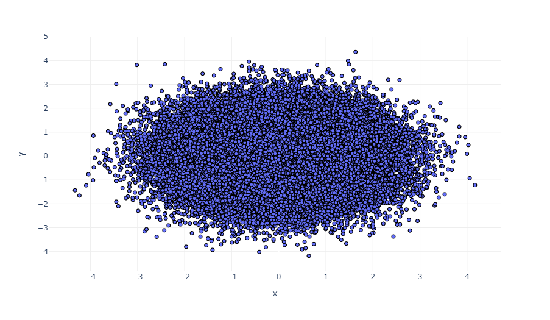
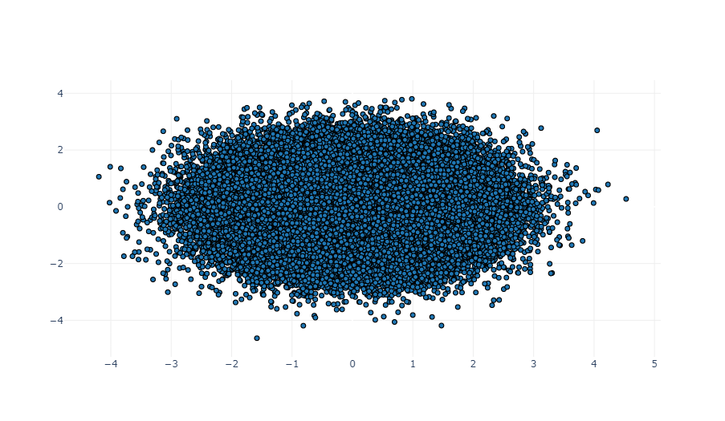
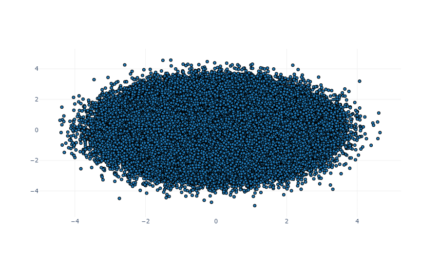
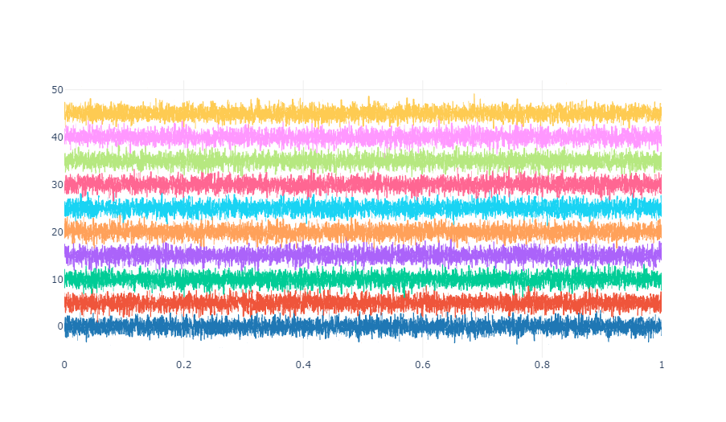

> 用 *WebGL* 加速、提升可交互性、有能力绘制更大量的数据！

## SVG 、canvas 和 WebGL

*Plotly* 图表是由浏览器完成渲染的。广义上讲，浏览器有三种渲染图形的能力：支持矢量渲染的 *SVG API* 、支持光栅渲染的 *Canvas API* 和能够释放 GPU 硬件加速性能的浏览器技术 *WebGL* 。所有的 *Plotly* 图线类型都是用 *SVG* 或 *WebGL* 的其中一种进行渲染的，尽管基于 *WebGL* 的图线也会使用部分的 *SVG* 。下列类型的图线部分或全部使用 *WebGL* 进行渲染：

- *SVG* 图线类型的加速版本：`scattergl`、`scatterpolargl`、`heatmapgl`
- 高性能多维图线：`splom`或`parcoords`
- 三维图线：`scatter3d`、`surface`、`mesh3d`、`cone`、`streamtube`
- 基于 *Mapbox GI JS* 的图线：`scattermapbox`、`choroplethmapbox`、`densitymapbox`

## WebGL 的限制与权衡

*WebGL* 是一个用于加速计算的黑科技，但它有一些严格的限制：

1. 对 GPU 的需求：*WebGL* 是一项 GPU （图形卡，显卡）技术，因此需要特定的硬件（大多数都行，但非全部）来支持绝大多数（也不是全部）浏览器。

   ::: tip
   常见的消费者级 GPU 包括 Intel HD Graphics 系列、NVIDIA GeForce 系列和 AMD Raedon 系列，这些 GPU 系列已经普遍支持 *WebGL* 了。与此同时，中国市场已经被 Google Chrome 、Microsoft Edge (Chromium) 、Mozilla Firefox 等主流官方浏览器占领，其他套壳浏览器也都是基于 Chromium 二次开发，也普遍提供了对 *WebGL* 的支持。
   :::

2. 光栅化：由 *WebGL* 渲染的数据被绘制为像素网格而不是单个形状，因此在一些情况下会出现像素化或模糊现象，在导出到静态文件格式时也可能在缩放过程中出现像素化。除此之外，文本渲染在 *SVG* 和 *WebGL* 图线中存在差异。

3. 上下文限制：浏览器对任何给定网页文档可访问的 *WebGL* 『上下文』数量施加了严格的限制。*Plotly* 中基于 *WebGL* 绘制的图线在一些情况下能够使用多个上下文，但一般而言，**它无法同一时间在同一页面上渲染超过 8 个由 *WebGL* 绘制的图线** 。

4. 大小限制：浏览器对使用 *WebGL* 绘制的图表的宽度和高度施加了硬件相关的限制，用户可能会在绘制非常巨大的图像（比如图像高度达到万像素级别）时遇到问题。

除了上述的限制之外，某些 *SVG* 图线的 *WebGL* 版本（`scattergl`、`scatterpolargl`、`heatmapgl`）还不是其 *SVG* 版本的完整替代品：

- 可用的图标存在差异
- *WebGL* 还不支持区域填充
- *WebGL* 还不支持时间轴上的范围间断
- 坐标轴数据范围的启发式确定方法可能不同

## WebGL 在散点图上的性能

在下面的示例中，我们展示了使用 *WebGL* 渲染的图线能够表示多达上百万个数据点。对于更大的数据集，或者为了更清晰地可视化数据点之间的密度，也可以使用 [Datashader](https://plotly.com/python/datashader/) 。

## 在 Plotly Express 中使用 WebGL

在支持的 *Plotly Express* 函数（比如`scatter`和`scatter_polar`）中指定`rendermode`参数能够启用 *WebGL* 渲染。

::: warning
默认的渲染模式是`auto`，在这种情况下 *Plotly Express* 会在输入数据量超过 1K 行时自动设置`rendermode="webgl"`。如果 *WebGL* 加速在当前状态下不可用，`rendermode`会被强制设置为`"svg"`以使用矢量（可能会变慢）渲染。
:::

以下是一个例子，我们用 *Plotly Express* 创建了具有 100K 个数据点的散点图，同时显式启用了 *WebGL* 渲染。

```python
from plotly import express as px
import pandas as pd
from numpy.random import seed, randn

seed(1)
N = 100000
df = pd.DataFrame(dict(x=randn(N), y=randn(N)))

fig = px.scatter(df, x="x", y="y", render_mode='webgl')
fig.update_traces(marker_line=dict(width=1, color='DarkSlateGray'))
fig.show()
```

::: center

:::

## 在 Graph Objects 中使用 WebGL

如果 *Plotly Express* 不是一个很好的交互入口，也可以使用[`plotly.graph_objects`](https://plotly.com/python/graph-objects/)中更为通用的`go.Scattergl`类。

```python
from plotly import graph_objects as go
from numpy.random import randn

N = 100000
fig = go.Figure()
fig.add_trace(go.Scattergl(
    x=randn(N), y=randn(N), mode='markers',
    marker=dict(line=dict(width=1, color='DarkSlateGrey'))
))
fig.show()
```

::: center

:::

### 百万级散点的 WebGL 渲染

```python
from plotly import graph_objects as go
from numpy.random import randn

N = 1000000
fig = go.Figure()
fig.add_trace(go.Scattergl(
    x=randn(N), y=randn(N), mode='markers',
    marker=dict(line=dict(width=1, color='DarkSlateGrey'))
))
fig.show()
```

::: center

:::

### WebGL 渲染多条图线

```python
from plotly import graph_objects as go
from numpy import linspace
from numpy.random import randn

trace_num = 10
point_num = 5000

fig = go.Figure()
for i in range(trace_num):
    fig.add_trace(go.Scattergl(
        x=linspace(0, 1, point_num),
        y=randn(point_num) + (i * 5)
    ))
fig.update_layout(showlegend=False)
fig.show()
```

::: center

:::

## 参考

更多信息和图表属性选项，请查阅 [散点图 (WebGL) - Python 图表参考](https://plotly.com/python/reference/scattergl/) 。
