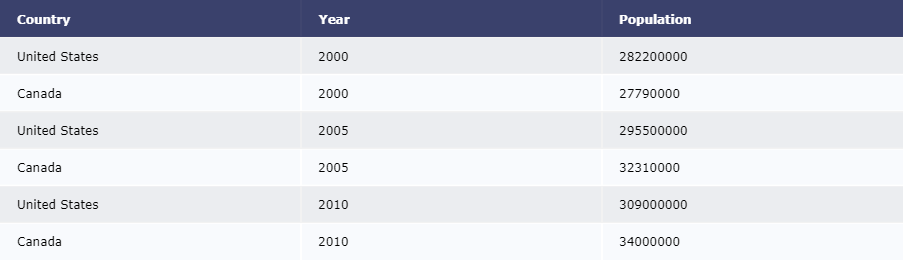
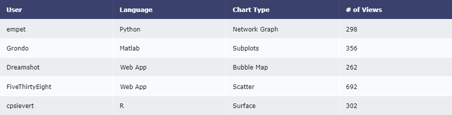
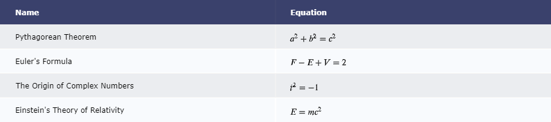
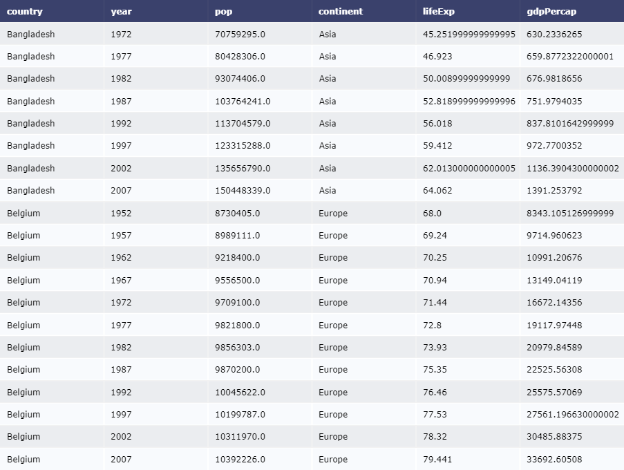
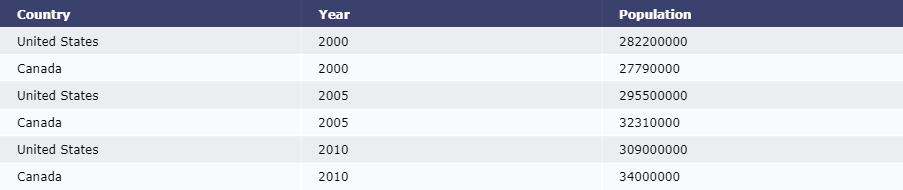
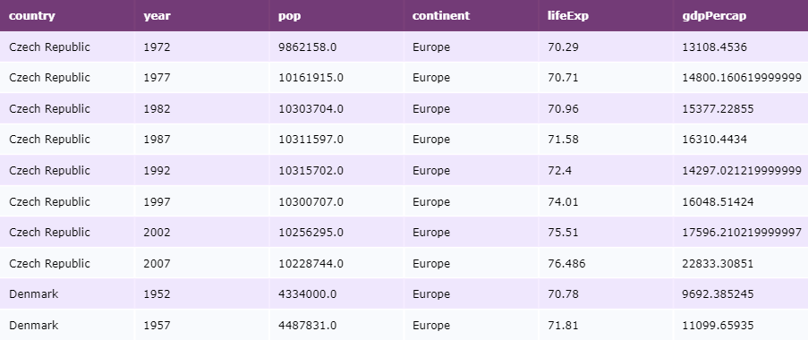
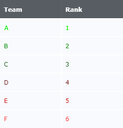
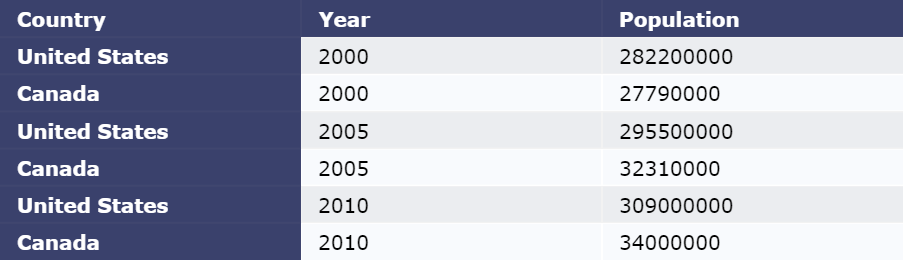
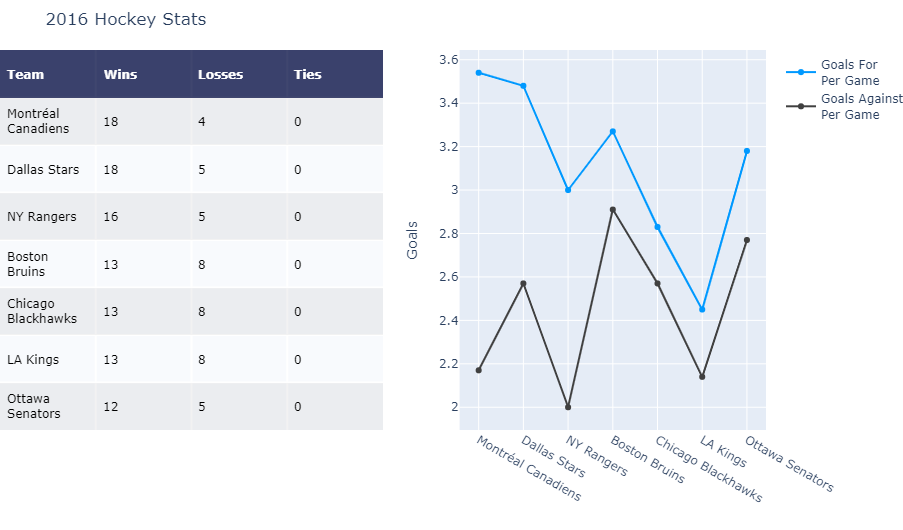

表格既可以使用[表格图线](/visualization/plotly/table)类型创建，也可以像本页一样使用[图表工厂](https://plotly.com/python/figure-factories/)创建。

## 简易表格

```python
from plotly import figure_factory as ff

data_matrix = [['Country', 'Year', 'Population'],
               ['United States', 2000, 282200000],
               ['Canada', 2000, 27790000],
               ['United States', 2005, 295500000],
               ['Canada', 2005, 32310000],
               ['United States', 2010, 309000000],
               ['Canada', 2010, 34000000]]
fig = ff.create_table(data_matrix)
fig.show()
```

::: center

:::

## 添加超链接

```python
from plotly import figure_factory as ff

data_matrix = [
    ['User', 'Language', 'Chart Type', '# of Views'],
    ['<a href="https://plotly.com/~empet/folder/home">empet</a>',
     '<a href="https://plotly.com/python/">Python</a>',
     '<a href="https://plotly.com/~empet/8614/">Network Graph</a>',
     298],
    ['<a href="https://plotly.com/~Grondo/folder/home">Grondo</a>',
     '<a href="https://plotly.com/matlab/">Matlab</a>',
     '<a href="https://plotly.com/~Grondo/42/">Subplots</a>',
     356],
    ['<a href="https://plotly.com/~Dreamshot/folder/home">Dreamshot</a>',
     '<a href="https://help.plot.ly/tutorials/">Web App</a>',
     '<a href="https://plotly.com/~Dreamshot/6575/_2014-us-city-populations/">Bubble Map</a>',
     262],
    ['<a href="https://plotly.com/~FiveThirtyEight/folder/home">FiveThirtyEight</a>',
     '<a href="https://help.plot.ly/tutorials/">Web App</a>',
     '<a href="https://plotly.com/~FiveThirtyEight/30/">Scatter</a>',
     692],
    ['<a href="https://plotly.com/~cpsievert/folder/home">cpsievert</a>',
     '<a href="https://plotly.com/r/">R</a>',
     '<a href="https://plotly.com/~cpsievert/1130/">Surface</a>',
     302]
]
fig = ff.create_table(data_matrix)
fig.show()
```

::: center

:::

## 使用 LaTeX 公式

```python
from plotly import figure_factory as ff

data_matrix = [['Name', 'Equation'],
               ['Pythagorean Theorem', '$a^{2}+b^{2}=c^{2}$'],
               ["Euler's Formula", '$F-E+V=2$'],
               ['The Origin of Complex Numbers', '$i^{2}=-1$'],
               ["Einstein's Theory of Relativity", '$E=m c^{2}$']]
fig =  ff.create_table(data_matrix)
fig.show()
```

::: center

:::

## 使用 Pandas 数据表

```python
from plotly import figure_factory as ff
import pandas as pd

df = pd.read_csv('https://raw.githubusercontent.com/plotly/'
                 'datasets/master/gapminderDataFiveYear.csv')
df_sample = df[100:120]

fig = ff.create_table(df_sample)
fig.show()
```

::: center

:::

## 修改行高

*Figure Factory* 生成表格的默认行高为 30px 。如果需要修改每一行的高度，请指定`height_constant`参数。

```python
from plotly import figure_factory as ff

data_matrix = [['Country', 'Year', 'Population'],
               ['United States', 2000, 282200000],
               ['Canada', 2000, 27790000],
               ['United States', 2005, 295500000],
               ['Canada', 2005, 32310000],
               ['United States', 2010, 309000000],
               ['Canada', 2010, 34000000]]

fig =  ff.create_table(data_matrix, height_constant=20)
fig.show()
```

::: center

:::

## 自定义表格颜色

```python
from plotly import figure_factory as ff
import pandas as pd

df = pd.read_csv('https://raw.githubusercontent.com/plotly/'
                 'datasets/master/gapminderDataFiveYear.csv')
df_sample = df[400:410]

colorscale = [[0, '#4d004c'],[.5, '#f2e5ff'],[1, '#ffffff']]
fig =  ff.create_table(df_sample, colorscale=colorscale)
fig.show()
```

::: center

:::

## 自定义字体颜色

```python
from plotly import figure_factory as ff

text = [['Team', 'Rank'], ['A', 1], ['B', 2],
        ['C', 3], ['D', 4], ['E', 5], ['F', 6]]
colorscale = [[0, '#272D31'],[.5, '#ffffff'],[1, '#ffffff']]
font=['#FCFCFC', '#00EE00', '#008B00', '#004F00',
      '#660000', '#CD0000', '#FF3030']

fig = ff.create_table(text, colorscale=colorscale, font_colors=font)
fig.layout.width=250
fig.show()
```

::: center

:::

## 修改字体大小

```python
from plotly import figure_factory as ff

data_matrix = [['Country', 'Year', 'Population'],
               ['United States', 2000, 282200000],
               ['Canada', 2000, 27790000],
               ['United States', 2005, 295500000],
               ['Canada', 2005, 32310000],
               ['United States', 2010, 309000000],
               ['Canada', 2010, 34000000]]

fig = ff.create_table(data_matrix, index=True)
for i in range(len(fig.layout.annotations)):
    # 增大字号
    fig.layout.annotations[i].font.size = 20
fig.show()
```

::: center

:::

## 带有图表的表格

```python
from plotly import graph_objs as go
from plotly import figure_factory as ff

# 构造表格数据
table_data = [
    ['Team', 'Wins', 'Losses', 'Ties'],
    ['Montréal<br>Canadiens', 18, 4, 0],
    ['Dallas Stars', 18, 5, 0],
    ['NY Rangers', 16, 5, 0],
    ['Boston<br>Bruins', 13, 8, 0],
    ['Chicago<br>Blackhawks', 13, 8, 0],
    ['LA Kings', 13, 8, 0],
    ['Ottawa<br>Senators', 12, 5, 0]
]

# 用图表工厂初始化一张图表
fig = ff.create_table(table_data, height_constant=60)

# 添加图表数据
teams = ['Montréal Canadiens', 'Dallas Stars', 'NY Rangers',
         'Boston Bruins','Chicago Blackhawks', 'LA Kings',
         'Ottawa Senators']
GFPG = [3.54, 3.48, 3.0, 3.27, 2.83, 2.45, 3.18]
GAPG = [2.17, 2.57, 2.0, 2.91, 2.57, 2.14, 2.77]

# 添加图线
fig.add_trace(go.Scatter(
    x=teams, y=GFPG, marker=dict(color='#0099ff'),
    name='Goals For<br>Per Game', xaxis='x2', yaxis='y2'
))
fig.add_trace(go.Scatter(
    x=teams, y=GAPG, marker=dict(color='#404040'),
    name='Goals Against<br>Per Game', xaxis='x2', yaxis='y2'
))

fig.update_layout(
    title_text='2016 Hockey Stats',
    margin={'t': 50, 'b': 100},
    xaxis={'domain': [0, .5]},
    xaxis2={'domain': [0.6, 1.]},
    yaxis2={'anchor': 'x2', 'title': 'Goals'}
)
fig.show()
```

::: center

:::

```python
from plotly import graph_objs as go
from plotly import figure_factory as ff

# 添加表格数据
table_data = [['Team', 'Wins', 'Losses', 'Ties'],
              ['Montréal<br>Canadiens', 18, 4, 0],
              ['Dallas Stars', 18, 5, 0],
              ['NY Rangers', 16, 5, 0],
              ['Boston<br>Bruins', 13, 8, 0],
              ['Chicago<br>Blackhawks', 13, 8, 0],
              ['Ottawa<br>Senators', 12, 5, 0]]
# 用图表工厂初始化图表
fig = ff.create_table(table_data, height_constant=60)

# 添加图表数据
teams = ['Montréal Canadiens', 'Dallas Stars', 'NY Rangers',
         'Boston Bruins', 'Chicago Blackhawks', 'Ottawa Senators']
GFPG = [3.54, 3.48, 3.0, 3.27, 2.83, 3.18]
GAPG = [2.17, 2.57, 2.0, 2.91, 2.57, 2.77]

fig.add_trace(go.Bar(
    x=teams, y=GFPG, xaxis='x2', yaxis='y2',
    marker=dict(color='#0099ff'),
    name='Goals For<br>Per Game'
))
fig.add_trace(go.Bar(
    x=teams, y=GAPG, xaxis='x2', yaxis='y2',
    marker=dict(color='#404040'),
    name='Goals Against<br>Per Game'
))

fig.update_layout(
    title_text='2016 Hockey Stats', height=800,
    margin={'t':75, 'l':50}, yaxis={'domain': [0, .45]},
    xaxis2={'anchor': 'y2'}, yaxis2={
        'domain': [.6, 1], 'anchor': 'x2', 'title': 'Goals'
    }
)
fig.show()
```

## 参考

有关`ff.create_table()`函数的更多信息，请查阅[完整函数参考](https://plotly.com/python-api-reference/generated/plotly.figure_factory.create_table.html)。
