此页面展示了如何配置[二维笛卡尔坐标系](https://plotly.com/python/figure-structure/#2d-cartesian-trace-types-and-subplots)以可视化类别（即定性、名义或有序数据，而不是连续数值数据）的示例，这些坐标轴非常适合柱状图、瀑布图、漏斗图、热力图、提琴图和箱线图，但也可以用于散点图和折线图。在对数坐标轴上配置网格线、刻度、刻度标签和坐标轴标签与[线性坐标轴](https://plotly.com/python/axes/)相同。

## 二维笛卡尔坐标系类型与自动检测

不同类型的笛卡尔坐标轴可以借助`xaxis.type`或`yaxis.type`属性进行设置，支持下列属性值：

- `"linear"`（请查阅[线性坐标轴教程](https://plotly.com/python/axes/)）
- `"log"`（请查阅[对数图表教程](https://plotly.com/python/log-plot/)）
- `"date"`（请查阅[时间序列教程](https://plotly.com/python/time-series/)）
- `"category"`和`"multicategory"`（如下）

坐标轴类型能够根据与此坐标轴关联的第1条图线自动确定。

- 首先尝试`multicategory`，然后尝试`date`，再尝试`category`，最后默认为`linear`（`log`模式不会被自动选中）
- `multicategory`只是一个『形状测试』：数据列表是嵌套的吗？
- `date`和`category`：需要**超过两倍于不重复数值的不重复日期或类别字符串数量**来自动选择这两种坐标轴模式。
  - 它们只测试最多 1K 个均匀间隔的样本。

## 强制使用类别坐标轴

你可以通过显式设置`xaxis_type`来强制使用此类型的坐标轴。下面这个例子的横坐标轴会被自动检测为`linear`（因为唯一字符串的数量不足唯一数值的两倍），但我们强制它使用`category`。

```python
from plotpy import express as px

fig = px.bar(x=["a", "a", "b", 3], y=[1, 2, 3, 4])
fig.update_xaxes(type='category')
fig.show()
```

::: center
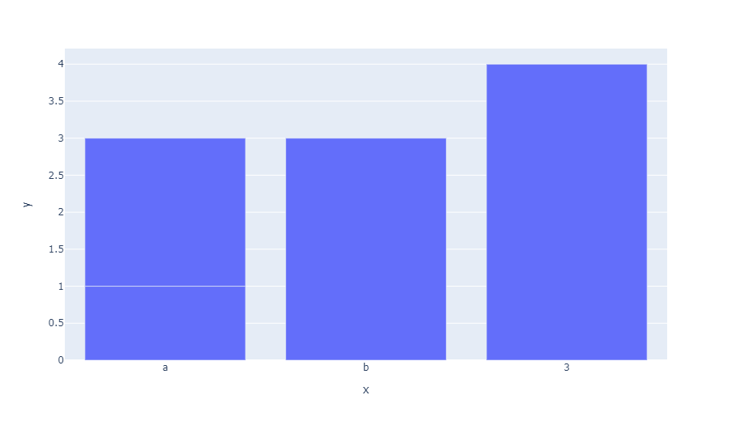
:::

## 类别坐标轴与图线类型

所有的笛卡尔坐标系图线类型都能兼容类别坐标系，并不只是柱状图。

当散点图的其中一个坐标轴是类别信息时，通常也被称为[圆点图](/visualization/plotly/dot-plots)。

```python
from plotly import express as px

df = px.data.medals_long()
fig = px.scatter(df, y="nation", x="count", color="medal", symbol="medal")
fig.update_traces(marker_size=10)
fig.show()
```

::: center
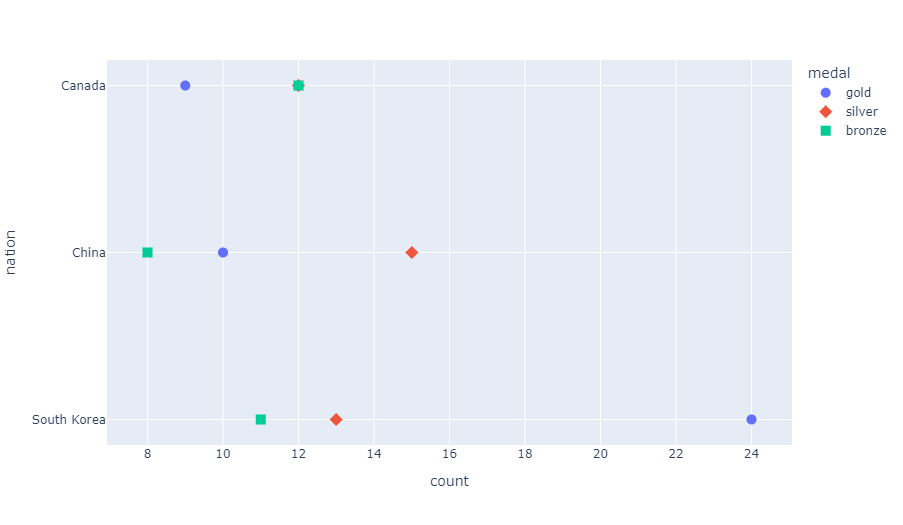
:::

箱线图和提琴图也常见于类别坐标轴＋连续数值坐标轴的组合中。

```python
from plotly import express as px

df = px.data.tips()
fig = px.box(df, x="sex", y="total_bill", color="smoker")
fig.show()
```

::: center
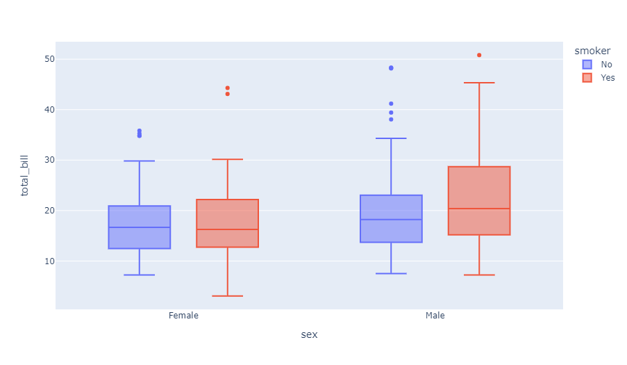
:::

```python
from plotly import express as px

df = px.data.tips()
fig = px.violin(df, x="sex", y="total_bill", color="smoker")
fig.show()
```

::: center
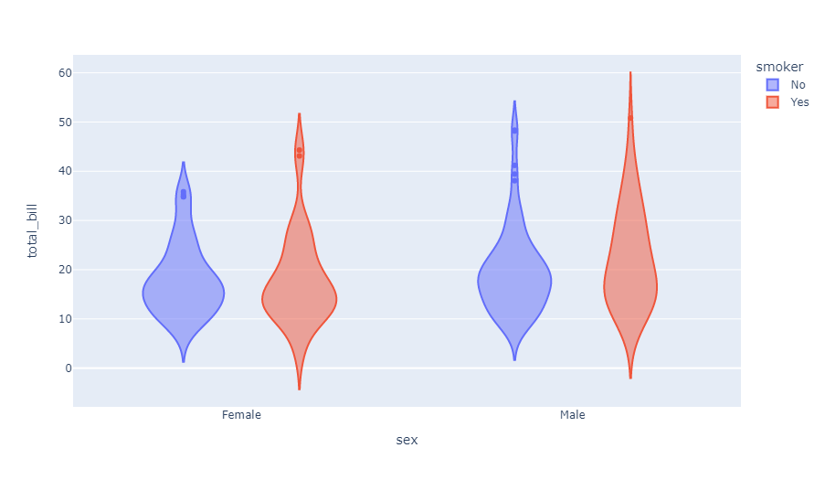
:::

## 用 Plotly Express 控制类别顺序

默认情况下，*Plotly Express* 按照类别出现在给定数据集中的顺序进行排列。所有的二维笛卡尔 *Plotly Express* 函数都有一个`category_orders`关键字参数指定绘制类别坐标轴的顺序，但除此之外，你不但能[控制离散色彩标签出现在图例中的顺序](https://plotly.com/python/discrete-color/)，还能控制[分面图展示的顺序](https://plotly.com/python/facet-plots/)。

```python
from plotly import express as px

df = px.data.tips()
fig = px.bar(
    df, x="day", y="total_bill", color="smoker",
    barmode="group", facet_col="sex", category_orders={
        "day": ["Thur", "Fri", "Sat", "Sun"],
        "smoker": ["Yes", "No"],
        "sex": ["Male", "Female"]
    }
)
fig.show()
```

::: center
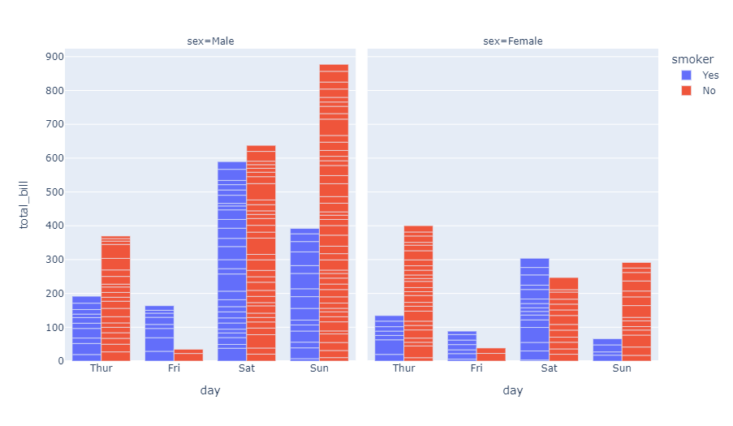
:::

## 按照名称或数值自动排序类别

不管你是否使用 *Plotly Express* ，类别数据都能够用`categoryorder`属性以字典序或数值序进行排序。

将`categoryorder`设置为`"category ascending"`或`"category descending"`可以按照类别名称的字典序排列，设置为`"total ascending"`或`"total descending"`按照数值顺序排列。你可以查阅[layout.xaxis.categoryorder - Python 图表参考](https://plotly.com/python/reference/layout/xaxis/#layout-xaxis-categoryorder)以获取更多信息。

::: warning
按照特定的图线对柱状图进行排序在现阶段是不可能的——因为它只能按照总数进行排序。当然，如果你需要更多的自定义，你总是可以在绘图**之前**对数据进行排序。
:::

```python
from plotly import express as px

x = ['b', 'a', 'c', 'd']
fig = go.Figure(go.Bar(x=x, y=[2, 5, 1, 9], name='Montreal'))
fig.add_trace(go.Bar(x=x, y=[1, 4, 9, 16], name='Ottawa'))
fig.add_trace(go.Bar(x=x, y=[6, 8, 4.5, 8], name='Toronto'))
fig.update_layout(barmode='stack')
fig.update_xaxes(categoryorder='category ascending')
fig.show()
```

::: center
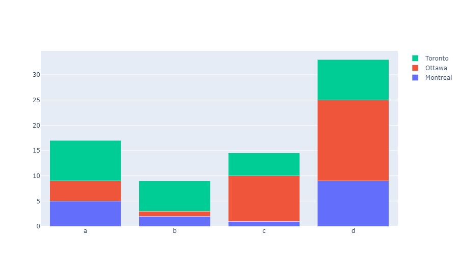
:::

```python
from plotly import express as px

x = ['b', 'a', 'c', 'd']
fig = go.Figure(go.Bar(x=x, y=[2, 5, 1, 9], name='Montreal'))
fig.add_trace(go.Bar(x=x, y=[1, 4, 9, 16], name='Ottawa'))
fig.add_trace(go.Bar(x=x, y=[6, 8, 4.5, 8], name='Toronto'))
fig.update_layout(barmode='stack')
fig.update_xaxes(categoryorder='total ascending')
fig.show()
```

::: center
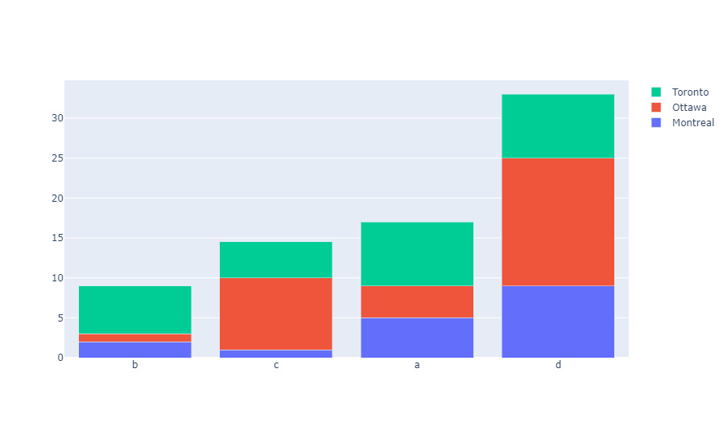
:::

```python
from plotly import express as px

x = ['b', 'a', 'c', 'd']
fig = go.Figure(go.Bar(x=x, y=[2, 5, 1, 9], name='Montreal'))
fig.add_trace(go.Bar(x=x, y=[1, 4, 9, 16], name='Ottawa'))
fig.add_trace(go.Bar(x=x, y=[6, 8, 4.5, 8], name='Toronto'))
fig.update_layout(barmode='stack')
fig.update_xaxes(categoryorder='array', categoryarray= ['d', 'a', 'c', 'b'])
fig.show()
```

::: center
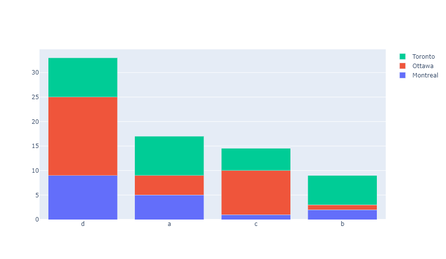
:::

## 网格线、刻度和刻度标签

默认情况下，网格线和刻度在类别坐标轴上不可见，但它们可以人为激活。

```python
from plotly import express as px

fig = px.bar(x=["A", "B", "C"], y=[1, 3, 2])
fig.update_xaxes(showgrid=True, ticks="outside")
fig.show()
```

::: center
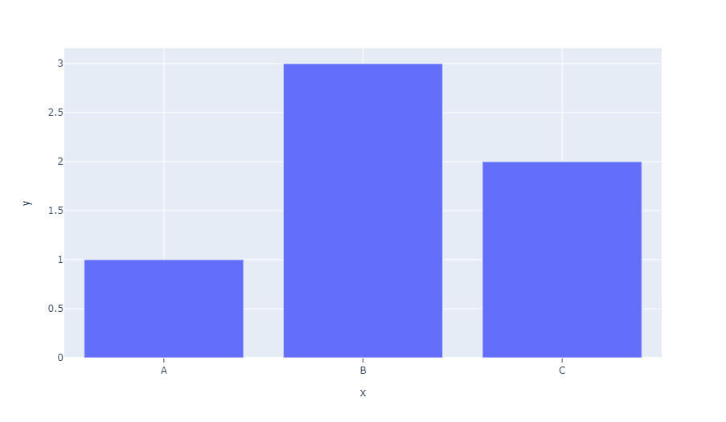
:::

默认情况下，刻度和网格线会在类别数据上展示。但你可以使用`tickson`属性将它们移动到类别数据的边缘。

```python
from plotly import express as px

fig = px.bar(x=["A","B","C"], y=[1,3,2])
fig.update_xaxes(showgrid=True, ticks="outside", tickson="boundaries")
fig.show()
```

::: center
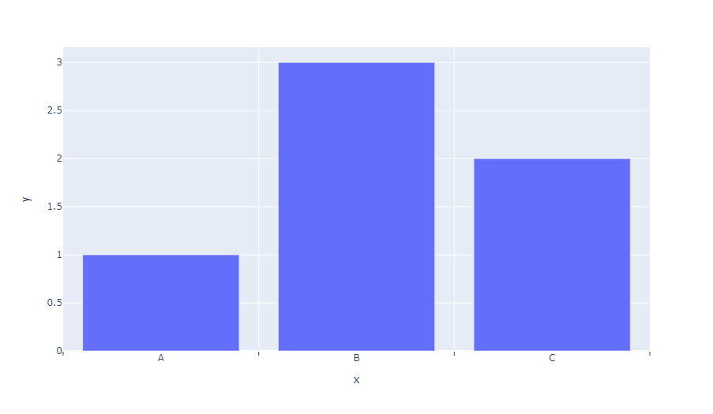
:::

## 多重类别坐标轴

你可以通过将图线的`x`或`y`属性指定为二维列表来创建一个二级分类坐标轴（也被称为分组坐标轴、分类坐标轴或子类别坐标轴）。二位列表首行表示外层分类值，而第2行表示内层分类值。目前这仅适用于 *Graph Objects* 而无法用于 *Plotly Express* 。

```python
from plotly import graph_objects as go

fig = go.Figure()
fig.add_trace(go.Bar(
    x=[['First', 'First', 'Second', 'Second'],
       ["A", "B", "A", "B"]],
    y=[2, 3, 1, 5],
    name="Adults",
))
fig.add_trace(go.Bar(
    x=[['First', 'First', 'Second', 'Second'],
       ["A", "B", "A", "B"]],
    y=[8, 3, 6, 5],
    name="Children",
))
fig.update_layout(title_text="Multi-category axis")
fig.show()
```

::: center
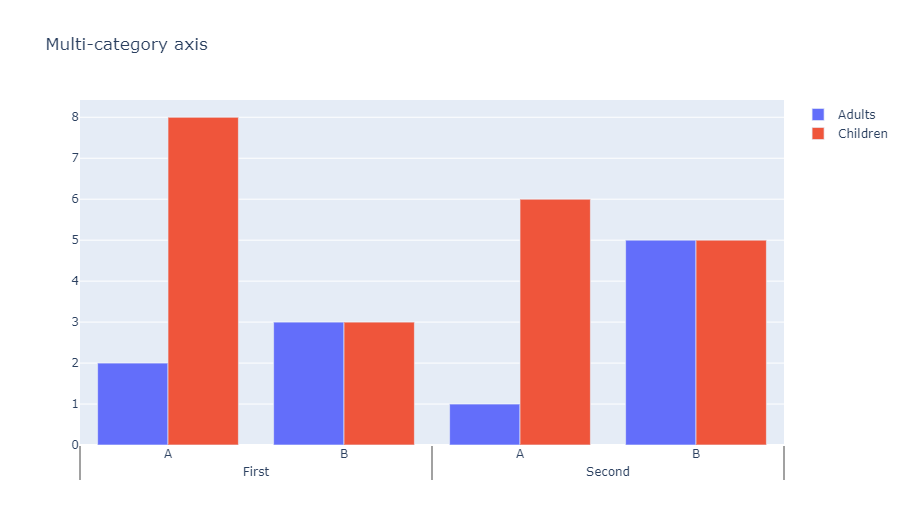
:::

## 参考

更多信息和图表属性选项，请查阅[`layout.xaxis` - Python 图标参考](https://plotly.com/python/reference/layout/xaxis/)。
