:tada: v5.0 新功能！

冰柱图用矩形扇区可视化层级数据，这些扇区可以从中心的根节点向上、下、左、右四个方向之一进行延伸。与[旭日图](/visialization/plotly/sunburst-charts/)和[树形图](/visualization/plotly/treemaps/)类似，这种层级结构由`labels`（*Plotly Express* 称为`names`）和`parents`属性定义。点击一个扇区进行缩放，同时会在冰柱图的上方显示一个路径栏。为了返回上级，你可以点击父扇区或借助路径栏跳转。

## 使用 Plotly Express 绘制冰柱图

[*Plotly Express*](https://plotly.com/python/plotly-express/) 是一个易于使用的 *Plotly* 高级接口，它允许[对各种类型的数据集进行操作](https://plotly.com/python/px-arguments/)并生成[易于个性化的图表](https://plotly.com/python/styling-plotly-express/)。

### 基础冰柱图

借助`px.icicle`，`character`列表中的每一项都将表示为冰柱图中的一个矩形扇区。

```python
from plotly import express as px

data = dict(
    character=["Eve", "Cain", "Seth", "Enos", "Noam", "Abel", "Awan", "Enoch", "Azura"],
    parent=["", "Eve", "Eve", "Seth", "Seth", "Eve", "Eve", "Awan", "Eve" ],
    value=[10, 14, 12, 10, 2, 6, 6, 4, 4]
)
fig = px.icicle(data, names='character', parents='parent', values='value')
fig.update_traces(root_color="lightgrey")
fig.update_layout(margin=dict(t=50, l=25, r=25, b=25))
fig.show()
```

::: center
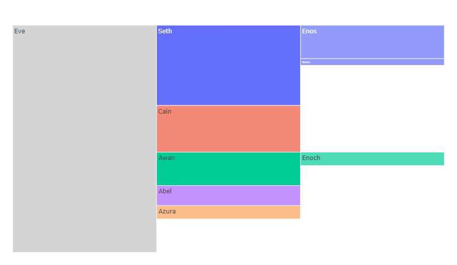
:::

### 矩形 DataFrame 数据表

层次结构数据也经常以矩形数据表的形式存储，不同的列代表层次结构中的不同层级。`px.icicle`能够将一个`path`参数视为表示数据列名称的列表。

::: warning
当指定了`path`参数时，`id`和`parent`参数不应被指定！
:::

```python
from plotly import express as px

df = px.data.tips()
fig = px.icicle(
    df, values='total_bill',
    path=[px.Constant("all"), 'day', 'time', 'sex']
)
fig.update_traces(root_color="lightgrey")
fig.update_layout(margin=dict(t=50, l=25, r=25, b=25))
fig.show()
```

::: center

:::

### 连续色彩参数

当传递了一个`color`参数时，每个节点的颜色将由其所有子节点的平均色彩计算得出，色彩深度则由他们各自的数值决定。

```python
from plotly import express as px
import numpy as np

df = px.data.gapminder().query("year == 2007")
fig = px.icicle(
    df, values='pop', color_continuous_scale='RdBu',
     path=[px.Constant("world"), 'continent', 'country'],
     color='lifeExp', hover_data=['iso_alpha'],
     color_continuous_midpoint=np.average(df.lifeExp, weights=df.pop)
)
fig.update_layout(margin=dict(t=50, l=25, r=25, b=25))
fig.show()
```

::: center
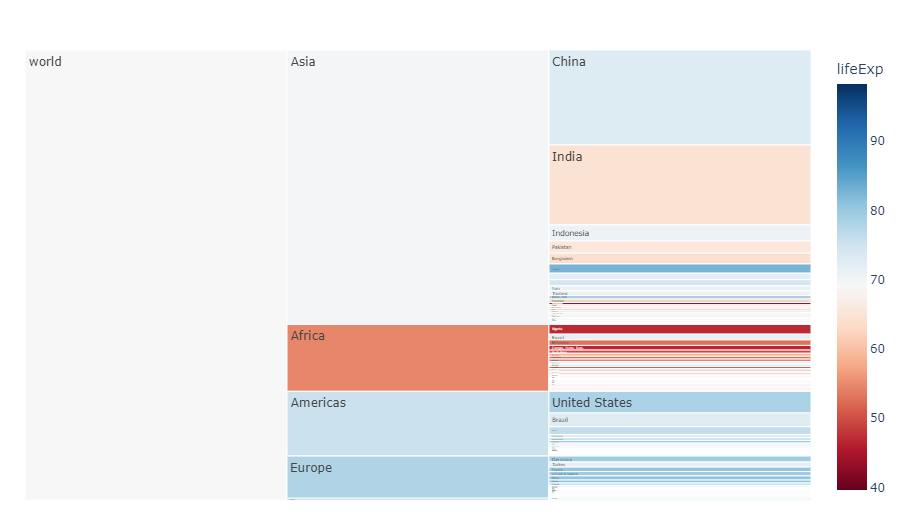
:::

### 离散色彩参数

当`color`参数的值是非数值数据时，*Plotly Express* 会使用离散色彩模式。如果一个扇区的颜色与其所有的子扇区的颜色相同，那么 *Plotly Express* 会直接使用指定的颜色，否则 *Plotly Express* 会使用列表中第1个元素指定的颜色。

```python
from plotly import express as px

df = px.data.tips()
fig = px.icicle(df, path=[px.Constant("all"), 'sex', 'day', 'time'],
                values='total_bill', color='day')
fig.update_layout(margin = dict(t=50, l=25, r=25, b=25))
fig.show()
```

::: center
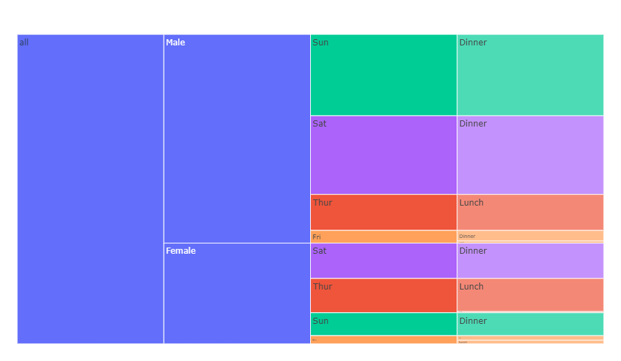
:::

### 离散色彩的显式映射

更多关于 **离散色彩** 的信息，请查阅[此页面](https://plotly.com/python/discrete-color/)。

```python
from plotly import express as px

df = px.data.tips()
fig = px.icicle(
    df, path=[px.Constant("all"), 'sex', 'day', 'time'],
    values='total_bill', color='time',
    color_discrete_map={
      '(?)':'lightgrey',
      'Lunch':'gold',
      'Dinner':'darkblue'
    }
)
fig.update_layout(margin=dict(t=50, l=25, r=25, b=25))
fig.show()
```

::: center
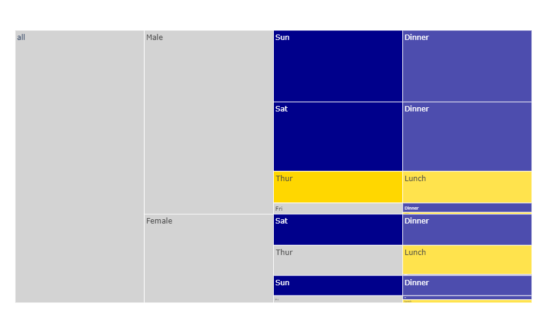
:::

### 带有缺失值的数据表

如果数据集不是完整的矩形，缺失值需要以`None`提供。需要注意的是，`None`必须是叶子节点，它不能拥有除了`None`之外的子节点（否则 *Plotly Express* 会抛出`ValueError`）。

```python
from plotly import express as px
import pandas as pd

vendors = ["A", "B", "C", "D", None, "E", "F", "G", "H", None]
sectors = ["Tech", "Tech", "Finance", "Finance", "Other",
           "Tech", "Tech", "Finance", "Finance", "Other"]
regions = ["North", "North", "North", "North", "North",
           "South", "South", "South", "South", "South"]
sales = [1, 3, 2, 4, 1, 2, 2, 1, 4, 1]
df = pd.DataFrame(dict(vendors=vendors, sectors=sectors,
                       regions=regions, sales=sales))
df.loc[:, 'all'] = "all"    # 为了获取统一的根节点
print(df)

fig = px.icicle(df, path=['all', 'regions', 'sectors', 'vendors'], values='sales')
fig.update_traces(root_color='lightgrey')
fig.update_layout(margin=dict(t=50, l=25, r=25, b=25))
fig.show()
```

```
  vendors  sectors regions  sales  all
0       A     Tech   North      1  all
1       B     Tech   North      3  all
2       C  Finance   North      2  all
3       D  Finance   North      4  all
4    None    Other   North      1  all
5       E     Tech   South      2  all
6       F     Tech   South      2  all
7       G  Finance   South      1  all
8       H  Finance   South      4  all
9    None    Other   South      1  all
```

::: center
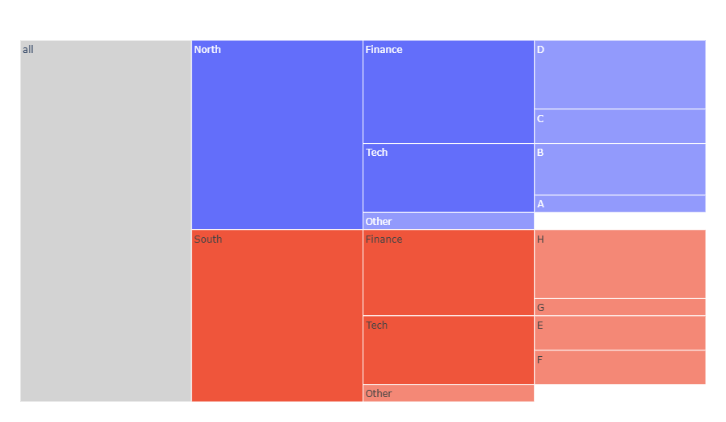
:::

## 使用 Graph Objects 绘制冰柱图

如果 *Plotly Express* 没法让你很好地上手，你也可以选择[`plotly.graph_objects`](https://plotly.com/python/graph-objects/)中更为通用的`go.Icicle`类。

### 基础冰柱图

主要参数：

1. `labels`（*Plotly Express* 中使用`names`因为它已经被用于覆盖列名）：冰柱图各扇区的标签
2. `parents`：各冰柱扇区的父扇区名称。默认情况下，根扇区会使用空字符串`''`作为其名称。
3. `values`：设置与冰柱扇区相关的值，这将决定它们的宽度（请查阅后续另一种用`branchvalues`设置宽度的方式）。

```python
from plotly import graph_objects as go

fig = go.Figure(go.Icicle(
    labels=["Eve", "Cain", "Seth", "Enos", "Noam", "Abel", "Awan", "Enoch", "Azura"],
    parents=["", "Eve", "Eve", "Seth", "Seth", "Eve", "Eve", "Awan", "Eve" ],
    values=[10, 14, 12, 10, 2, 6, 6, 4, 4],
    root_color="lightgrey"
))
fig.update_layout(margin=dict(t=50, l=25, r=25, b=25))
fig.show()
```

::: center

:::

### 重复标签

```python
from plotly import graph_objects as go

fig = go.Figure(go.Icicle(
    ids=["Sports", "North America", "Europe", "Australia",
         "North America - Football", "Soccer", 
         "North America - Rugby", "Europe - Football", "Rugby",
         "Europe - American Football","Australia - Football",
         "Association", "Australian Rules", "Autstralia - American Football",
         "Australia - Rugby", "Rugby League", "Rugby Union"],
    labels= ["Sports", "North<br>America", "Europe", "Australia",
             "Football", "Soccer", "Rugby", "Football", "Rugby",
             "American<br>Football", "Football", "Association",
             "Australian<br>Rules", "American<br>Football",
             "Rugby", "Rugby<br>League", "Rugby<br>Union"],
    parents=["", "Sports", "Sports", "Sports", "North America",
             "North America", "North America", "Europe", "Europe",
             "Europe","Australia", "Australia - Football",
             "Australia - Football", "Australia - Football",
             "Australia - Football", "Australia - Rugby",
             "Australia - Rugby"],
    root_color="lightgrey"
))
fig.update_layout(margin = dict(t=50, l=25, r=25, b=25))
fig.show()
```

::: center
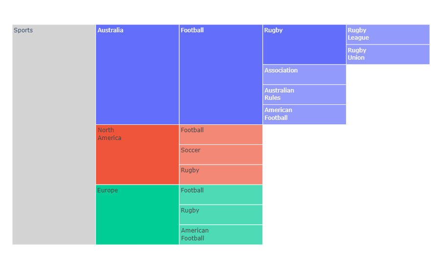
:::

### Branchvalues

将`branchvalues`设置为`total`，父结点的值表示此扇区的高度/宽度。在下面这个例子中，`"Enoch"`是4、`"Awan"`是6，因此`Enoch`的高度是`Awan`的 $2/3$ 。将`branchvalues`设置为`remainder`，父节点的宽度由它自己的数值加上所有子节点的数值决定，因此`Enoch`的高度是`Awan`的 $2/5$ （$4 \div (6 + 4)$）。

::: warning
这说明在`branchvalues == "total"`时，所有子节点的数值总和不能大于它们的父节点。当`branchvalues == "remainder"`（默认设置），子节点不会占满父节点的所有空间（除非父节点是根节点且数值为0）。

```python
from plotly import graph_objects as go

fig = go.Figure(go.Icicle(
    labels=["Eve", "Cain", "Seth", "Enos", "Noam", "Abel", "Awan", "Enoch", "Azura"],
    parents=[  "",  "Eve",  "Eve", "Seth", "Seth",  "Eve",  "Eve",  "Awan",   "Eve"],
    values=[  65,    14,     12,     10,     2,      6,      6,      4,       4],
    branchvalues="total", root_color="lightgrey"
))
fig.update_layout(margin = dict(t=50, l=25, r=25, b=25))
fig.show()
```

::: center
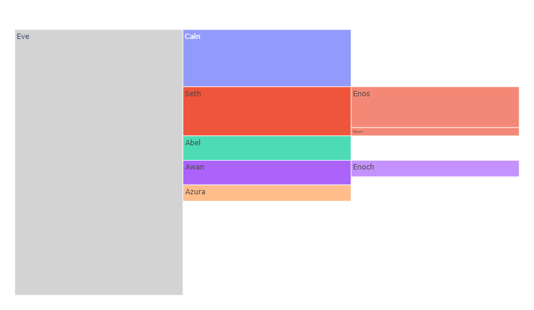
:::

### 大量扇区

这个例子使用了[*Plotly* `grid`参数](https://plotly.com/python/reference/layout/#layout-grid)创建子图，用[`domain`](https://plotly.com/python/reference/icicle/#icicle-domain)属性指定行/列位置。

```python
from plotly import graph_objects as go
import pandas as pd

df = pd.read_csv('https://raw.githubusercontent.com/plotly/datasets/'
                 '96c0bd/sunburst-coffee-flavors-complete.csv')

fig = go.Figure()
fig.add_trace(go.Icicle(
    ids=df.ids, labels=df.labels,
    parents=df.parents, root_color="lightgrey"
))
fig.update_layout(margin = dict(t=50, l=25, r=25, b=25))
fig.show()
```

::: center
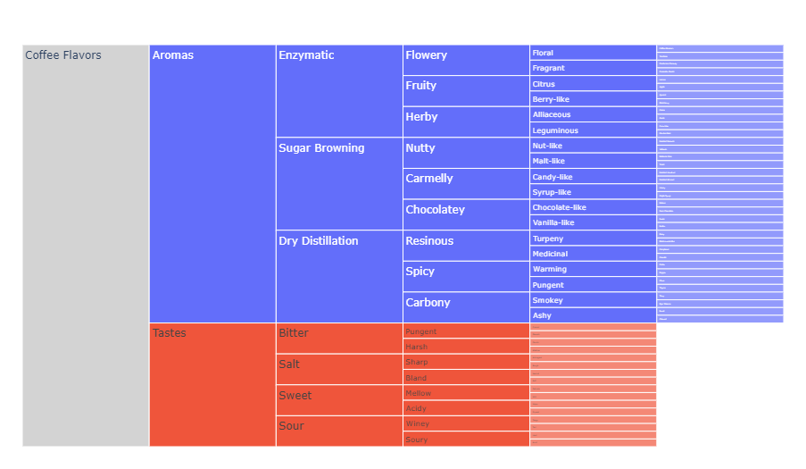
:::

### 统一字号控制

```python
from plotly import graph_objects as go
import pandas as pd

df = pd.read_csv('https://raw.githubusercontent.com/plotly/datasets/'
                 '96c0bd/sunburst-coffee-flavors-complete.csv')

fig = go.Figure(go.Icicle(
    ids=df.ids, labels=df.labels,
    parents=df.parents, root_color="lightgrey"
))
fig.update_layout(
    uniformtext=dict(minsize=10, mode='hide'),
    margin=dict(t=50, l=25, r=25, b=25)
)
fig.show()
```

::: center
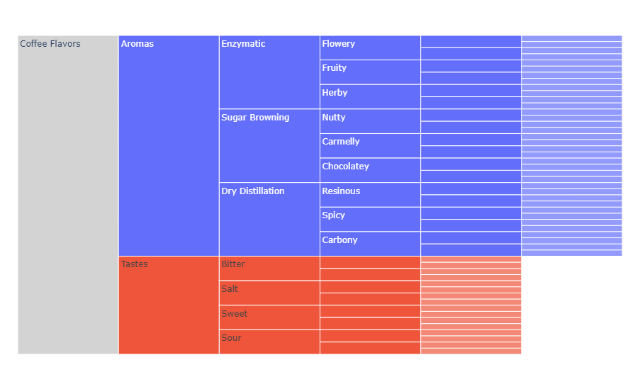
:::

### 连续色彩范围

```python
from plotly import graph_objects as go
from plotly.subplots import make_subplots
import pandas as pd

df = pd.read_csv('https://raw.githubusercontent.com/plotly/'
                 'datasets/master/sales_success.csv')
print(df.head())

levels = ['salesperson', 'county', 'region'] # levels used for the hierarchical chart
color_columns = ['sales', 'calls']
value_column = 'calls'


def build_hierarchical_dataframe(df, levels, value_column, color_columns=None):
    """
    Build a hierarchy of levels for Icicle charts.

    Levels are given starting from the bottom to the top of the hierarchy,
    ie the last level corresponds to the root.
    """
    df_all_trees = pd.DataFrame(columns=['id', 'parent', 'value', 'color'])
    for i, level in enumerate(levels):
        df_tree = pd.DataFrame(columns=['id', 'parent', 'value', 'color'])
        dfg = df.groupby(levels[i:]).sum()
        dfg = dfg.reset_index()
        df_tree.loc[:, 'id'] = dfg.level.copy()
        if i < len(levels) - 1:
            df_tree.loc[:, 'parent'] = dfg.loc[:, levels[i + 1]].copy()
        else:
            df_tree.loc[:, 'parent'] = 'total'
        df_tree.loc[:, 'value'] = dfg.loc[:, value_column]
        df_tree.loc[:, 'color'] = dfg.loc[:, color_columns[0]] / dfg.loc[:, color_columns[1]]
        df_all_trees = df_all_trees.append(df_tree, ignore_index=True)
    total = pd.Series(dict(
        id='total', parent='', value=df.loc[:, value_column].sum(),
        color=df[color_columns[0]].sum() / df[color_columns[1]].sum()
    ))
    df_all_trees = df_all_trees.append(total, ignore_index=True)
    return df_all_trees


df_all_trees = build_hierarchical_dataframe(df, levels, value_column, color_columns)
average_score = df.sales.sum() / df.calls.sum()

fig = make_subplots(1, 2, specs=[
    [{"type": "domain"}, {"type": "domain"}]
])
fig.add_trace(go.Icicle(
    labels=df_all_trees.id, parents=df_all_trees.parent,
    values=df_all_trees.value, branchvalues='total',
    marker=dict(colors=df_all_trees.color, colorscale='RdBu',
                cmid=average_score), name='',
    hovertemplate=('<b>%{label} </b> <br> Sales: %{value}'
                   '<br> Success rate: %{color:.2f}'),
), 1, 1)
fig.add_trace(go.Icicle(
    labels=df_all_trees.id, parents=df_all_trees.parent,
    values=df_all_trees.value,
    branchvalues='total',
    marker=dict(colors=df_all_trees['color'], colorscale='RdBu',
                cmid=average_score), maxdepth=2,
    hovertemplate=('<b>%{label} </b> <br> Sales: %{value}'
                   '<br> Success rate: %{color:.2f}'),
), 1, 2)
fig.update_layout(margin=dict(t=50, l=25, r=25, b=25))
fig.show()
```

```
   Unnamed: 0 region   county salesperson  calls  sales
0           0  North   Dallam          JE     35     23
1           1  North   Dallam          ZQ     49     13
2           2  North   Dallam          IJ     20      6
3           3  North  Hartley          WE     39     37
4           4  North  Hartley          PL     42     37
```

::: center
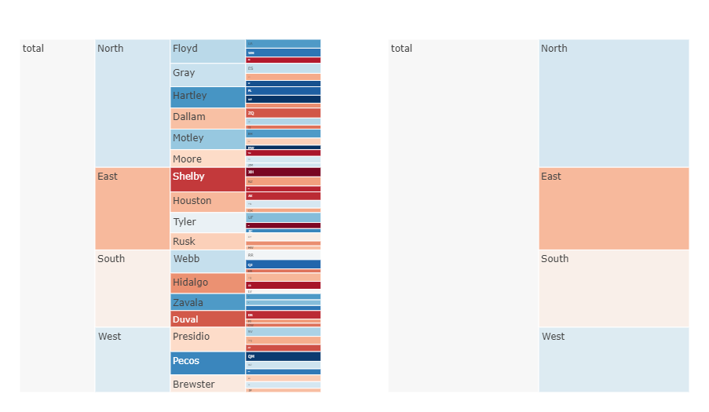
:::

### 设置扇区的颜色

```python
from plotly import graph_objects as go

labels = ["container", "A1", "A2", "A3", "A4", "A5", "B1", "B2"]
parents = ["", "container", "A1", "A2", "A3", "A4", "container", "B1"]

fig = go.Figure(go.Icicle(
    labels=labels, parents=parents, marker_colors=[
        "pink", "royalblue", "lightgray", "purple", 
        "cyan", "lightgray", "lightblue", "lightgreen"
    ]
))
fig.update_layout(margin=dict(t=50, l=25, r=25, b=25))
fig.show()
```

::: center
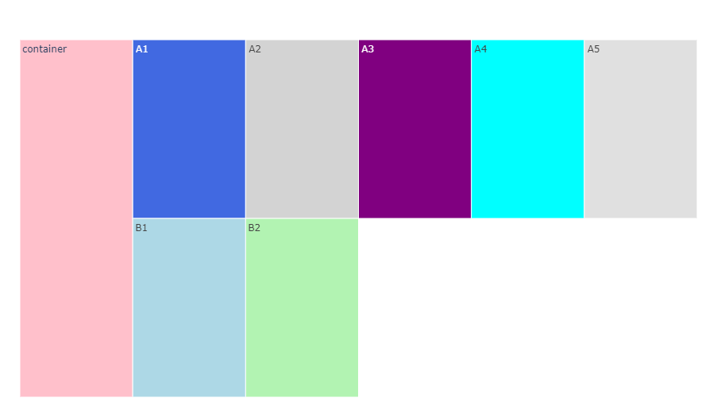
:::

### 设置图表方向

我们在上面提到，冰柱图可以向四个方向之一延伸。冰柱图拥有一个`tiling`属性，其下含有2个属性：`orientation`和`flip`。`orientation`接受`h`（水平）或`v`（竖直）值，`flip`接受`x`或`y`（翻转轴）。你可以借助这两个属性的组合以生成四个方向的图表。

#### 向上（火焰图）

```python
from plotly import graph_objects as go
import pandas as pd

df = pd.read_csv('https://raw.githubusercontent.com/plotly/datasets/'
                 '96c0bd/sunburst-coffee-flavors-complete.csv')
fig = go.Figure(go.Icicle(
    ids=df.ids, labels=df.labels,
    parents=df.parents, root_color="lightgrey",
    tiling = dict(orientation='v', flip='y')
))
fig.update_layout(margin=dict(t=50, l=25, r=25, b=25))
fig.show()
```

::: center
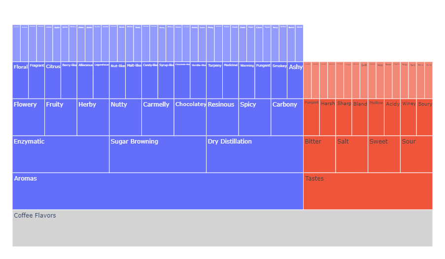
:::

#### 向下（冰柱图）

```python
from plotly import graph_objects as go
import pandas as pd

df = pd.read_csv('https://raw.githubusercontent.com/plotly/datasets/'
                 '96c0bd/sunburst-coffee-flavors-complete.csv')

fig = go.Figure(go.Icicle(
    ids=df.ids, labels=df.labels, parents=df.parents,
    root_color="lightgrey", tiling=dict(orientation='v')
))
fig.update_layout(margin=dict(t=50, l=25, r=25, b=25))
fig.show()
```

::: center
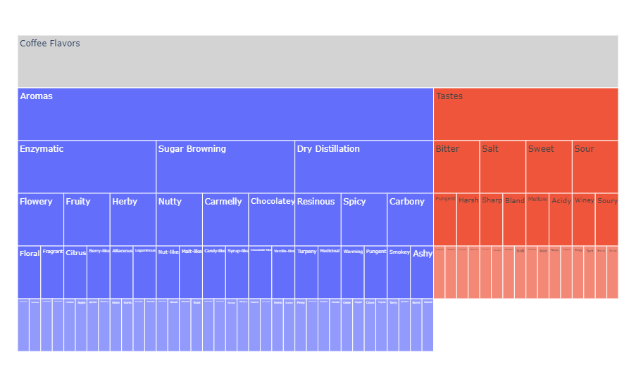
:::

#### 向右

```python
from plotly import graph_objects as go
import pandas as pd

df = pd.read_csv('https://raw.githubusercontent.com/plotly/datasets/'
                 '96c0bd/sunburst-coffee-flavors-complete.csv')

fig = go.Figure(go.Icicle(
    ids=df.ids, labels=df.labels, parents=df.parents,
    root_color="lightgrey", tiling=dict(orientation='h')
))
fig.update_layout(margin=dict(t=50, l=25, r=25, b=25))
fig.show()
```

::: center

:::

#### 向左

```python
from plotly import graph_objects as go
import pandas as pd

df = pd.read_csv('https://raw.githubusercontent.com/plotly/datasets/'
                 '96c0bd/sunburst-coffee-flavors-complete.csv')

fig = go.Figure(go.Icicle(
    ids=df.ids, labels=df.labels, parents=df.parents,
    root_color="lightgrey", tiling=dict(orientation='h', flip='x')
))
fig.update_layout(margin=dict(t=50, l=25, r=25, b=25))
fig.show()
```

::: center
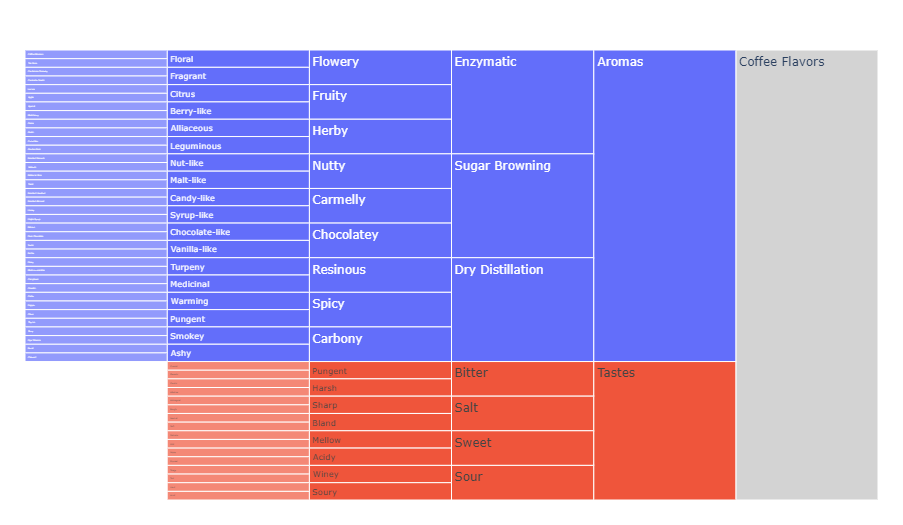
:::

## 参考

- [`px.icicle()`函数参考](https://plotly.com/python-api-reference/generated/plotly.express.icicle)
- [冰柱图 - Python 图表参考](https://plotly.com/python/reference/icicle/)
