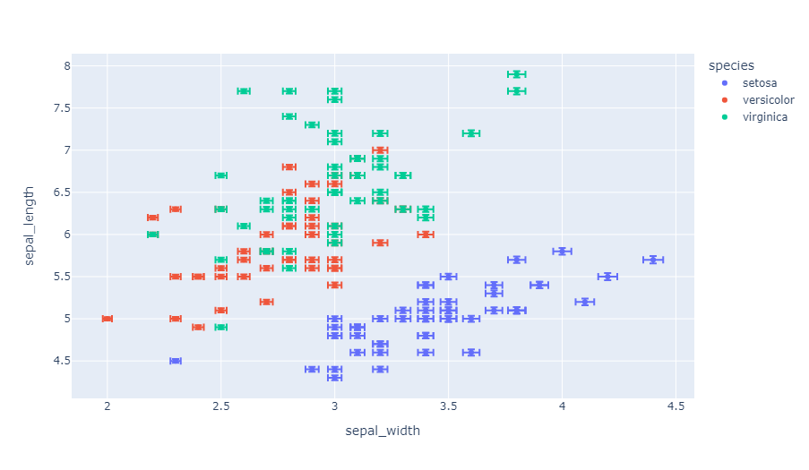
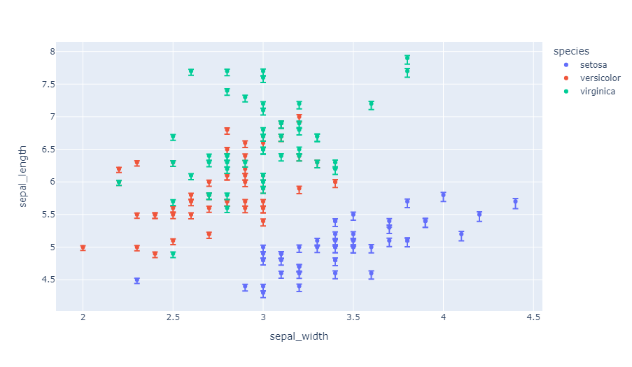
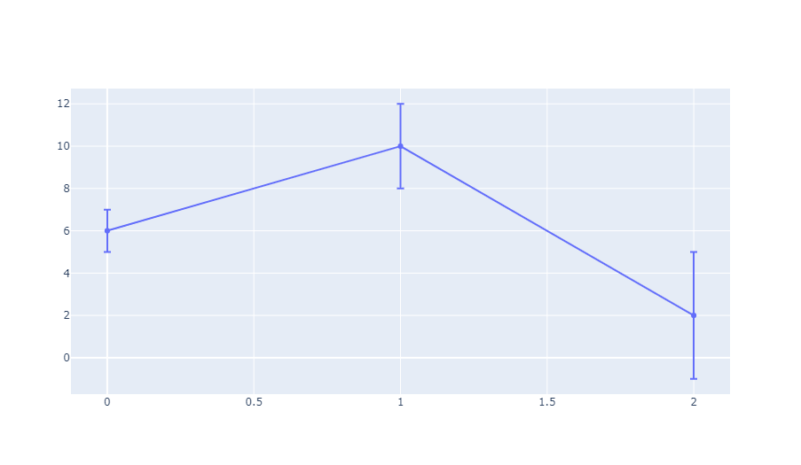
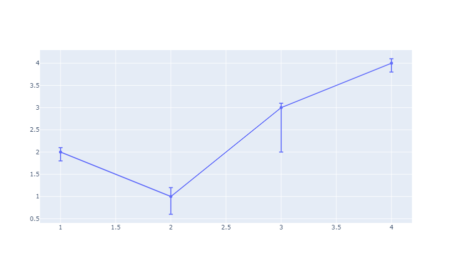
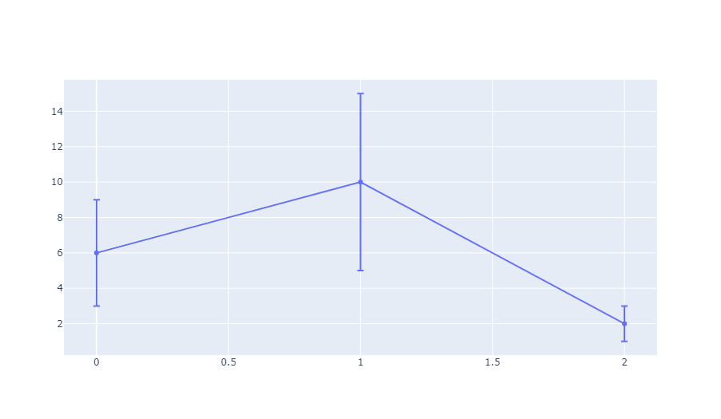
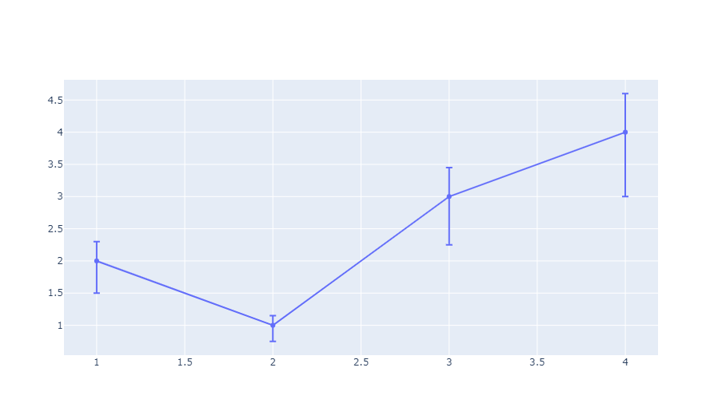
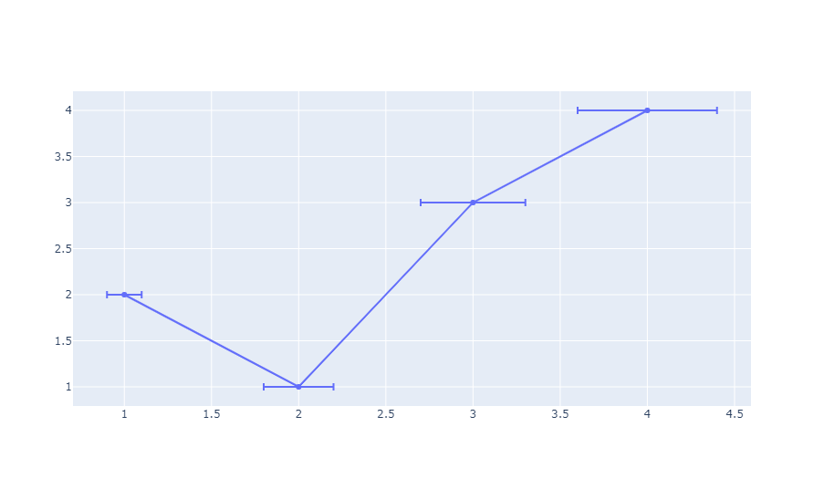
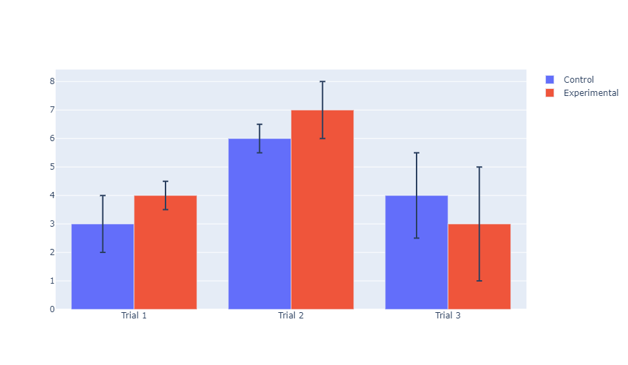
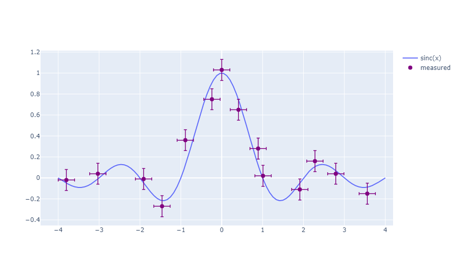

## 使用 Plotly Express 绘制

### 误差柱状图

对于所有用于描述二维数据点的函数，比如[`px.scatter`](/visualization/plotly/line-and-scatter/)、[`px.line`](/visualization/plotly/line-charts/)和[`px.bar`](/visualization/plotly/bar-charts/)，误差柱状图可以通过指定`error_x`（X轴方向上的误差）和`error_y`（Y轴方向上的误差）对应的列名生成。

```python
from plotly import express as px

df = px.data.iris()
df.loc[:, 'e'] = df.loc[:, "sepal_width"] / 100
fig = px.scatter(df, x="sepal_width", y="sepal_length", 
                 color="species", error_x="e", error_y="e")
fig.show()
```

::: center

:::

### 非对称误差柱状图

```python
from plotly import express as px

df = px.data.iris()
df.loc[:, "e_plus"] = df.loc[:, "sepal_width"] / 100
df.loc[:, "e_minus"] = df.loc[:, "sepal_width"] / 40
fig = px.scatter(df, x="sepal_width", y="sepal_length", color="species",
                 error_y="e_plus", error_y_minus="e_minus")
fig.show()
```

::: center

:::

## 使用 Graph Objects 绘制

### 基础对称误差柱状图

```python
from plotly import graph_objects as go

fig = go.Figure(data=go.Scatter(
    x=[0, 1, 2],
    y=[6, 10, 2],
    error_y=dict(
        type='data',  # 误差以绝对数值形式提供
        array=[1, 2, 3], visible=True
    )
))
fig.show()
```

::: center

:::

### 非对称误差柱状图

```python
from plotly import graph_objects as go

fig = go.Figure(data=go.Scatter(
    x=[1, 2, 3, 4], y=[2, 1, 3, 4],
    error_y=dict(
        type='data', symmetric=False,
        array=[0.1, 0.2, 0.1, 0.1],
        arrayminus=[0.2, 0.4, 1, 0.2]
    )
))
fig.show()
```

::: center

:::

### 百分比误差

```python
from plotly import graph_objects as go

fig = go.Figure(data=go.Scatter(
    x=[0, 1, 2], y=[6, 10, 2],
    error_y=dict(
        type='percent', # 误差以Y轴数值的百分比表示
        value=50, visible=True
    )
))
fig.show()
```

::: center

:::

### 恒定偏移量的非对称误差柱状图

```python
from plotly import graph_objects as go

fig = go.Figure(data=go.Scatter(
    x=[1, 2, 3, 4], y=[2, 1, 3, 4],
    error_y=dict(
        type='percent', symmetric=False,
        value=15, valueminus=25
    )
))
fig.show()
```

::: center

:::

### 水平误差条形图

```python
from plotly import graph_objects as go

fig = go.Figure(data=go.Scatter(
    x=[1, 2, 3, 4], y=[2, 1, 3, 4],
    error_x=dict(type='percent', value=10)
))
fig.show()
```

::: center

:::

### 带有误差信息的柱状图

```python
from plotly import graph_objects as go

fig = go.Figure()
fig.add_trace(go.Bar(
    name='Control', x=['Trial 1', 'Trial 2', 'Trial 3'],
    y=[3, 6, 4], error_y=dict(type='data', array=[1, 0.5, 1.5])
))
fig.add_trace(go.Bar(
    name='Experimental', x=['Trial 1', 'Trial 2', 'Trial 3'],
    y=[4, 7, 3], error_y=dict(type='data', array=[0.5, 1, 2])
))
fig.update_layout(barmode='group')
fig.show()
```

::: center

:::

### 颜色与样式

```python
from plotly import graph_objects as go
import numpy as np

x_theo = np.linspace(-4, 4, 100)
sincx = np.sinc(x_theo)
x = [-3.8, -3.03, -1.91, -1.46, -0.89, -0.24, -0.0,
     0.41, 0.89, 1.01, 1.91, 2.28, 2.79, 3.56]
y = [-0.02, 0.04, -0.01, -0.27, 0.36, 0.75, 1.03,
     0.65, 0.28, 0.02, -0.11, 0.16, 0.04, -0.15]

fig = go.Figure()
fig.add_trace(go.Scatter(x=x_theo, y=sincx, name='sinc(x)'))
fig.add_trace(go.Scatter(
    x=x, y=y, mode='markers', name='measured',
    error_y=dict(type='constant', value=0.1, color='purple',
                 thickness=1.5, width=3),
    error_x=dict(type='constant', value=0.2, color='purple',
                 thickness=1.5, width=3),
    marker=dict(color='purple', size=8)
))
fig.show()
```

::: center

:::

## 参考

更多信息和图表属性选项，请查阅[散点图 - Python 图表参考](https://plotly.com/python/reference/scatter/)！