[箱线图](https://www.jmp.com/zh_cn/statistics-knowledge-portal/exploratory-data-analysis/box-plot.html)是用其四分位描述变量分布的一种统计学表示。箱型的两个端点分别表示下四分位和上四分位，而中位数（第二个四分位点）用箱型内部的一条线表示。关于数值型数据的其他统计学表示，请查阅[其他统计学图表](/visualization/#统计学图表)。

除了箱线图，能够可视化变量分布情况的图表还包括[频率分布直方图](/visualization/plotly/histograms/)、[提琴图](https://plotly.com/python/violin/)、[ECDF图](https://plotly.com/python/ecdf-plots/)和[带状图](https://plotly.com/python/strip-charts/)。

## 使用 Plotly Express 绘制箱线图

在使用`px.box`创建的箱线图中，由`y`参数指定的列的分布将被表示。

```python
from plotly import express as px

df = px.data.tips()
fig = px.box(df, y="total_bill")
fig.show()
```

::: center
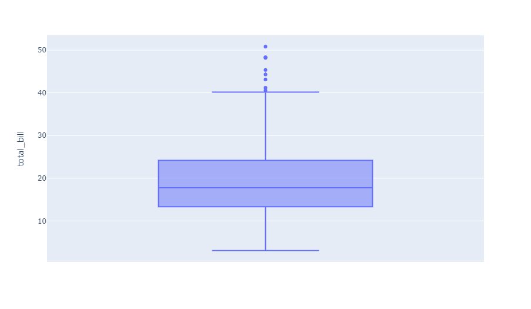
:::

如果一个列名以`x`参数的形式指定，那么会为每一个`x`值生成一个箱线图。

```python
from plotly import express as px

df = px.data.tips()
fig = px.box(df, x="time", y="total_bill")
fig.show()
```

::: center
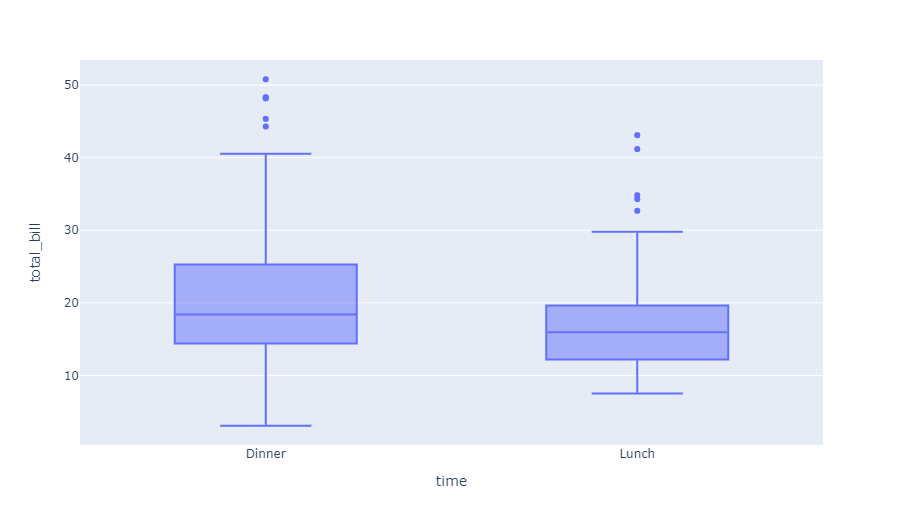
:::

### 展示底层数据

使用`points`参数，我们可以选择以所有数据点（`all`）的形式、仅展示离域点（`outliers`，默认）或不展示任何点（`False`）的方式显示底层数据点。

```python
from plotly import express as px

df = px.data.tips()
fig = px.box(df, x="time", y="total_bill", points="all")
fig.show()
```

::: center
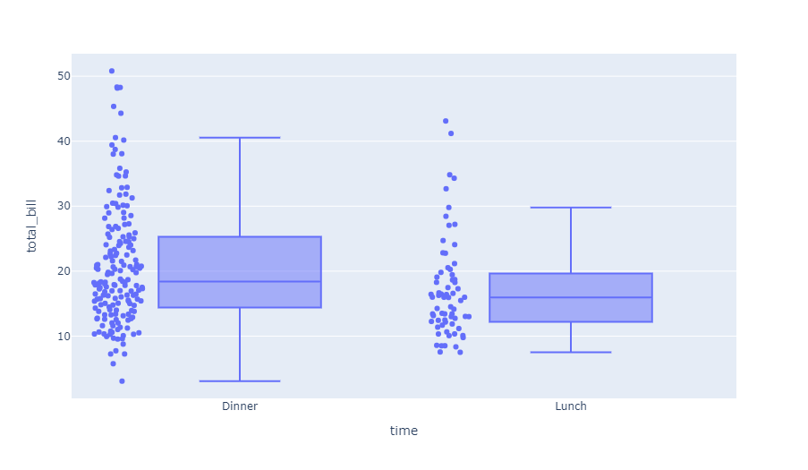
:::

### 选择四分位算法

默认情况下，箱线图的四分位数是以线性方法（有关更多线性插值的内容，请查阅[此文档](http://jse.amstat.org/v14n3/langford.html)中的**方法10**，或者[MBA智库](https://wiki.mbalib.com/wiki/%E5%9B%9B%E5%88%86%E4%BD%8D%E6%95%B0)）计算得出的。

然而，你还可以选择使用一个`inclusive`（包含）或`exclusive`（排除）算法去计算四分位数。

**排除算法**使用中位数将有序数据集分为两半。如果样本数量是偶数，它将不会在任何一半包含这个中位数。下四分位数是下半数据集的中位数，上四分位数是上半数据集的中位数。

**包含算法**同样使用中位数将有序数据集分为两半。但当样本数量是偶数时，它会同时在两侧包含中位数。下四分位数是下班数据集的中位数，上四分位数是上半数据集的中位数。

```python
from plotly import express as px

df = px.data.tips()

fig = px.box(df, x="day", y="total_bill", color="smoker")
fig.update_traces(quartilemethod="exclusive") # or "inclusive", or "linear" by default
fig.show()
```

::: center
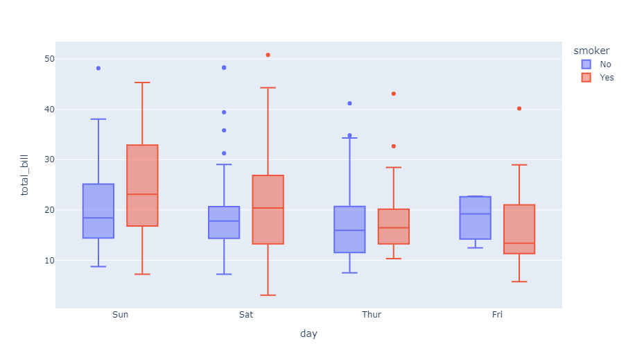
:::

### 四分位算法之间的区别

许多时候，我们难以在线性、包含和排除算法中看出计算四分位数的区别。在下面的例子中，我们以三种不同的四分位数计算方法可视化相同的数据集。

```python
from plotly import express as px
import pandas as pd

data = [1,2,3,4,5,6,7,8,9]
df = pd.DataFrame(
    dict(linear=data,inclusive=data, exclusive=data)
).melt(var_name="quartilemethod")


fig = px.box(df, y="value", facet_col="quartilemethod",
             color="quartilemethod", boxmode="overlay",
             points='all')

fig.update_traces(quartilemethod="linear", jitter=0, col=1)
fig.update_traces(quartilemethod="inclusive", jitter=0, col=2)
fig.update_traces(quartilemethod="exclusive", jitter=0, col=3)

fig.show()
```

::: center
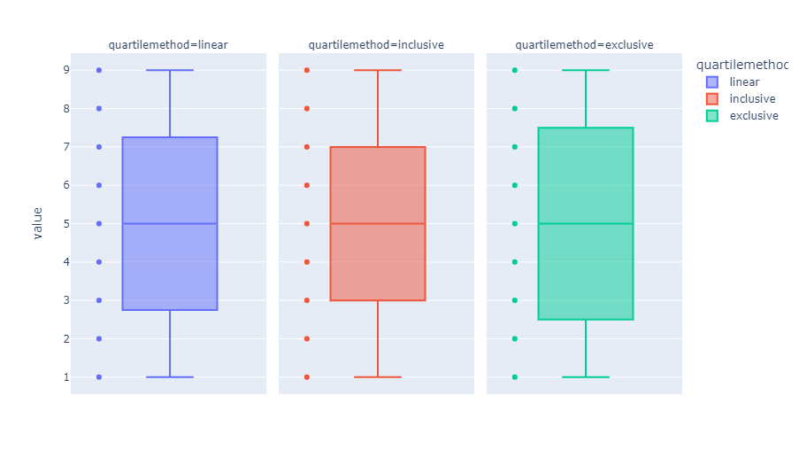
:::

### 箱线图的样式

有关缺口的解释，请查阅[此文档（英文）](https://en.wikipedia.org/wiki/Box_plot#Variations)。

```python
from plotly import express as px

df = px.data.tips()
fig = px.box(
    df, x="time", y="total_bill", color="smoker",
    notched=True,                      # used notched shape
    title="Box plot of total bill",
    hover_data=["day"]                 # add day column to hover data
)
fig.show()
```

::: center
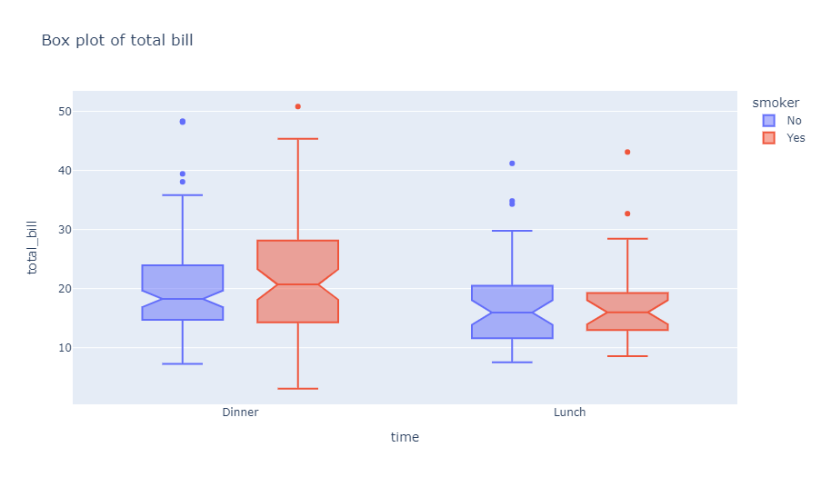
:::

## 使用 Graph Objects 绘制箱线图

如果 *Plotly Express* 不能让你很好地上手绘图，也可以使用[`plotly.graph_objects`](https://plotly.com/python/graph-objects/)中更为通用的`go.Box`类。`go.Box`中所有可用的选项都在[参考手册](https://plotly.com/python/reference/box/)中有所描述。

### 基础箱线图

```python
from plotly import graph_objects as go
import numpy as np
np.random.seed(1)

y0 = np.random.randn(50) - 1
y1 = np.random.randn(50) + 1

fig = go.Figure()
fig.add_trace(go.Box(y=y0))
fig.add_trace(go.Box(y=y1))

fig.show()
```

::: center
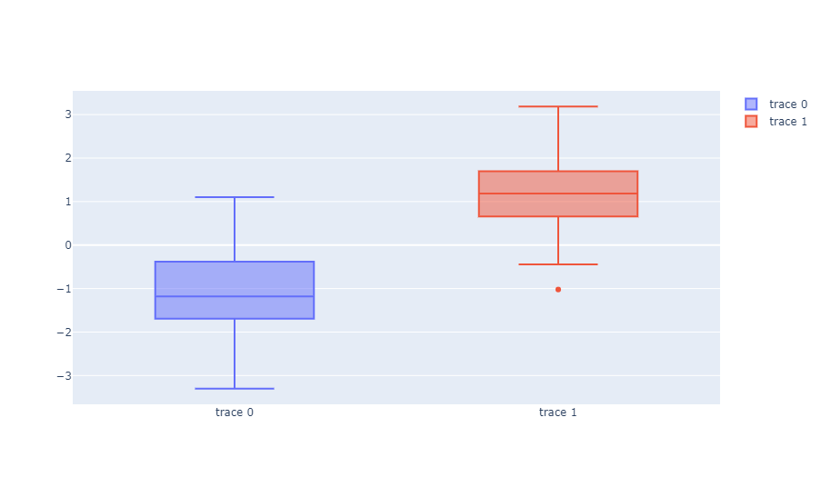
:::

### 基础水平箱线图

```python
from plotly import graph_objects as go
import numpy as np

x0 = np.random.randn(50)
x1 = np.random.randn(50) + 2    # 移动平均数的位置

fig = go.Figure()
# 为了绘制水平箱线图，使用x参数而不是y参数
fig.add_trace(go.Box(x=x0))
fig.add_trace(go.Box(x=x1))

fig.show()
```

::: center
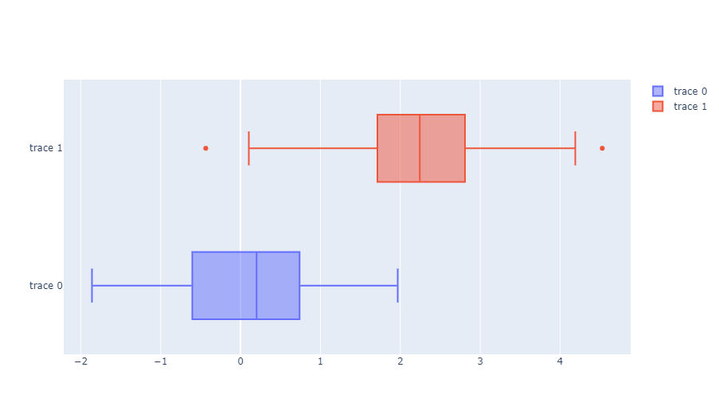
:::

### 展示底层数据

```python
from plotly import graph_objects as go

fig = go.Figure(data=[go.Box(
    y=[0, 1, 1, 2, 3, 5, 8, 13, 21],
    boxpoints='all',  # 可以选择outliers、suspectedoutliers或False
    jitter=0.3,       # 添加少许的抖动以更好地区分数据点
    pointpos=-1.8     # 数据点相对于箱线图中轴线的偏移
)])

fig.show()
```

::: center
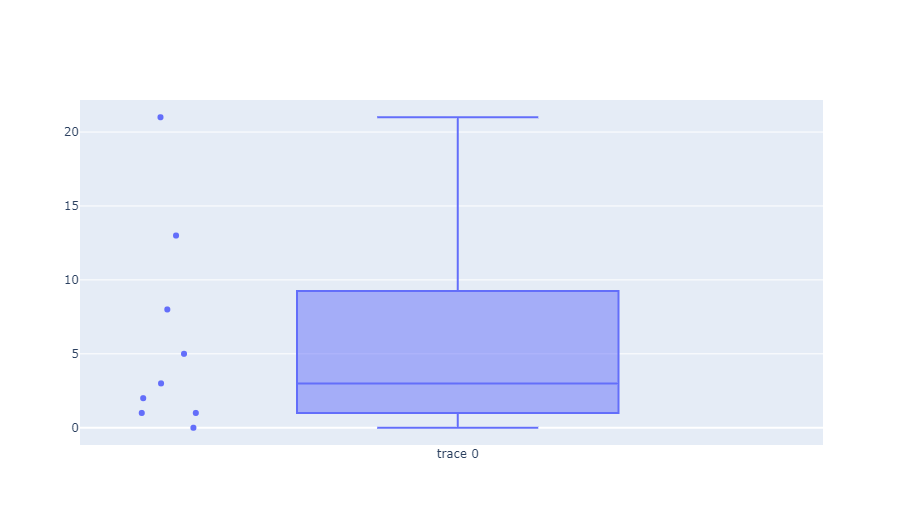
:::

### 修改四分位数算法

关于各种算法是如何工作的，请查阅[选择四分位算法](/visualization/plotly/box-plots#选择四分位算法)。

```python
from plotly import graph_objects as go

data = [1, 2, 3, 4, 5, 6, 7, 8, 9]

fig = go.Figure()
fig.add_trace(go.Box(y=data, quartilemethod="linear", name="Linear Quartile Mode"))
fig.add_trace(go.Box(y=data, quartilemethod="inclusive", name="Inclusive Quartile Mode"))
fig.add_trace(go.Box(y=data, quartilemethod="exclusive", name="Exclusive Quartile Mode"))
fig.update_traces(boxpoints='all', jitter=0)
fig.show()
```

::: center
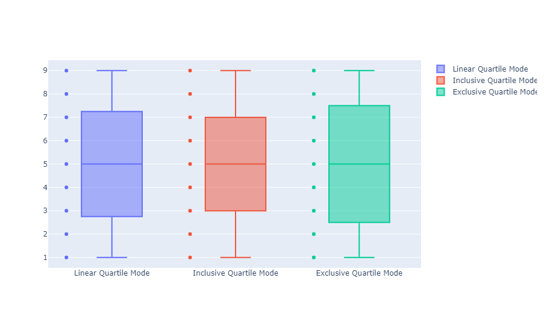
:::

### 预先计算了四分位数的箱线图

你可以指定预先计算好的四分位数，而不是使用内置的四分位数算法。

当你已经预先计算好了四分位数，或是你打算用系统提供之外的算法，它会非常实用。

```python
from plotly import graph_objects as go

fig = go.Figure()
fig.add_trace(go.Box(y=[
        [0, 1, 2, 3, 4, 5, 6, 7, 8, 9],
        [0, 1, 2, 3, 4, 5, 6, 7, 8, 9],
        [0, 1, 2, 3, 4, 5, 6, 7, 8, 9]
], name="Precompiled Quartiles"))
fig.update_traces(
    q1=[1, 2, 3], median=[4, 5, 6], q3=[7, 8, 9], 
    lowerfence=[-1, 0, 1], upperfence=[5, 6, 7],
    mean=[2.2, 2.8, 3.2], sd=[0.2, 0.4, 0.6],
    notchspan=[0.2, 0.4, 0.6]
)
fig.show()
```

::: center
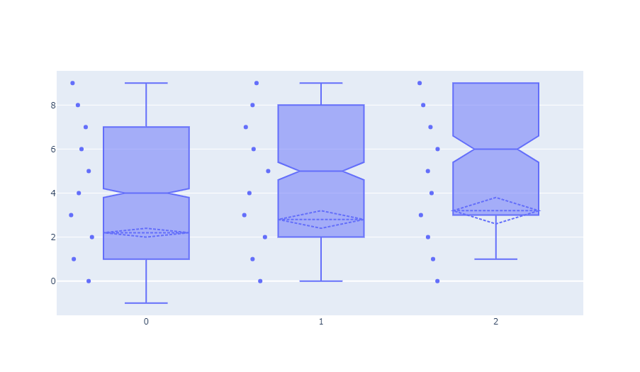
:::

### 带有颜色的箱线图

```python
from plotly import graph_objects as go
import numpy as np

y0 = np.random.randn(50)
y1 = np.random.randn(50) + 1  # 移动平均数的位置

fig = go.Figure()
fig.add_trace(go.Box(y=y0, name='Sample A', marker_color = 'indianred'))
fig.add_trace(go.Box(y=y1, name = 'Sample B', marker_color = 'lightseagreen'))
fig.show()
```

::: center

:::

### 带有平均数和标准差的箱线图

```python
from plotly import graph_objects as go

fig = go.Figure()
fig.add_trace(go.Box(
    y=[2.37, 2.16, 4.82, 1.73, 1.04,
       0.23, 1.32, 2.91, 0.11, 4.51,
       0.51, 3.75, 1.35, 2.98, 4.50,
       0.18, 4.66, 1.30, 2.06, 1.19],
    name='Only Mean',
    marker_color='darkblue',
    boxmean=True  # 展示平均数
))
fig.add_trace(go.Box(
    y=[2.37, 2.16, 4.82, 1.73, 1.04,
       0.23, 1.32, 2.91, 0.11, 4.51,
       0.51, 3.75, 1.35, 2.98, 4.50,
       0.18, 4.66, 1.30, 2.06, 1.19],
    name='Mean & SD',
    marker_color='royalblue',
    boxmean='sd'  # 展示平均数和标准差
))

fig.show()
```

::: center
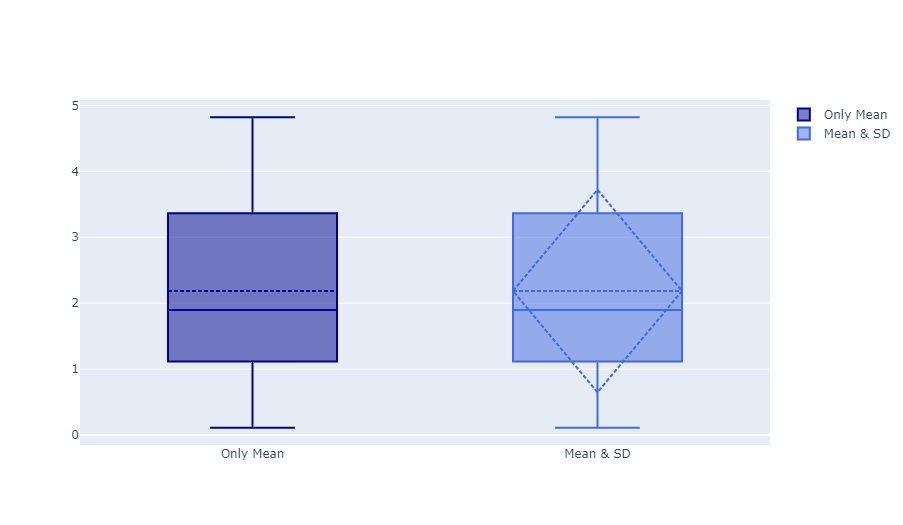
:::

### 离域点

下面的例子展示了如何使用`boxpoints`参数。如果设置为`outliers`，只有超出了箱线区域的样本会被显示出来；如果设置为`suspectedoutliers`，小于 $4Q_1-3Q_3$ 或大于 $4Q_3-3Q_1$ 的点也会以离域点的颜色高亮；如果设置为`all`，所有数据点都会显示；如果设置为`False`，只有箱线会被保留（没有任何数据点）。

```python
from plotly import graph_objects as go

fig = go.Figure()
fig.add_trace(go.Box(
    y=[0.75, 5.25, 5.5, 6, 6.2, 6.6, 6.80, 7.0, 7.2, 7.5,
       7.5, 7.75, 8.15, 8.15, 8.65, 8.93, 9.2, 9.5, 10, 
       10.25, 11.5, 12, 16, 20.90, 22.3, 23.25],
    name="All Points", jitter=0.3, pointpos=-1.8,
    boxpoints='all',  # 展示所有数据点
    marker_color='rgb(7,40,89)', line_color='rgb(7,40,89)'
))
fig.add_trace(go.Box(
    y=[0.75, 5.25, 5.5, 6, 6.2, 6.6, 6.80, 7.0, 7.2,
       7.5, 7.5, 7.75, 8.15, 8.15, 8.65, 8.93, 9.2,
       9.5, 10, 10.25, 11.5, 12, 16, 20.90, 22.3, 23.25],
    name="Only Whiskers", boxpoints=False,  # 不显示数据点
    marker_color='rgb(9,56,125)', line_color='rgb(9,56,125)'
))
fig.add_trace(go.Box(
    y=[0.75, 5.25, 5.5, 6, 6.2, 6.6, 6.80, 7.0, 7.2,
       7.5, 7.5, 7.75, 8.15, 8.15, 8.65, 8.93, 9.2,
       9.5, 10, 10.25, 11.5, 12, 16, 20.90, 22.3, 23.25],
    name="Suspected Outliers",
    boxpoints='suspectedoutliers',  # 仅显示可疑离域点
    marker=dict(
        color='rgb(8,81,156)',
        outliercolor='rgba(219, 64, 82, 0.6)',
        line=dict(
            outliercolor='rgba(219, 64, 82, 0.6)',
            outlierwidth=2)
    ), line_color='rgb(8,81,156)'
))
fig.add_trace(go.Box(
    y=[0.75, 5.25, 5.5, 6, 6.2, 6.6, 6.80, 7.0, 7.2,
       7.5, 7.5, 7.75, 8.15, 8.15, 8.65, 8.93, 9.2,
       9.5, 10, 10.25, 11.5, 12, 16, 20.90, 22.3, 23.25],
    name="Whiskers and Outliers", boxpoints='outliers',  # 仅显示离域点
    marker_color='rgb(107,174,214)', line_color='rgb(107,174,214)'
))

fig.update_layout(title_text="Box Plot Styling Outliers")
fig.show()
```

::: center
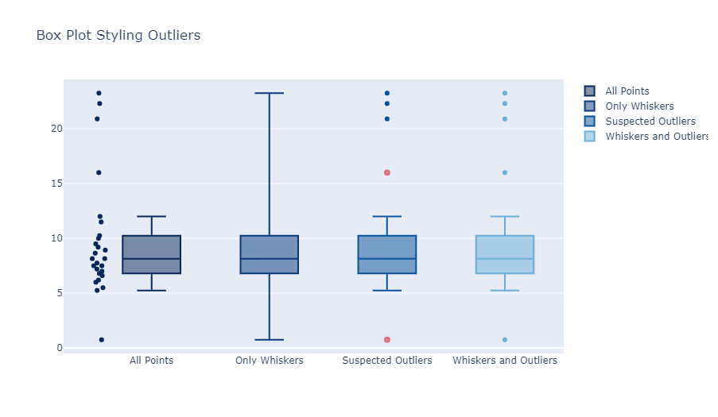
:::

### 分组箱线图

```python
from plotly import graph_objects as go

x = ['day 1', 'day 1', 'day 1', 'day 1', 'day 1', 'day 1',
     'day 2', 'day 2', 'day 2', 'day 2', 'day 2', 'day 2']

fig = go.Figure()
fig.add_trace(go.Box(
    y=[0.2, 0.2, 0.6, 1.0, 0.5, 0.4, 0.2, 0.7, 0.9, 0.1, 0.5, 0.3],
    x=x, name='kale', marker_color='#3D9970'
))
fig.add_trace(go.Box(
    y=[0.6, 0.7, 0.3, 0.6, 0.0, 0.5, 0.7, 0.9, 0.5, 0.8, 0.7, 0.2],
    x=x, name='radishes', marker_color='#FF4136'
))
fig.add_trace(go.Box(
    y=[0.1, 0.3, 0.1, 0.9, 0.6, 0.6, 0.9, 1.0, 0.3, 0.6, 0.8, 0.5],
    x=x, name='carrots', marker_color='#FF851B'
))

fig.update_layout(
    yaxis_title='normalized moisture',
    boxmode='group'    # 将位于不同图线上的箱线图合并到一个分组中
)
fig.show()
```

::: center
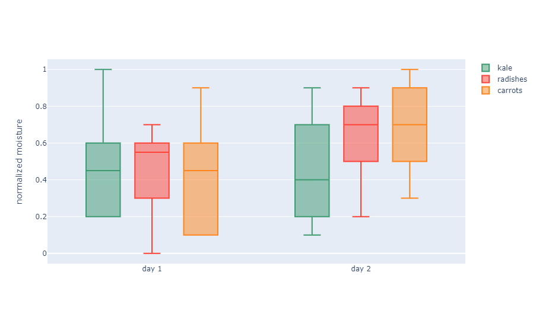
:::

### 分组水平箱线图

```python
from plotly import graph_objects as go

y = ['day 1', 'day 1', 'day 1', 'day 1', 'day 1', 'day 1',
     'day 2', 'day 2', 'day 2', 'day 2', 'day 2', 'day 2']

fig = go.Figure()
fig.add_trace(go.Box(
    x=[0.2, 0.2, 0.6, 1.0, 0.5, 0.4, 0.2, 0.7, 0.9, 0.1, 0.5, 0.3],
    y=y, name='kale', marker_color='#3D9970'
))
fig.add_trace(go.Box(
    x=[0.6, 0.7, 0.3, 0.6, 0.0, 0.5, 0.7, 0.9, 0.5, 0.8, 0.7, 0.2],
    y=y, name='radishes', marker_color='#FF4136'
))
fig.add_trace(go.Box(
    x=[0.1, 0.3, 0.1, 0.9, 0.6, 0.6, 0.9, 1.0, 0.3, 0.6, 0.8, 0.5],
    y=y, name='carrots', marker_color='#FF851B'
))

fig.update_layout(
    xaxis=dict(title='normalized moisture', zeroline=False),
    boxmode='group'
)

fig.update_traces(orientation='h')  # 切换箱线图为水平方向
fig.show()
```

::: center
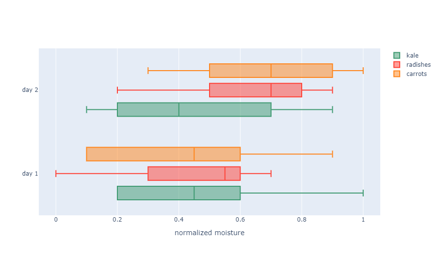
:::

### 彩虹箱线图

```python
from plotly import graph_objects as go
import numpy as np

N = 30    # 箱线图数量

# 以固定饱和度和亮度的形式生成一个由 HSL 色彩表示的彩虹色表
# Plotly 支持任意格式的CSS色彩表示
c = ['hsl(' + str(h) + ',50%' + ',50%)' for h in np.linspace(0, 360, N)]

# 每一个箱线图由一个包含数据、类型和颜色的字典表示
# 用列表生成式来表示N个箱线，每一个箱线拥有随机的颜色和随机的数据
fig = go.Figure(data=[
    go.Box(
        y=3.5 * np.sin(np.pi * i/N) + i/N + (1.5 + 0.5 * np.cos(np.pi*i/N)) * np.random.rand(10),
        marker_color=c[i])
    for i in range(int(N))
])

# 格式化布局样式
fig.update_layout(
    xaxis=dict(showgrid=False, zeroline=False, showticklabels=False),
    yaxis=dict(zeroline=False, gridcolor='white'),
    paper_bgcolor='rgb(233,233,233)',
    plot_bgcolor='rgb(233,233,233)',
)
fig.show()
```

::: center
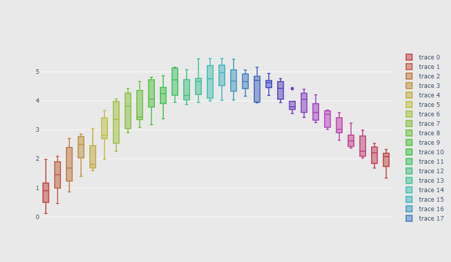
:::

### 全面个性化的箱线图

```python
from plotly import graph_objects as go

x_data = ['Carmelo Anthony', 'Dwyane Wade',
          'Deron Williams', 'Brook Lopez',
          'Damian Lillard', 'David West',]
N = 50
y0 = (10 * np.random.randn(N) + 30).astype(np.int)
y1 = (13 * np.random.randn(N) + 38).astype(np.int)
y2 = (11 * np.random.randn(N) + 33).astype(np.int)
y3 = (9 * np.random.randn(N) + 36).astype(np.int)
y4 = (15 * np.random.randn(N) + 31).astype(np.int)
y5 = (12 * np.random.randn(N) + 40).astype(np.int)
y_data = [y0, y1, y2, y3, y4, y5]
colors = ['rgba(93, 164, 214, 0.5)', 'rgba(255, 144, 14, 0.5)', 'rgba(44, 160, 101, 0.5)',
          'rgba(255, 65, 54, 0.5)', 'rgba(207, 114, 255, 0.5)', 'rgba(127, 96, 0, 0.5)']

fig = go.Figure()
for xd, yd, cls in zip(x_data, y_data, colors):
    fig.add_trace(go.Box(
        y=yd, name=xd, boxpoints='all', jitter=0.5,
        whiskerwidth=0.2, fillcolor=cls,
        marker_size=2, line_width=1
    ))
fig.update_layout(
    title='Points Scored by the Top 9 Scoring NBA Players in 2012',
    yaxis=dict(
        autorange=True, showgrid=True, zeroline=True, dtick=5,
        gridcolor='rgb(255, 255, 255)', gridwidth=1,
        zerolinecolor='rgb(255, 255, 255)', zerolinewidth=2,
    ),
    margin=dict(l=40, r=30, b=80, t=100),
    paper_bgcolor='rgb(243, 243, 243)',
    plot_bgcolor='rgb(243, 243, 243)',
    showlegend=False
)
fig.show()
```

::: center
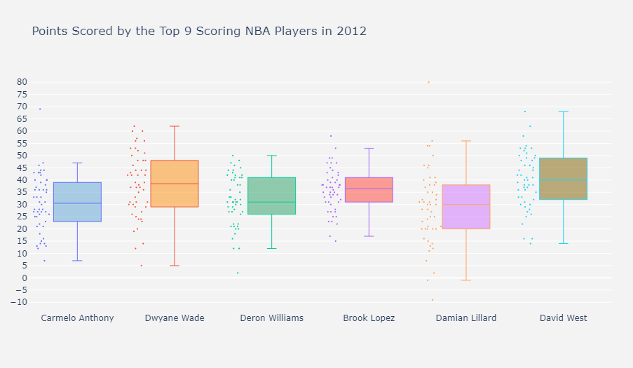
:::

## 只有数据点的箱线图

[带状图](https://plotly.com/python/strip-charts/)与箱线图类似，但它只呈现数据点，没有箱线。

```python
from plotly import express as px

df = px.data.tips()
fig = px.strip(df, x='day', y='tip')
fig.show()
```

::: center
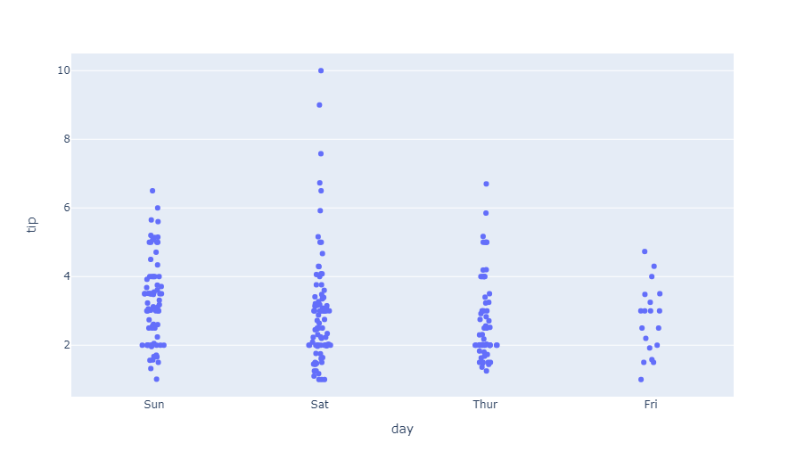
:::

## 参考

有关更多信息和图表参数选项，请查阅：

- [`px.box()`函数参考](https://plotly.com/python-api-reference/generated/plotly.express.box)
- [箱线图 - Python图表参考](https://plotly.com/python/reference/box/)
