在统计学中，[直方图](https://wiki.mbalib.com/wiki/%E7%9B%B4%E6%96%B9%E5%9B%BE)是对数值型数据分布的一种描述，其中数据会被划分到相应的桶中，直方图的高度由每个桶所在的元素数量表示。更普遍的说，在 *Plotly* 中直方图是一种被应用了多种聚合函数（比如求和、平均、计数）、能够在类别坐标轴、时间坐标轴与线性坐标轴上进行可视化的柱状图。

除了直方图，用于可视化数据分布的图表还有[提琴图](https://plotly.com/python/violin/)、[箱线图](/visualization/plotly/box-plots/)、[ECDF图](https://plotly.com/python/ecdf-plots/)和[带状图](https://plotly.com/python/strip-charts/)。

::: tips
如果你正在寻找柱状图教程，例如用矩形柱条表示原始、未经聚合的数据，请查阅[柱状图教程](/visualization/plotly/bar-charts/)。
:::

## 使用 Plotly Express 绘制直方图

```python
from plotly import express as px

df = px.data.tips()
fig = px.histogram(df, x="total_bill")
fig.show()
```

::: center
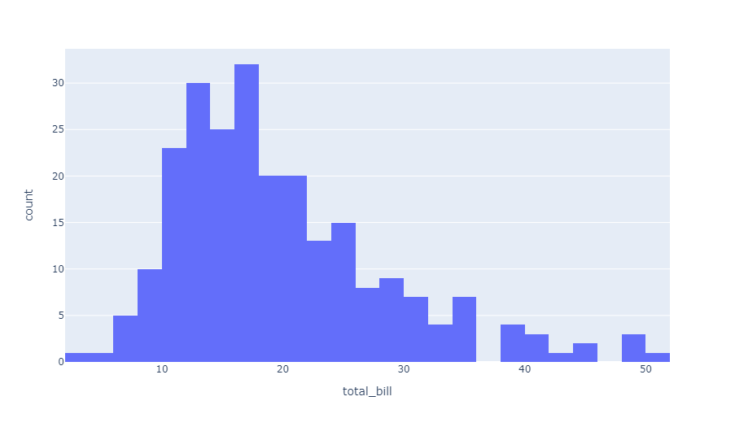
:::

```python
from plotly import express as px

df = px.data.tips()
# 这里我们使用带有类别数据的列
fig = px.histogram(df, x="day")
fig.show()
```

::: center
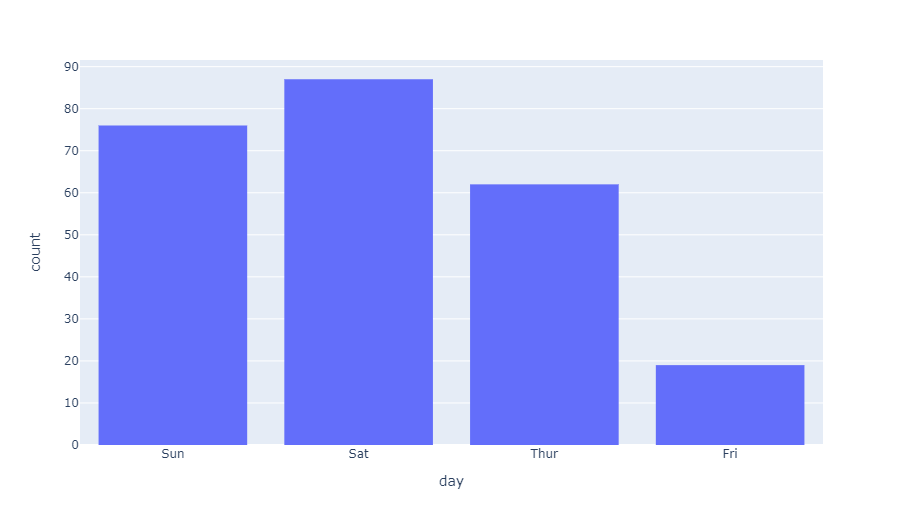
:::

### 选择桶的数量

默认情况下，桶的数量会自适应地设置为与桶内样本数量最匹配的值。这个数量可以自定义。

```python
from plotly import express as px

df = px.data.tips()
fig = px.histogram(df, x="total_bill", nbins=20)
fig.show()
```

::: center
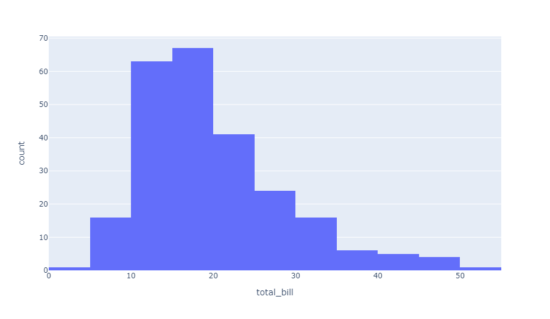
:::

### 日期数据上的直方图

*Plotly* 的直方图会自动地将日期数据划分到桶中。

```python
from plotly import express as px

df = px.data.stocks()
fig = px.histogram(df, x="date")
fig.update_layout(bargap=0.2)
fig.show()
```

::: center
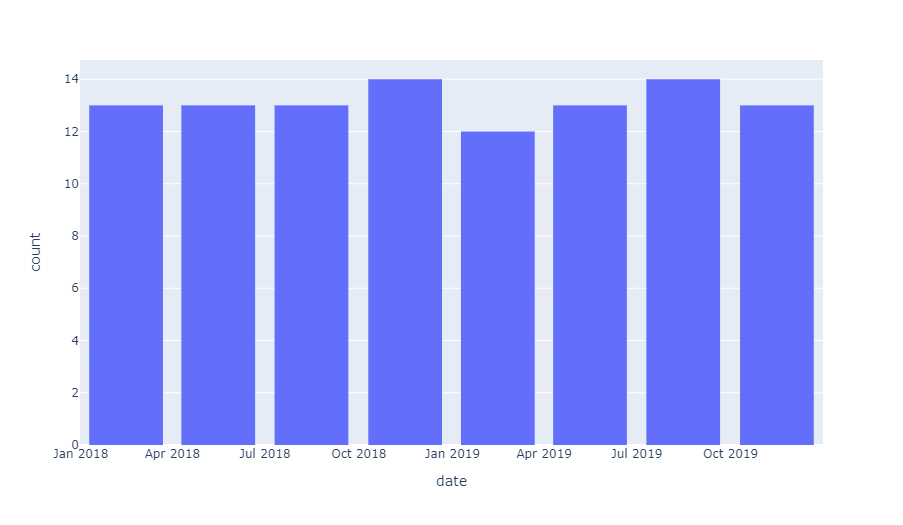
:::

### 类别数据上的直方图

*Plotly* 的直方图除了能自动地将数值或日期数据划分到桶中，还能对原始类别数据执行相同的划分。比如下面这个例子，横轴就是类别变量`day`的值。

```python
from plotly import express as px

df = px.data.tips()
fig = px.histogram(
    df, x="day", category_orders=dict(
        day=["Thur", "Fri", "Sat", "Sun"]
    )
)
fig.show()
```

::: center
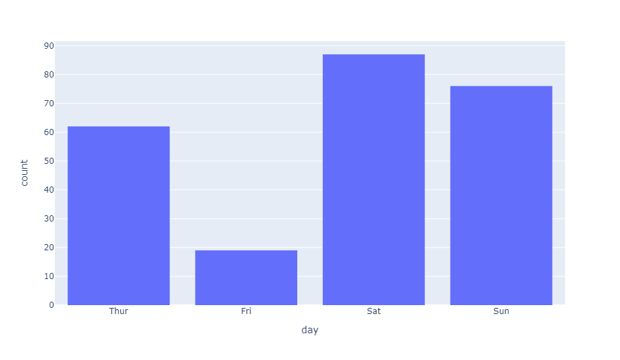
:::

### 获取统计（纵轴）值

*Plotly* 底层使用了 *JavaScript* ，而纵轴的统计值是在浏览器运行时计算得出的，因此无法通过`fig`对象获取它们。不过你可以使用`np.histogram`手动计算它们。

```python
from plotly import express as px
import numpy as np

df = px.data.tips()
# 创建划分桶
counts, bins = np.histogram(df.total_bill, bins=range(0, 60, 5))
bins = 0.5 * (bins[:-1] + bins[1:])

fig = px.bar(x=bins, y=counts, labels={'x':'total_bill', 'y':'count'})
fig.show()
```

::: center

:::

### 标准化的方法

默认情况下，直方图会展示每个桶中的样本数量。使用`histnorm`参数，也可以用百分比或分数描述样本在每个桶中的占比（`histnorm="percent"`或`histnorm="probability"`），或绘制一个密度直方图（所有直方图的面积总和相当于所有样本的数量，`histnorm="density"`），又或是概率分布直方图（所有直方图的面积总和为1，`histnorm="pribability density"`）。

```python
from plotly import express as px

df = px.data.tips()
fig = px.histogram(df, x="total_bill", histnorm='probability density')
fig.show()
```

::: center

:::

### 直方图的外观

```python
from plotly import express as px

df = px.data.tips()
fig = px.histogram(
    df, x="total_bill", title='Histogram of bills',
    labels={'total_bill':'total bill'},    # 可以指定每一个数据列的标签
    opacity=0.8, log_y=True,               # 以对数坐标的形式表示直方图
    color_discrete_sequence=['indianred']  # 指定直方图的颜色
)
fig.show()
```

::: center
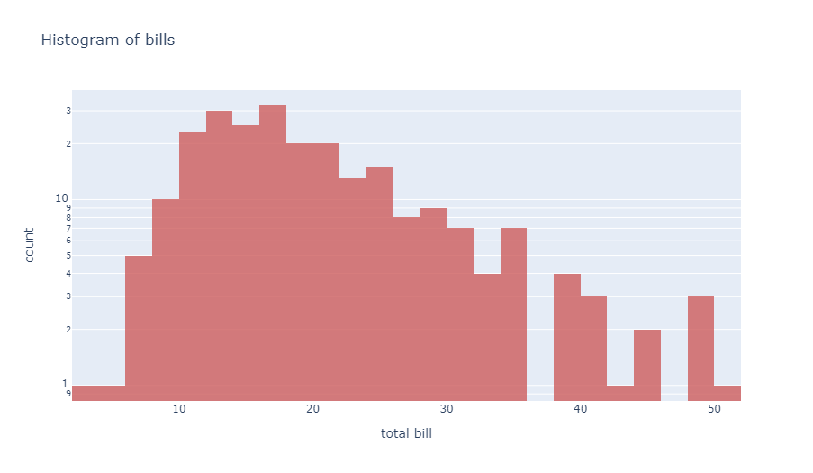
:::

::: details :sparkles: *v5.0* 新功能
除了色彩，直方图支持使用[模式（晕滃或材质）](/visualization/plotly/pattern-hatching-texture/)：

```python
from plotly import express as px

df = px.data.tips()
fig = px.histogram(df, x="sex", y="total_bill",
                   color="sex", pattern_shape="smoker")
fig.show()
```

::: center
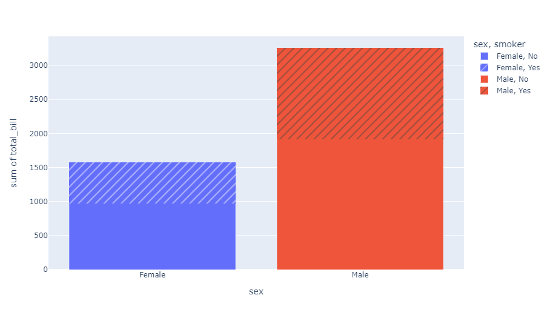
:::
:::

### 同列不同值形成的多个直方图

```python
from plotly import express as px
df = px.data.tips()
fig = px.histogram(df, x="total_bill", color="sex")
fig.show()
```

::: center
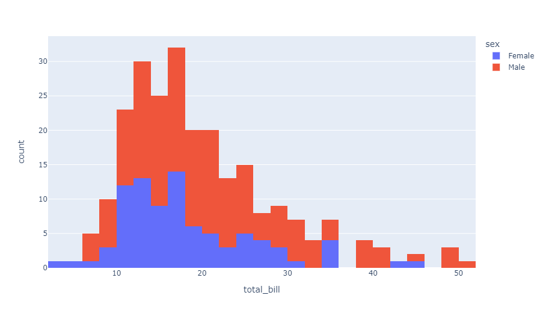
:::

### 用其他函数进行聚合

对于横轴`x`的每一个桶，用于进行聚合计算的函数由`histfunc`定义。`histfunc`函数的参数由数据表里被指定为纵轴`y`的数值决定。下图展示了`tip`的平均值随`total_bill`变化的关系。

```python
from plotly import express as px

df = px.data.tips()
fig = px.histogram(df, x="total_bill", y="tip", histfunc='avg')
fig.show()
```

::: center
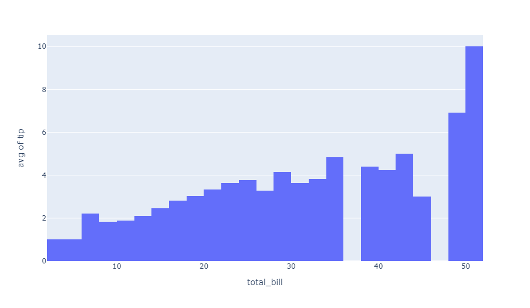
:::

当指定了参数`y`时，默认的`histfunc`是`'sum'`，这在`x`轴是类别数据时同样有效。

```python
from plotly import express as px

df = px.data.tips()
fig = px.histogram(df, x="day", y="total_bill", category_orders=dict(day=["Thur", "Fri", "Sat", "Sun"]))
fig.show()
```

::: center
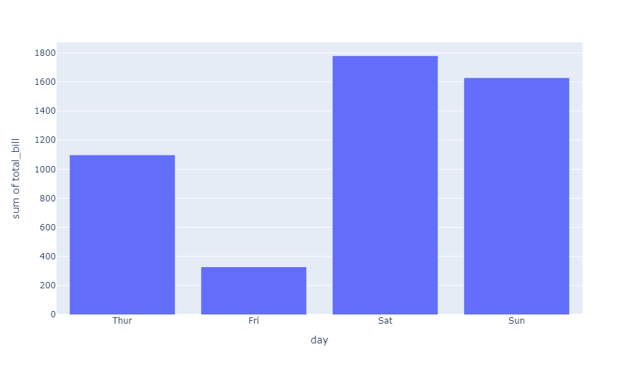
:::

### 可视化分布

使用`marginal`关键词，一张边缘分布图会随着直方图一起生成，用于可视化分布信息。请查阅[分布图教程](https://plotly.com/python/distplot/)以获取更多混合统计学图表的例子。

```python
import plotly.express as px
df = px.data.tips()
fig = px.histogram(df, x="total_bill", color="sex", 
                   marginal="rug", # can be `box`, `violin`
                   hover_data=df.columns)
fig.show()
```

::: center
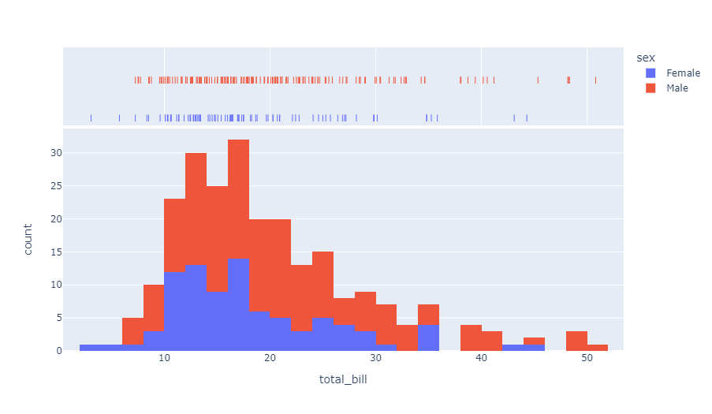
:::

### 按类别顺序排序

直方图能够按照横轴的`categoryorder`属性设置的顺序逻辑进行排序。即使是拥有多个图线的相同横坐标轴，使用`categoryorder`对直方图进行排序也是有效的。在下面的例子中，直方图将按照总数值进行排序。

```python
from plotly import express as px

df = px.data.tips()
fig = px.histogram(df, x="day").update_xaxes(categoryorder='total ascending')
fig.show()
```

::: center
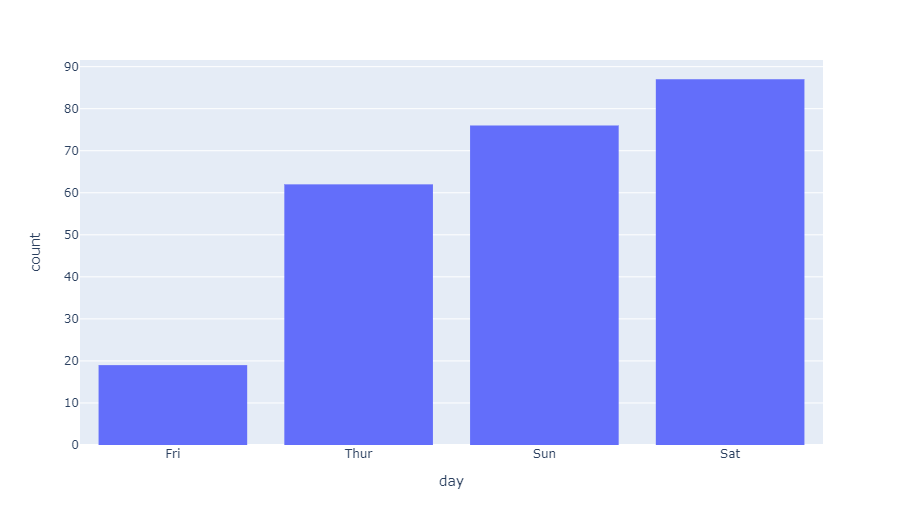
:::

```python
from plotly import express as px

df = px.data.tips()
fig = px.histogram(
    df, x="day", color="smoker"
).update_xaxes(categoryorder='total descending')
fig.show()
```

::: center
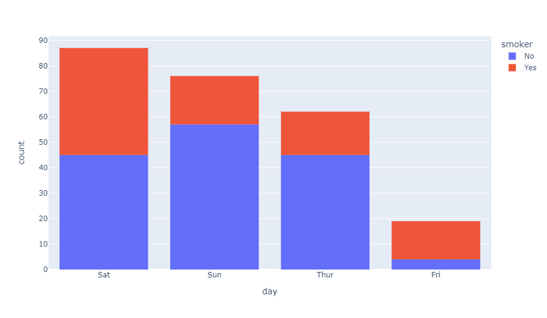
:::

## 用 Graph Objects 绘制直方图

如果 *Plotly Express* 无法让你很好驾驭直方图，你也可以使用[`plotly.graph_objects`](https://plotly.com/python/graph-objects/)中更为通用的`go.Histogram`类。所有可用的直方图选项都在参考手册的[直方图](https://plotly.com/python/reference#histogram)章节中有所描述。

### 基础直方图

```python
from plotly import graph_objects as go
import numpy as np

np.random.seed(1)
x = np.random.randn(500)

fig = go.Figure(data=[go.Histogram(x=x)])
fig.show()
```

::: center

:::

### 标准化直方图

```python
from plotly import graph_objects as go
import numpy as np

x = np.random.randn(500)
fig = go.Figure(data=[go.Histogram(x=x, histnorm='probability')])
fig.show()
```

::: center
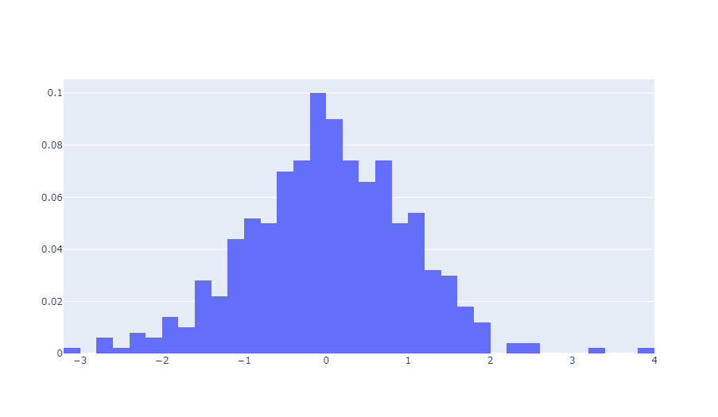
:::

### 水平直方图

```python
from plotly import graph_objects as go
import numpy as np

# 用 `y` 参数而不是 `x` 参数来绘制水平直方图
y = np.random.randn(500)
fig = go.Figure(data=[go.Histogram(y=y)])
fig.show()
```

::: center
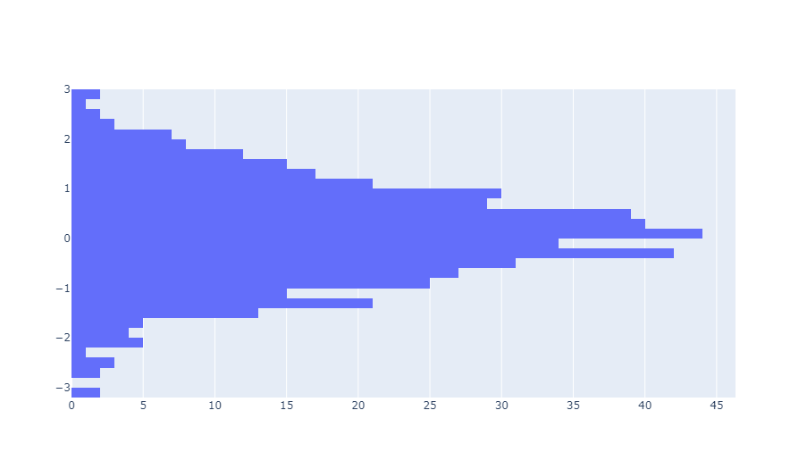
:::

### 层叠直方图

```python
from plotly import graph_objects as go
import numpy as np

x0 = np.random.randn(500)
# 让高斯分布产生1个单位的偏移
x1 = np.random.randn(500) + 1

fig = go.Figure()
fig.add_trace(go.Histogram(x=x0))
fig.add_trace(go.Histogram(x=x1))

# 堆叠两个直方图
fig.update_layout(barmode='overlay')
# 降低不透明度以同时看见两个直方图
fig.update_traces(opacity=0.75)
fig.show()
```

::: center
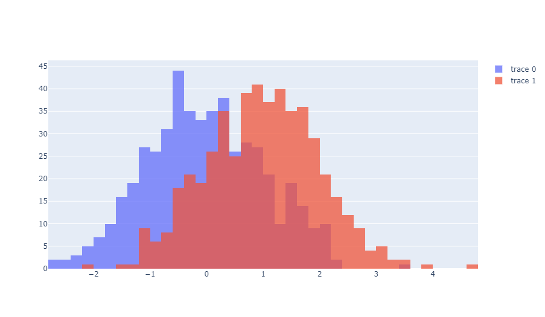
:::

### 堆叠直方图

```python
from plotly import graph_objects as go
import numpy as np

x0 = np.random.randn(2000)
x1 = np.random.randn(2000) + 1

fig = go.Figure()
fig.add_trace(go.Histogram(x=x0))
fig.add_trace(go.Histogram(x=x1))

# 其中一个直方图会叠放在另一个上方
fig.update_layout(barmode='stack')
fig.show()
```

::: center
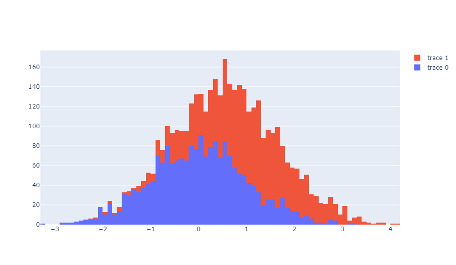
:::

### 直方图的样式

```python
import plotly.graph_objects as go
import numpy as np

x0 = np.random.randn(500)
x1 = np.random.randn(500) + 1

fig = go.Figure()
fig.add_trace(go.Histogram(
    x=x0, histnorm='percent',
    name='control',    # 在图例和悬浮标签中使用的图线名称
    xbins=dict(        # 用于直方图的划分区间
        start=-4.0, end=3.0, size=0.5
    ), marker_color='#EB89B5',  # 标记颜色
    opacity=0.75                # 不透明度
))
fig.add_trace(go.Histogram(
    x=x1, histnorm='percent', name='experimental',
    xbins=dict(start=-3.0, end=4, size=0.5),
    marker_color='#330C73', opacity=0.75
))
fig.update_layout(
    title_text='Sampled Results',  # 图表标题
    xaxis_title_text='Value',      # 横轴标签
    yaxis_title_text='Count',      # 纵轴标签
    bargap=0.2,                    # 组内直方图之间的空隙宽度
    bargroupgap=0.1                # 每组直方图之间的空隙宽度
)
fig.show()
```

::: center
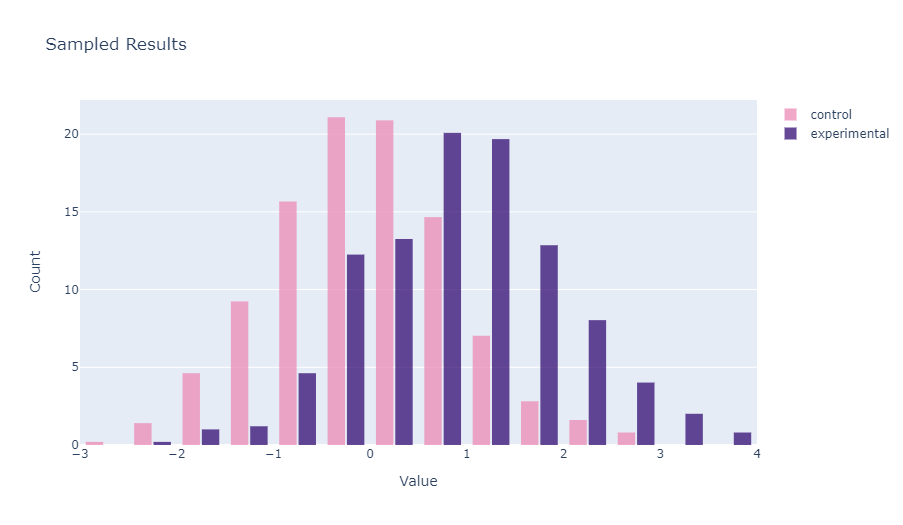
:::

### 累积直方图

```python
from plotly import graph_objects as go
import numpy as np

x = np.random.randn(500)
fig = go.Figure(data=[go.Histogram(x=x, cumulative_enabled=True)])
fig.show()
```

::: center
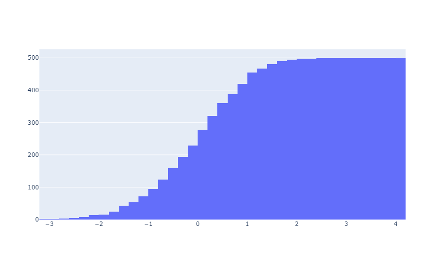
:::

### 指定聚合函数

```python
import plotly.graph_objects as go

x = ["Apples","Apples","Apples","Oranges", "Bananas"]
y = ["5","10","3","10","5"]

fig = go.Figure()
fig.add_trace(go.Histogram(histfunc="count", y=y, x=x, name="count"))
fig.add_trace(go.Histogram(histfunc="sum", y=y, x=x, name="sum"))

fig.show()
```

::: center
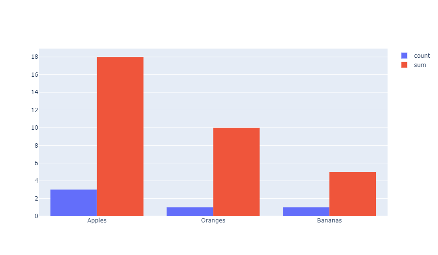
:::

### 自定义划分

为了能够在横轴方向上进行自定义划分区间，请使用`nbinsx`属性。请注意，自动划分算法会选择一个极佳的近似区间数量，在某些情况下会小于`nbinsx`划分的总区间数量。除此之外，你还可以精确设置`xbins`的值，并将`autobinx`设置为`False`。

```python
from plotly import graph_objects as go
from plotly.subplots import make_subplots

x = ['1970-01-01', '1970-01-01', '1970-02-01', '1970-04-01', 
     '1970-01-02', '1972-01-31', '1970-02-13', '1971-04-19']

fig = make_subplots(rows=3, cols=2)
trace0 = go.Histogram(x=x, nbinsx=4)
trace1 = go.Histogram(x=x, nbinsx = 8)
trace2 = go.Histogram(x=x, nbinsx=10)
trace3 = go.Histogram(
    x=x, xbins=dict(
        start='1969-11-15', end='1972-03-31',
        size='M18'  # 表示18个月
    ), autobinx=False
)
trace4 = go.Histogram(
    x=x, xbins=dict(
        start='1969-11-15', end='1972-03-31',
        size='M4'   # 4个月
    ), autobinx=False
)
trace5 = go.Histogram(
    x=x, xbins=dict(
        start='1969-11-15', end='1972-03-31',
        size='M2'   # 2个月
    ), autobinx = False
)

fig.append_trace(trace0, 1, 1)
fig.append_trace(trace1, 1, 2)
fig.append_trace(trace2, 2, 1)
fig.append_trace(trace3, 2, 2)
fig.append_trace(trace4, 3, 1)
fig.append_trace(trace5, 3, 2)

fig.show()
```

::: center
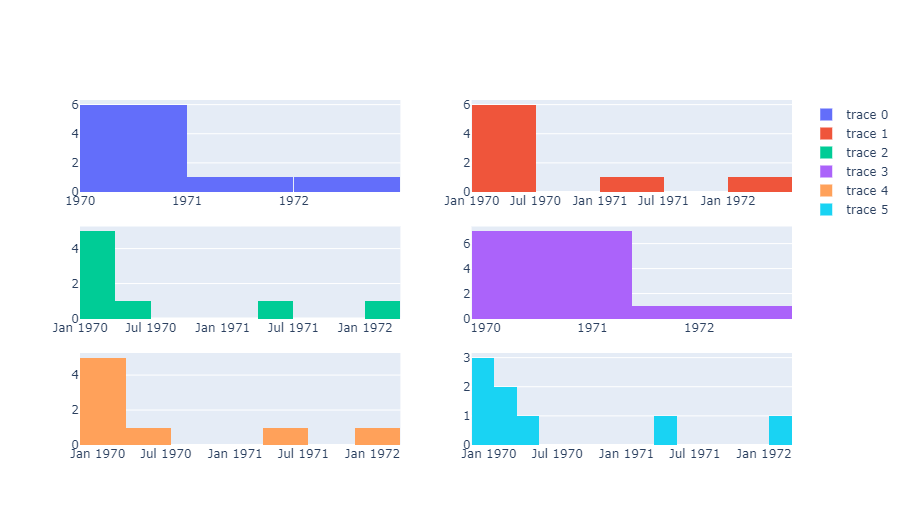
:::

### 共享分区

在这个例子中，两个直方图使用[`bingroup`](https://plotly.com/python/reference/histogram/#histogram-bingroup)属性获得了相互兼容的分区设置。需要注意，在用一个子图中、具有相同`barmode`（`"stack"`、`"relative"`和`"group"`）的图线会被强制分配到同一个`bingroup`中，然而设置了`barmode="overlay"`或是位于不同坐标系上的图线能够获取互相兼容的分区设置。直方图与[二维直方图](https://plotly.com/python/2D-Histogram/)能够共享相同的`bingroup`。

```python
from plotly import graph_objects as go
import numpy as np

fig = go.Figure(go.Histogram(
    x=np.random.randint(7, size=100),
    bingroup=1
))

fig.add_trace(go.Histogram(
    x=np.random.randint(7, size=20),
    bingroup=1
))

fig.update_layout(barmode="overlay", bargap=0.1)
fig.show()
```

::: center
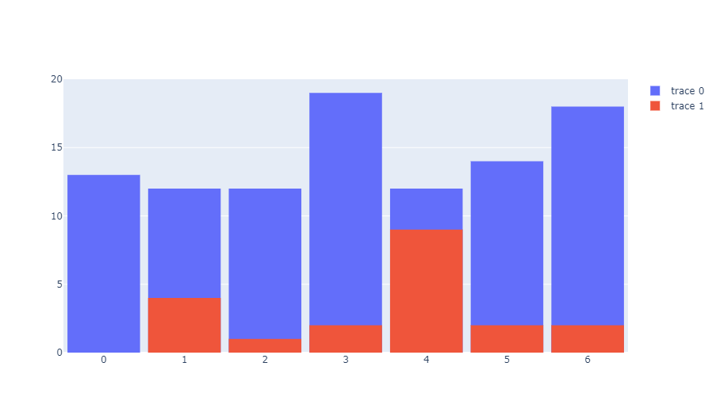
:::

## 另请参阅：柱状图

如果你希望展现以独立的直方图展现独立元素的信息，可以像下面这样创建一个不包含悬浮信息栏的堆叠柱状图。请注意，这并不是直方图的本身用途，但它能够像下面这样用`px.histogram`产生与`px.bar`极为相似的效果。更多信息，请查阅[柱状图教程](/visualization/plotly/bar-charts/)。

```python
from plotly import express as px
df = px.data.tips()
fig1 = px.bar(df, x='day', y='tip', height=300,
              title='Stacked Bar Chart - Hover on individual items')
fig2 = px.histogram(df, x='day', y='tip', histfunc='sum', height=300,
                    title='Histogram Chart')
fig1.show()
fig2.show()
```

::: center
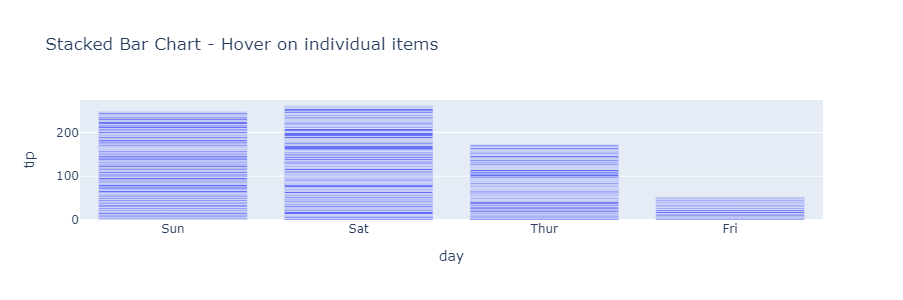
:::

::: center
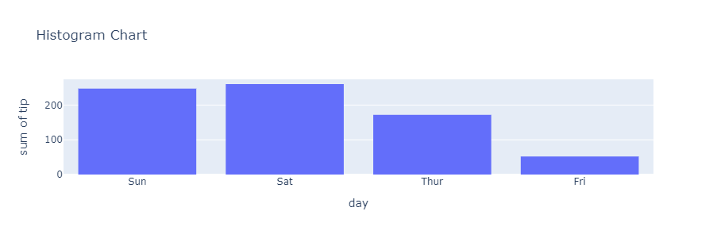
:::

## 参考

更多信息和图表属性选项，请查阅：

- [`px.histogram()`函数参考](https://plotly.com/python-api-reference/generated/plotly.express.histogram)
- [直方图 - Python图表参考](https://plotly.com/python/reference/histogram/)
