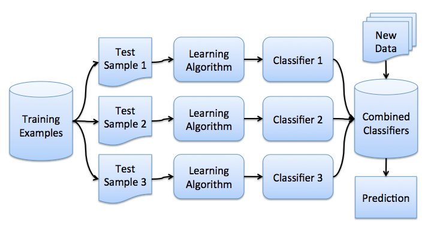

# 集成学习和随机森林方法

## 集成

- **集成（Ensemble）** ：使用一系列学习器进行学习，并使用某种规则把各个学习结果进行整合从而获得比单个学习器更好的学习效果的一种机器学习方法。在集成中，最终的整体输出比任何单个部分的表现更重要。

- **孔多塞陪审团定理（CJT）** ：政治科学上有关集体决策正确性概率的定理。

  > 假设群体需要通过多数表决来做出一个决定，表决的结果可能是正确或者错误的。每个投票者有一部分独立的个人信息，这个信息有 $p$ 的可能是正确的，投票者根据 $p$ 做出决定。投票得出结果的正确性由 $p$ 决定：
  > $$
  > \mu = \sum_{i=m}^{N}{N\choose i}p^i(1-p)^{N-i}
  > $$
  > 其中：$N$ 为陪审团人数，$m=\left\lfloor\frac{N}{2}\right\rfloor+1$ 为构成多数的最小人数，$N \choose i$ 是 **组合数** ，$p$ 是单个评审员做出正确决策的概率，$\mu$ 是陪审团整体做出正确决策的概率。
  >
  > 由上式可知，若 $p\gt0.5$ ，则 $\mu \gt p$ ；若 $N\to\infty$ ，则 $\mu\to1$ 。

## 自助法（Bootstraping）

假设有尺寸为 $N$ 的样本 $X$，从该样本中 **有放回地** 随机抽取 $N$ 个样本，以创建一个新样本。换句话说，从尺寸为 $N$ 的原样本中随机选择一个元素，并重复此过程 $N$ 次。选中所有元素的可能性是一样的，因此每个元素被抽中的概率均为 $\frac{1}{N}$ 。因为是有放回抽样，由抽样产生的新样本可能存在重复的元素。将上述抽样重复 $M$ 次，生成一组 **自助样本** $(X_1,X_2,\cdots,X_M)$ ，这样我们拥有了充足的样本来计算原始样本的统计学数据。

## 引导聚集（Bagging / Bootstrap Aggregation）

假设我们有一个训练集 $X$。我们使用自助法生成样本 $X_1,X_2,\cdots,X_M$ 。现在，我们在每个自助样本上分别训练分类器  ，最终的分类器将对所有这些单独的分类器的输出取均值。在分类情形下，这种技术即 **投票（voting）** ：
$$
\mathcal{L}(x) = \frac{1}{M} \sum_{i = 1}^M \mathcal{L}_i(x)
$$

::: center

:::

在回归问题中，通过对回归结果取均值，引导聚集将均方误差降至 $\frac{1}{M}$ （ $M$ 为回归器数量）。

- 引导聚集通过在不同数据集上训练模型的方式来降低分类器的方差。换句话说，引导聚集可以预防过拟合。
- 由于我们强假设「单独误差是不相关的」，但这个假设对实际应用来说过于乐观。当假定不成立时，误差的下降就不会那么显著。

## 袋外误差（OOB Error）

- 随机森林 **不需要** 使用交叉验证或留置样本，因为它 **内置了误差估计** 。随机森林中的决策树基于原始数据集中不同的自助样本构建。对第 K 棵树而言，其特定自助样本大约留置了 37% 的输入。

- 自然常数的一个来源：
  $$
  \lim_{\ell\to+\infty}{\left(1-\frac{1}{\ell}\right)^\ell}=\frac{1}{e}
  $$

- 随机森林的每一棵决策树仅建立在约 63% 的原始样本上进行训练，剩余的 37% 数据量可以用于验证， **袋外估计** 只是基础算法在 37% 置留数据上的平均估计。

## 随机森林

- 决策树相当复杂，并能在任何样本上达到零分类误差。
- 随机子空间方法可以降低树的相关性，从而避免过拟合。

### 随机子空间法构建集成模型

1. 设样本数等于 $n$，特征维度数等于 $d$ 。
2. 选择模型的数目 $M$ 。
3. 对于每个模型 $m$ ，选择特征数 $d_m\lt d$ 。所有模型使用相同的 $d_m$ 值。
4. 对每个模型 $m$ ，通过在整个 $d$ 特征集合上随机选择 $d_m$ 个特征创建一个训练集。
5. 训练每个模型。
6. 通过组合 $M$ 个模型的结果，将生成的整体模型应用于新数据中，应用时可以基于 **多数投票算法** 或 **后验概率聚合** 。

### 随机森林的算法

1. 对每个 $k = 1, \cdots, N$，生成自助样本 $X_k$。
2. 在样本 $X_k$ 上创建一棵决策树 $b_k$：
  3. 根据给定的标准选择最佳的特征维度。根据该特征分割样本以创建树的新层。重复这一流程，直到样本用尽。
  4. 创建树，直到任何叶节点包含的实例不超过 $n_\text{min}$ 个，或者达到特定深度。
  5. 每次分割，首先从 $d$ 个原始特征中随机选择 $m$ 个特征，接着只在该子集上搜索最佳分割。

最终分类器定义为：
$$
a(x) = \frac{1}{N}\sum_{k = 1}^N b_k(x)
$$
在分类问题上，模型使用多数投票算法，建议设置 $m=\sqrt{d},n_{\min}=1$ ；在回归问题上，模型使用均值，建议设置 $m=\frac{d}{3},n_{\min}=5$ 。

### 随机森林的参数

回归时使用 `sklearn.ensemble.BaggingRegressor` ，分类时使用 `sklearn.ensemble.BaggingClassifier` 。其中，

- `n_estimators` 是随机森林中树的数量；
- `criterion` 是衡量分割质量的函数；
- `max_features` 是查找最佳分割时考虑的特征数；
- `min_samples_leaf` 是叶节点的最小样本数；
- `max_depth` 是树的最大深度。

### 随机森林在现实问题中的应用

- 随机森林最重要的一点是它的准确率不会随着树的增加而下降。

### 随机森林的方差和去相关

$$
\mathrm{Var} f(x) = \rho(x)\sigma^2(x)
$$

$$
\rho(x) = \mathrm{Corr}\left[T(x_1,\Theta_1(Z)),T(x_2,\Theta_2(Z))\right]
$$

其中，

- $\rho(x)$ 为任意两棵树之间的样本相关性；
- $\Theta_1(Z)$ 和 $\Theta_2(Z)$ 为在样本 $Z$ 的随机元素上，随机选择的一对树；
- $T(x,\Theta_i(Z))$ 为第 $i$ 个树分类器在输入向量 $x$ 上的输出；
- $\sigma^2(x)$ 为任何随机选择的树上的样本方差：$\sigma^2(x) = \mathrm{Var}\left[T(x,\Theta(X))\right]$

### 随机森林的偏差

随机森林、引导聚集决策树的偏差与单棵决策树相同：

随机森林和引导聚集决策树的偏差通常比单棵决策树大，因为随机过程和样本空间缩减使得模型受到了限制。引导聚集决策树和随机森林在预测准确率上比单棵决策树要高的原因仅仅源自方差的降低。

### 极端随机树（Extremely Randomized Tree）

- **极端随机树** 在节点分岔时应用了更多随机性。和随机森林一样，极端随机树使用一个 **随机特征子空间** 。
- 极端随机树为每个可能的特征随机生成一个阈值，然后挑选最佳阈值对应的特征来分割节点，通过增加少量偏差来降低方差。
- `sklearn.ensemble.ExtraTreesClassifier` 和 `sklearn.ensemble.ExtraTreesRegressor` 分别实现了极端随机树的分类和回归，如果使用随机森林或梯度提升遇到了严重的过拟合，可以试试极端随机树。

### 随机森林和 k 近邻的相似性

- 随机森林的预测基于 **训练集中相似样本的标签** ，这些样本越常出现在同一叶节点，它们的相似度就越高。

### 转换数据集为高维表示

- 随机森林主要用于监督学习，不过也可以应用于无监督学习。
- 使用 `sklearn.ensemble.RandomTreesEmbedding()` 方法，可以将数据集转换为高维的稀疏表示，继而用于无监督学习中。

### 随机森林的优势和劣势

|                             优势                             |                        劣势                        |
| :----------------------------------------------------------: | :------------------------------------------------: |
|                         高预测准确率                         |                    输出更难解释                    |
|                     对离散值的鲁棒性较好                     |         特征重要性估计没有形式化的 $p$ 值          |
|                对特征缩放及其他单调转换不敏感                |          在数据稀疏时，表现不如线性模型好          |
|                     不需要精细的参数调整                     | 无法外推 不会因为离散值的存在导致极端值的出现 |
|             在具有大量特征和类别的数据集上很高效             |      在某些问题（处理高噪声数据）上容易过拟合      |
|                既可处理连续值，也可处理离散值                |     偏重数量级较高的数据，能更明显的提高准确率     |
|                       不容易出现过拟合                       |                    所得模型较大                    |
|                有理论方法可以估计特征的重要性                |                                                    |
|                    能够很好地处理数据缺失                    |                                                    |
|            支持整个数据集及单棵树样本上的加权分类            |                                                    |
|    相似性计算可以用于后续的聚类、离散值检测或兴趣数据表示    |                                                    |
| 功能和性质可以扩展到未标注数据 支持无监督聚类，数据可视化和离散值检测 |                                                    |
|                     易于并行化，伸缩性强                     |                                                    |

## 特征的重要性

### 方法精要

- 在随机森林中，某一特征在所有树中离树根的平均距离越近，这一特征在给定的分类或回归问题中就越重要。

- **集成** 中计算 **特征重要性** 的公式：

  - 未经正则化：

    $$
    VI(x_j) = \frac{\sum_{T=1}^{N}VI^{T}(x_j)}{N}
    $$

  - 标准差正则化：
    $$
    z_j = \frac{VI(x_j)}{\frac{\hat{\sigma}}{\sqrt{N}}}
    $$

### 梯度提升介绍

- **弱模型** ：既指像决策树这样简单的基本模型，也指那些精度相对较差（稍优于随机模型）的模型。

- **AdaBoost** ：一种贪婪学习算法。

  1. 每一个基分类器开始进行分类前，都会根据前一个分类器的分类误差来调节样本的权重值；
  2. 通线性组合的方式把所有的基分类器集成起来得到一个强分类器。

  当数据有非常怪异的异常值时，*AdaBoost* 过拟合现象较为严重。

- 1999 年，**杰罗姆·弗里德曼** 提出了 *AdaBoost* 的泛化版本：**梯度提升（Gradient Boost Machine，GBM）**。

## 损失函数

对于模型训练而言，选择合适的损失函数 $\mathcal{L}(y,f)$ 非常重要。

### 回归损失函数

- $L_2$ （高斯）损失函数：假定数据服从高斯分布。没有额外信息，也不要求模型的鲁棒性，那么可以使用该损失函数。
  $$
  L(y, f) = (y - f)^2
  $$

- $L_1$ （拉普拉斯）损失：定义了条件中位数。对离群值的鲁棒性更好，对大偏差的惩罚不像 $L_2$ 那么大。
  $$
  L(y, f) = |y - f|
  $$

- $L_q$ （分位数）损失：使用分位数而不是中位数。
  

  
  

- Humber 损失：鲁棒性强，少量异常值使用 $L_2$ ，数量超过阈值后改为 $L_1$ 。能够减少异常值影响，更关注整体情况。

- 梯度提升算法的底层基础算法不一定是决策树，也可以是其他基础算法。

- Humber 损失函数的效果很好，但仅有极少数函数库支持，其中 *XGBoost* 并不支持 Humber 函数。

### 分类损失函数

以下分类损失函数适用于二分类问题  。$L_2$ 也可以完成，但一般不这样。二分类要求损失函数使用对数似然。

- 逻辑（伯努利）损失：不仅要优化损失，同时要类别之间区别得更开，甚至会惩罚正确预测的分类。
  $$
  L(y, f) = \ln(1 + e^{-2yf})
  $$

- AdaBoost 损失：对错误的预测有更为严重的指数惩罚。
  $$
  L(y, f) = e^{-yf}
  $$
