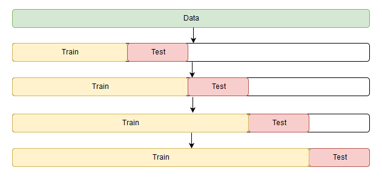
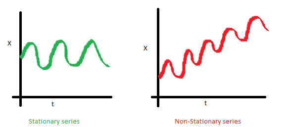
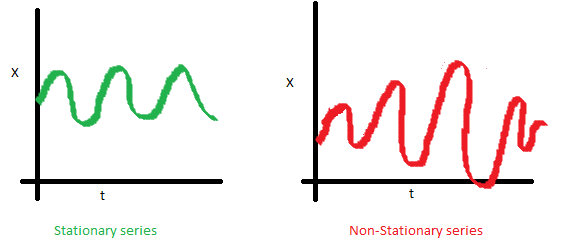
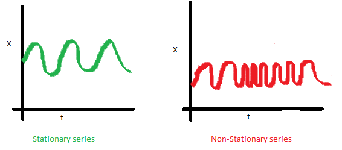
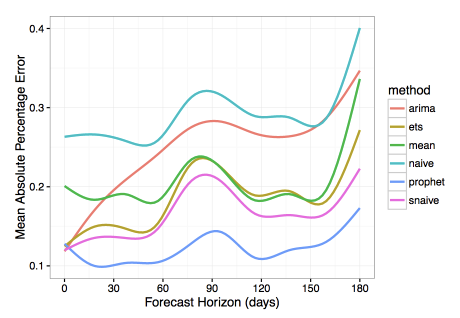

# 时间序列处理与应用

### 知识点

- 时间序列
- SARIMA
- 线性回归
- XGBoost
- Prophet

------

## 时间序列数据介绍

- 定义：

  > 时间序列指的是同一个统计指标的数值按其发生的时间先后顺序排列而构成的一组数列

- 处理工具：*Statsmodule* 模块

- 在将数据加载至 *Pandas* 数据表时，可以通过 `pandas.read_csv()` 的 `parse_dates=` 关键字参数指定需要被解析为时间字段的列名

## 预测质量评价指标

- **可决系数**，又称 [$R^2$](http://scikit-learn.org/stable/modules/model_evaluation.html#r2-score-the-coefficient-of-determination)

  - 取值范围在 $[0,+\infty)$ ，值越大表示拟合效果越好，可以使用 `sklearn.metrics.r2_score` 调用

  $$
  R^2 = 1 - \frac{SS_{\text{res}}}{SS_{\text{tot}}}
  $$

- [**平均绝对误差**](http://scikit-learn.org/stable/modules/model_evaluation.html#mean-absolute-error)

  - 所有单个观测值与算术平均值的偏差的绝对值的平均
  - 具有可解释性，取值范围在 $[0,+\infty)$ ，接口为 `sklearn.metrics.mean_absolute_error`

  $$
  \text{AE}_{\text{Mean}} = \frac{\sum\limits_{i=1}^{n} |y_i - \hat{y}_i|}{n}
  $$

- [**中值绝对误差**](http://scikit-learn.org/stable/modules/model_evaluation.html#median-absolute-error)

  - 所有单个观测值与算术平均值的偏差的绝对值的中值，对异常值不敏感
  - 取值范围为 $[0,+\infty)$ ，调用接口为 `sklearn.metrics.median_absolute_error`

  $$
  \text{AE}_{\text{Median}} = \text{Med}(|y_1 - \hat{y}_1|, ... , |y_n - \hat{y}_n|)
  $$

- [**均方误差**](http://scikit-learn.org/stable/modules/model_evaluation.html#mean-squared-error)

  - 最常用的度量标准，对大偏差给予较高的惩罚，反之亦然
  - 取值范围为 $[0,+\infty)$ ，调用接口为 `sklearn.metrics.mean_squared_error`

  $$
  \text{MSE} = \frac{1}{n}\sum\limits_{i=1}^{n} (y_i - \hat{y}_i)^2
  $$

- [**均方对数误差**](http://scikit-learn.org/stable/modules/model_evaluation.html#mean-squared-logarithmic-error)

  - 对均方差取对数而得到，更重视小偏差，通常用在呈指数趋势的数据
  - 取值范围为 $[0,+\infty)$ ，调用接口为 `sklearn.metrics.mean_squared_log_error`

  $$
  \text{MSLE} = \frac{1}{n}\sum\limits_{i=1}^{n}{(\log(1+y_i) - \log(1+\hat{y}_i))^2}
  $$

- **平均绝对百分比误差**，取值范围为 $[0,+\infty)$
  $$
  \text{MAPE} = \frac{100}{n}\sum\limits_{i=1}^{n}{\frac{|y_i - \hat{y}_i|}{y_i}}
  $$

## 平移、平滑、评估

### 移动平均（MA）

假设 $\widehat{y_t}$ 仅仅依赖 $k$ 个最相近的值，对这 $k$ 个值求平均值得到 $\widehat{y_t}$
$$
\widehat{y_t} = \frac{1}{k}\sum\limits^{k}_{n=1} y_{t-n}
$$
*Pandas* 提供了 `DataFrame.rolling(window).mean()` 接口用于实现移动平滑

### 加权平滑

将 $k$ 个之前的数据进行加权求和
$$
\widehat{y_t} = \sum\limits^{k}_{n=1}{\omega_n y_{t+1-n}}
$$

### 指数平滑

 [**指数平滑**](https://en.wikipedia.org/wiki/Exponential_smoothing) 则是一开始加权所有可用的观测值，而当每一步向后移动窗口时，进行指数地减小权重
$$
\hat{y}_{t} = \alpha \cdot y_t + (1-\alpha) \cdot \hat y_{t-1}
$$
函数的递归中隐藏了指数：也就是每次乘以 $1-\alpha$ ，其已经包含先前预测值幂乘 $1-\alpha$ 的运算结果

### 双指数平滑

$$
\begin{eqnarray}
\ell_x &=& \alpha y_x + (1-\alpha)(\ell_{x-1} + b_{x-1}) \\
b_x &=& \beta(\ell_x - \ell_{x-1}) + (1-\beta)b_{x-1} \\
\hat{y}_{x+1} &=& \ell_x + b_x
\end{eqnarray}
$$

其中，$\ell_x$ 表示 **截距** ，$b_x$ 表示 **趋势** ，$\alpha$ 表示 **序列平滑因子** ，$\beta$ 表示 **趋势指数平滑系数** 。当 $\alpha$ 和 $\beta$ 越大，最近一个观测点的权重越大，平滑程度越小。

人工设置部分参数组合可能绘制出奇奇怪怪的结果，需要考虑引入自动参数调节。

### 三指数平滑

又称为 *Holt-Winters* 模型。相比于双指数平滑，三指数平滑还增加了季节性成分。如果时间序列预计没有季节性，就不应该使用这种方法。
$$
\begin{eqnarray}
\ell_x &=& \alpha(y_x - s_{x-L}) + (1-\alpha)(\ell_{x-1} + b_{x-1}) \\
b_x &=& \beta(\ell_x - \ell_{x-1}) + (1-\beta)b_{x-1} \\
s_x &=& \gamma(y_x - \ell_x) + (1-\gamma)s_{x-L} \\
\hat{y}_{x+m} &=& \ell_x + mb_x + s_{x-L+1+((m-1)\mod L)}
\end{eqnarray}
$$
模型引入了 Brutlag 方法，用来创建置信区间：
$$
\begin{eqnarray}
\hat y_{max_x} &=& \ell_{x−1}+b_{x−1}+s_{x−T}+m⋅d_{t−T} \\
\hat y_{min_x} &=& \ell_{x−1}+b_{x−1}+s_{x−T}-m⋅d_{t−T} \\
d_t &=& \gamma∣y_t−\hat y_t∣+(1−\gamma)d_{t−T}
\end{eqnarray}
$$
其中，$T$ 是季节长度，$d$ 是预测偏差，其他参数与三指数平滑相同。

## 时间序列交叉验证

1. 要评估模型，必须选择适合该任务的损失函数（描述了模型拟合数据的接近程度）；

2. 使用交叉验证，将损失函数值最终降至全局最小值

   - 时间序列具有时间结构，不能随意对数据进行组合
   - 随机组合会导致观测点之间的所有时间依赖关系将丢失

3. 将时间序列数据划分为多个时间片段，每次选取一段或多段进行训练，并使用下一段进行测试。

   

*Sklearn* 提供了 `sklearn.model_selection.TimeSeriesSplit` 实现时间序列的划分，它会返回一组由 `(train_indices, text_indicies)` 组成的索引集合。

### 平稳性

[**平稳性**](https://en.wikipedia.org/wiki/Stationary_process) 通常指的是时间序列是否平稳，其统计特性（均值、方差以及协方差）是否随时间变化。

- 均值不稳定性

  

- 方差不稳定性

  

- 协方差不稳定性

  

对于标准高斯噪声 $x\sim\mathcal{N}(0,1)$ 而言，其分布生成的过程是稳定的，均值 $\mu=1$ ，方差 $\sigma^2=1$ 。基于此过程生成新的噪声 $x_t=\rho x_{t-1}+e_t$ ，其中 $e_t\sim\mathcal{N}(0,1)$ 。我们发现，当 $\rho_0=0,\rho\to1$ 时，过程开始显示出较长周期性，但整体仍相对静止。当 $\rho=1$ ，我们会获得一个非平稳的随机时间序列。

在达到临界值后，序列 $x_t=\rho x_{t-1}+e_t$ 不会回归其平均值，其相邻变化量 $x_t-x_{t-1}=(\rho-1)x_{t-1}+e_t$ 称为 **一阶差分** 。

若能够使用 $n$ 阶差分从一个非平稳序列中生成平稳序列，则这个序列为 $n$ 阶差分序列。

### 非平稳性消除方法

- 多阶差分
- 移除趋势和季节性去除
- 平滑
- Box-Cox 转换
- 对数转换

## 摆脱非平稳性并构建 SARIMA

### SARIMA

**季节性差分自回归滑动平均模型**（*Seasonal Autoregressive Integrated Moving Average*，记为 **SARIMA**）是常用的时间序列预测分析方法之一，它可以对任何周期的时间序列进行建模。

*SARIMA* 的部分参数需要根据自相关图和偏自相关图来进行选取，其中相关性一般用 **皮尔逊系数** 来衡量。

### ARIMA

- $\text{AR}(p)$ 称为 **自回归模型** ，它是对时间序列自身的回归分析。我们假设其序列值仅依赖于前序一个范围的值，记 **滞后大小** 为 $p$ 。
- $\text{MA}(q)$ 称为 **移动平均模型** ，按上面相同的假设，滞后记为 $q$ 。
- $I(d)$ 称为 **差分** ，这是让序列平稳的非季节性差异，一阶差分下 $d=1$ 。
- $S(s)$ 为 **季节性差分** ，其中 $s$ 是季节性周期长度。

综上所属，*ARIMA* 模型将有3个参数：

- $P$ 称为 **模型季节分量的自回归阶数** ，它可以从 *PACF* 获得
- $Q$ 与 $P$ 类似，也需要从 *ACF* 获得
- $D$ 称为 **季节差分** ，取值为二元集合 $\{0,1\}$ ，表示是否使用了季节差分

## 时间序列上的线性模型

- 一些模型永远不会被认为是「随时可用」的
  - 需要太多的时间进行数据准备
  - 需要对新数据进行频繁的再训练
  - 很难调优
- 选择几个特性，构建简单的 LR 或 RF 会更加容易

### 特征提取

- 时间序列相邻记录的时差
- （滑动）窗口统计
  - 最大/小值
  - 中位数和平均数
  - 方差
- 时间节点特征
  - 年、月、日，时、分、秒
  - 节假日、特殊日期（需要日历辅助）
- 目标编码
- 其他模型导出的结果

### 目标编码

- 许多机器学习算法并不能直接处理类别型数据，要将类别型特征转化为数值型特征
- 在时间序列中，可以考虑使用 **平均值编码**

### 正则化和特征选择

- *Ridge*（L2）正则化：均方误差损失＋正则化项，正则化项对系数平方进行惩罚
- *Lasso*（L1）正则化：对系数绝对值惩罚

## XGBoosting

- 这是一种梯度提升方法
- 基于树的模型处理数据趋势的能力较差，而 *XGBoost* 的基模型是决策树
- 必须先消除时间序列数据的趋势，或者使用一些特殊的技巧
- 使用线性模型来预测趋势，然后将其加入 *XGBoost* 的预测

## Prophet

- 由 *Facebook* 开源
- 有许多直观且易于解释的定制功能，以供逐步改善模型预测的质量
- 适用对象和场景很广泛

### Prophet 预测模型

本质上是一个加性回归模型：
$$
y(t)=g(t)+s(t)+h(t)+\epsilon_t
$$
其中，

- $g(t)$ 预测非周期性趋势
- $s(t)$ 预测周期性趋势
- $h(t)$ 预测特殊时间节点信息
- $\epsilon_t$ 表示误差

#### 趋势

- 非线性饱和增长模型（[逻辑增长模型](https://en.wikipedia.org/wiki/Logistic_function)）：
  $$
  g(t) = \frac{C}{1+e^{-k(t - m)}}
  $$
  其中，$C$ 为 **承载量** （曲线最大值）、$k$ 为增长率（曲线的陡峭程度）、$m$ 为偏置参数。可用于饱和增长场景中。

- 简单分段线性模型：增长率恒定、适合不存在饱和的线性增长数据

#### 季节性

- 每周的季节性数据是通过虚拟变量来进行建模的，产生6个虚拟变量（不包括周日）
- 年季节性通过傅里叶级数进行建模
- *v0.2* 之后加入了新的日季节性特性，可以使用日以下尺度的时序数据，并做出日以下尺度的预测

#### 假期和事件

- 可以预测特殊时间节点
- 需要提供自定义的事件列表

#### 误差

- 表示的是所构建的模型中未反映的信息
- 一般取高斯噪声 $\epsilon_t\sim\mathcal{N}(0,1)$

### 与其他算法的对比

::: center

:::

- *Naive* 模型：一个过度简化的预测方法，仅仅根据上一时间点的观测数据来预测所有未来值
- *S-Naive* 模型：考虑了季节性因素，与 *Naive* 类似
- *Mean* 模型：使用数据的平均值作为预测
- *ARIMA* 模型：自回归集成移动平均
- *ETS* 模型：指数平滑

### 安装

*Prophet* 支持 Python API 与 R API

### 数据集

1. [文章数量数据集](https://labfile.oss-cn-hangzhou.aliyuncs.com/courses/1283/medium_posts.csv.zip) ，使用制表符分隔；
2. 数据集来自 [*Medium.com*](https://medium.com/) ，此站点于 2012年8月15日 起对外提供服务；

### 可视化分析数据

*Plotly* 是一个自带交互功能、用于机器学习和高级数据分析的绘图库。

### 构建预测模型

*Prophet* 提供 API 与 *scikit-learn* 提供的 API 非常相似：

1. 创建一个 `Prophet()` 模型对象；
2. 调用 `fit()` 方法学习优化模型；
3. 调用 `make_future_dataframe()` 方法生成需要预测的未来时间序列；
4. 调用 `predict()` 方法进行预测。

*Prophet* 的官方建议至少根据最新的几个月的历史数据来做出预测，理想情况下是一年以上。

- *Prophet* 有内置可视化工具（`.plot()` 方法）评估模型结果
- `.plot_components()` 方法用于可视化模型不同特征的预测结果

### 预测结果质量评估

*Prophet* 在执行 `predict()` 时，除了给出预测值 `yhat` 之外，还会给出与预测结果相关的其他评估指标。

### 可视化

*Prophet* 可能不适合方差不稳定的时间序列，至少在使用默认设置时是这样。

## Box-Cox 变换

这是一个单调的数据转换，可以用来稳定方差。
$$
\begin{eqnarray}
    \text{BC}^{(\lambda)}(y_{i}) &=&
    \begin{cases}
      \frac{y_{i}^{\lambda} - 1}{\lambda} &, \text{if }\lambda \neq 0 \\
      ln(y_{i}) &, \text{if }\lambda = 0
    \end{cases}
    \\
    BC_{\text{inv}}^{(\lambda)}(y_{i}) &=&
    \begin{cases}
    e^{\left (\frac{\ln(\lambda y_{i} + 1)}{\lambda} \right )} &, \text{if }\lambda \neq 0 \\
    e^{y_{i}} &, \text{if }\lambda = 0.
  \end{cases}
\end{eqnarray}
$$
