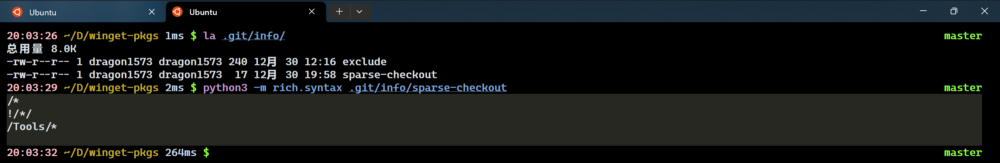
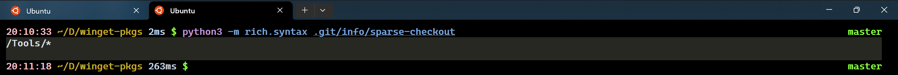

## Sparse Checkout（稀疏检出）


本段内容参考 [Git 官方文档](https://www.git-scm.com/docs/git-sparse-checkout) 。


在面对体量尤为巨大的 Git 仓库时， `git-sparse-checkout` 能够极大程度地压缩你的工作目录树，让你在当前庞大的 Commit 中只检出你希望跟踪的子树。

一棵工作树（Working Tree）可能会有成千上万零散的小文件被 Git 进行跟踪，在 `git checkout` 进行工作树更新的时候将有大量且频繁的文件读写发生。更多时候，我们关注的只是每个 Commit 中很小一部分子树的更改，此时可以充分利用稀疏检出的能力让工作树聚焦于特定的子树并屏蔽树的其他部分。

## 准备工作

在使用稀疏检出之前，你最好在本地创建一个空白仓库以直接执行稀疏检出。此处，我们以 `microsoft/winget-pkgs` 为例进行说明。

首先，在你的本地工作环境上使用 `git init` 创建一个空白的仓库，由于 `microsoft/winget-pkgs` 的默认主分支名称为 `master` 而非 `main` ，因此我们还需要用 `git branch --move` 将系统默认创建的分支改一个名字。

随后，我们需要配置这个仓库的远程地址，以便从远程获取相关的 Commits 。

为了加速我们的 Fetch 过程，我们只获取最近的一次 Commit ，将过去所有的提交全部压入此 Commit 中。

## 使用稀疏检出

一切准备就绪，可以让我们开始执行稀疏检出工作了！在 Git 内部有一个 `sparse-checkout` 子命令，它提供了 `init` 二级命令用于开始并初始化稀疏检出模式。

让我们查看一下 `.git/info/` 目录，可以看到里面有一个叫做 `sparse-checkout` 的文件，它是用于描述我们稀疏检出模式的配置文件。用 `cat` （此处使用的 `rich.syntax` 可以识别语法并代码染色）打印一下里面的内容，看上去它和我们执行 `git sparse-checkout list` 的结果一样。

简单解释一下：

1. `.git/info/sparse-checkout` 配置文件是纯文本文件。
2. 配置文件的每一行是一个路径，支持正则表达式（`*` 表示路径通配符），第1行和第3行表示我们将会检出根目录下的所有文件和 `Tools/` 目录下的所有文件。
3. 配置文件开头的 `!` 表示逻辑非，第2行表示不检出根目录下所有子目录的内容。

现在，我们把前两行去掉，文件内容变成下面这个样子。

执行 `git checkout master` 切换到 `master` 分支并与远程分支同步，再执行一下 `git sparse-checkout reapply` ，看看当前仓库下有什么？

可以看到，Git 如我们所愿地只从最新提交里检出了 `Tools/` 子目录下的内容。

## 后记

如果在后续的工作流中需要检出其他的工作子树呢？有以下两种方法：

1. 使用 `git sparse-checkout add` 子命令添加子树；
2. 直接编辑 `.git/info/sparse-checkout` 配置文件。
