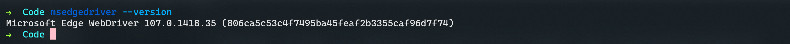

## Selenium 简介



摘抄自 [Selenium 浏览器自动化项目 | Selenium](https://www.selenium.dev/zh-cn/documentation/)



Selenium 是支持 Web 浏览器自动化的一系列工具和库的综合项目。

它提供了扩展来模拟用户与浏览器的交互，用于扩展浏览器分配的分发服务器， 以及用于实现 [W3C WebDriver 规范](https://www.w3.org/TR/webdriver/) 的基础结构， 该 **规范** 允许您为所有主要 Web 浏览器编写可互换的代码。

这个项目是由志愿者贡献者实现的，他们投入了自己数千小时的时间， 并使源代码 [免费提供](https://www.selenium.dev/zh-cn/documentation/about/copyright/#license) 给任何人使用、享受和改进。

Selenium 汇集了浏览器供应商，工程师和爱好者，以进一步围绕 Web 平台自动化进行公开讨论。 该项目组织了 [一次年度会议](https://seleniumconf.com/) ，以教学和培养社区。

## 示例环境

- Microsoft Windows 11 Professional 22H2
- Ubuntu 22.04 LTS on WSL2
  - 需要同时安装 WSLg 提供图形化支持
- Python v3.10.7
  - 可选：Poetry (version 1.2.2)

- Selenium 4.6.0
- Microsoft Edge for Linux 107.0.1418.35
- EdgeDriver 107.0.1418.35

由于我们在 WSL2 环境中使用 Selenium ，并不能直接使用位于 Windows 宿主上的 Edge(Driver) 版本，需要由我们在 WSL2 环境中另外安装一个 Microsoft Edge 和 EdgeDriver 版本。

### 安装 Microsoft Edge for Linux

在 Windows 宿主上访问 [Edge 官网](https://www.microsoft.com/zh-cn/edge) ，选择「立即下载 EDGE 浏览器」，展开下拉菜单并选择「Linux (*.deb)」。


下载完成后，可以使用 `/mnt` 目录在 WSL2 上访问 Windows 文件系统，执行以下命令完成安装并检查软件版本。

```bash
sudo apt install -y /mnt/path/to/file/microsoft-edge-stable_107.0.1418.35-1_amd64.deb
microsoft-edge --version
```


执行 `microsoft-edge` ，WSLg 能够自动打开一个浏览器窗口。


### 安装 EdgeDriver for Linux

EdgeDriver 驱动程序必须与 Microsoft Edge for Linux 版本相同，否则无法正常启动。执行以下命令完成安装并检查版本信息。

```bash
wget https://msedgedriver.azureedge.net/107.0.1418.35/edgedriver_linux64.zip
unzip -d /opt/microsoft/msedgedriver/ edgedriver_linux64.zip
update-alternatives --install /usr/bin/msedgedriver msedgedriver /opt/microsoft/msedgedriver/msedgedriver 100
msedgedriver --version
```



执行 `msedgedriver` ，能够正常启动驱动程序。


## 开发过程



此处假设你已经使用任意方式完成了 Selenium 的安装，如果您不清楚该怎么做，请考虑使用 [venv](https://docs.python.org/3.10/library/venv.html) 或 [Poetry](https://python-poetry.org/) 等工具创建虚拟环境，并在其中进行安装。



### 引入依赖

在本次开发中，我们需要使用到下列内容：

```python
# Microsoft Edge 浏览器核心驱动类
from selenium.webdriver import Edge
# 元素定位方式常量类
from selenium.webdriver.common.by import By
# 显示等待判断方法库
from selenium.webdriver.support import expected_conditions as ec
# 显示等待器
from selenium.webdriver.support.wait import WebDriverWait
# 行为操作链
from selenim.webdriver.common.action_chains import ActionChains
# 键盘常量库
from selenium.webdriver.common.keys import Keys
# 所有浏览器驱动的父类
# 用于类型标记，方便提供代码补全
from selenium.webdriver.remote.webdriver import WebDriver
```

### 主函数

本项目的主要目标有两个：登录邮箱和发送邮件。此处选取的邮箱是学校自有域名，基于腾讯企业邮箱，没有 2FA 等额外的验证步骤，同时支持用户名＋密码直接完成登录。

```python
if __name__ == "__main__":
    # 创建一个浏览器实例
    # 由于我们将 msedgedriver 用 update-alternatives 添加到 /usr/bin/ 目录下
    # 此处可以不指定驱动所在路径
    driver = Edge()
    # 打开邮箱域名
    driver.get("http://mail.chicken.edu.cn/")
    # 执行登录
    login(driver)
    # 完成发件
    send_mail(driver)
    # 关闭浏览器实例并退出自动化
    driver.quit()
```

### 登录邮箱

让我们在 Windows 宿主中打开 Microsoft Edge ，在其中分析页面并完成工程开发。

访问邮箱域名，是一个腾讯企业邮箱的登录界面。在「邮箱账号」上右键并选择「检查」打开 DevTools 开发人员工具。仔细检查发现，用户登录区域在下图这样一个元素中，为方便起见我们使用 XPath 语法完成元素定位，选取其 `class` 属性作为定位谓语，得到 XPath 表达式 `//div[@class='login_content_wrap'][1]` ，在「元素」面板中进行搜索。搜索结果共有2个，其中第1个为页面中可见的元素。


「邮箱账号」元素是一个 `<input />` 节点，我们同样尝试用它的 `name` 标签作为 XPath 定位谓语进行检索，得到 `//*[@name="inputuin"]` 这样一个 XPath 表达式。本次搜索只命中了这唯一的节点。于是乎，我们在定位时可以不必指定 `By.XPATH` 来使用 XPath 语法，而是直接使用 `By.NAME` 用其 `name` 标签实现精准定位。

在人工填充用户名和密码并执行登录的过程中，我们注意到两个输入框可以使用 `Tab` 键进行切换，信息填充完成后按下 `Enter` 可以进行登录。这个发现可以让我们的代码省去大量的元素定位的逻辑，借助键盘快捷键方便地在各必要的交互元素中进行切换，完成登录流程。

登录成功后进入邮箱首页，注意到此时的标题栏会显示学校的名称，我们以此作为成功登录的标志。


<details><summary>点击查看函数源代码</summary>

```python
def login(driver: WebDriver) -> None:
    """ 登录
    
    自动化完成邮箱的登录
    
    Parameter
    ---------
    driver: WebDriver
    	浏览器驱动实例
    """
    # 使用 WebDriverWait 显示等待页面元素完成加载
    WebDriverWait(driver, 15).until(
        # 检查元素是否存在
        ec.presence_of_element_located(
            # 使用 XPath 语法更易于进行元素定位
            (By.XPATH, "//div[@class='login_content_wrap'][1]")))
    # 使用 ActionChains 实现驱动的链式操作
    # .click() 方法接受一个参数指定需要被点击的元素
    ActionChains(driver).click(driver.find_element(
        # 由于用户名输入框在全页面具有唯一的 name 属性
        # 此处直接用 By.NAME 进行元素定位
        # .send_keys() 可以发送键盘文本输入
        By.NAME, "inputuin")).send_keys("username").send_keys(
            # 也可以借助 Keys 常量类发送键盘上的功能键
            # 我们可以用 Tab 在各输入框之间快速切换
            # 避免重复定位元素的麻烦
            Keys.TAB).send_keys("password").send_keys(
                # 页面支持直接用 Enter 键执行登录操作
                # 调用链设计完成后需要调用 .perform() 执行
                Keys.ENTER).perform()
    # 由于是学校域名的腾讯企业邮箱，登录后的页面标签会显示学校名称
    # 同样使用 WebDriverWait 检查页面标签是否匹配
    # 以此作为成功登录的标志
    WebDriverWait(driver, 15).until(ec.title_is("野鸡大学"))
```

</details>

### 发送邮件

在 DevTools 开发人员工具中使用快捷键 `Ctrl + Shift + C` 打开鼠标选择器并点击「写信」，可以看到其元素路径是 `a#composebtn` ，经搜索确认这个 CSS 选择器在全页面唯一，我们可以使用 `By.CSS_SELECTOR` 来定位这个元素。


在页面中点击「写信」，打开邮件编辑窗口。我们注意到右侧的邮件编辑区是一个 `<iframe />` ，因此可以把它作为我们进入写信状态的判定标志，其 XPath 表达式为 `//iframe[@name='mainFrame']` 。经过搜索，这个 XPath 表达式对应的元素唯一，因此我们在切换 frame 的过程中可以直接使用其 `name` 属性值来指代这个 `<iframe />` 。


检查「收件人」输入框，真正接受用户输入的是其中层层嵌套的 `<input />` 。基于 DevTools 开发人员工具下方的元素路径标识（面包屑导航），我们可以写出 XPath 表达式 `//div[@id='toAreaCtrl']/div[@class='addr_text']/input` ，完成元素的定位。与登录界面相同，邮件编辑区域同样支持使用 `Tab` 键在各输入框之间切换，我们使用 `ActionChains` 操作链依次填充收件人、主题和正文。


我们在 DevTools 开发人员工具中检查蓝色的「发送」按钮，注意到其中的 `name` 属性，尝试用 XPath 表达式 `//input[@name='sendbtn']` 进行定位。搜索结果共有两个，其中编辑区域的上方和下方各有一个相同的「发送」按钮，我们只选择上方那个元素，需要在表达式末尾添加 `[1]` 明确元素序号。


<details><summary>点击查看函数源代码</summary>

```python
def send_mail(driver: WebDriver) -> None:
    WebDriverWait(driver, 15).until(
        # 我们需要点击按钮，需要判断按钮能否被我们点击
        # 这个元素具有唯一的 id 属性，可以考虑用 CSS 选择器进行定位
        ec.element_to_be_clickable((By.CSS_SELECTOR, "a#composebtn")))
    # 点击这个按钮
    driver.find_element(By.CSS_SELECTOR, "a#composebtn").click()
    WebDriverWait(driver, 15).until(
        # 在填写具体信件内容前
        # 我们要判断一下这个元素是否被正确打开并正确呈现在屏幕上
        ec.presence_of_element_located(
            # 信件编辑区是一个具有唯一 name 属性的 iframe 子窗口
            # 此处使用 XPath 进行元素定位
            (By.XPATH, "//iframe[@name='mainFrame']")))
    # 我们目前位于此 URL 页面的顶层窗口
    # Selenium 无法直接与 iframe 中的元素进行交互
    # 需要告知驱动实例从外层窗口切换到 iframe 中
    driver.switch_to.frame("mainFrame")
    WebDriverWait(driver, 15).until(
        # 在人工操作中，我们需要点击「收件人」输入框
        # 等待光标闪烁后输入对方的收件地址
        # 此处我们需要确保输入框可以被我们点击
        # 作为发件窗口可以进行交互的标志
        ec.element_to_be_clickable(
            (By.XPATH,
             # 同样地，此处依旧使用 XPath 定位元素
             "//div[@id='toAreaCtrl']/div[@class='addr_text']/input")))
    ActionChains(driver).send_keys_to_element(
        # ActionChains.send_keys_to_element 接受两个参数
        # 第一个参数为键盘输入内容的发送目标元素，即上方的输入框
        driver.find_element(
            By.XPATH, "//div[@id='toAreaCtrl']/div[@class='addr_text']/input"),
        # 第二个参数为需要输入的内容
        "username@126.com").send_keys(
            # 与登录界面相同，此处也可以使用 Tab 在多个输入框之间切换
            # 此时为第二个输入框，代表邮件的主题
            Keys.TAB).send_keys("Selenium 自动化测试邮件").send_keys(
                # 第三个输入框即为邮件正文
                # 由于腾讯企业邮箱默认的邮件正文采用 HTML 格式
                # 因此正文部分本身也是一个 iframe
                # 用快捷键切换可以节省我们来回切换 iframe 的麻烦
                Keys.TAB).send_keys("测试正文内容").perform()
    WebDriverWait(driver, 15).until(
        # 邮件编写完成，我们当前处在中层邮件编辑区
        # 发送按钮位于这一层中，判断它能否被我们点击
        ec.element_to_be_clickable((By.XPATH, "//input[@name='sendbtn'][1]")))
    # 点击按钮，发送邮件！
    driver.find_element(By.XPATH, "//input[@name='sendbtn'][1]").click()
```

</details>

## 测试

让我们在终端运行项目，检查代码全流程能否正常运行。

1. 此处假设你使用的是 Fish Shell
2. 如果你使用的是 Poetry 虚拟环境，则假设你的虚拟环境存储在当前目录下

```bash
# 使用 Poetry
source ./.venv/bin/activate.fish
poetry run python main.py

# 一般的运行方法
source ./venv/bin/activate.fish
python main.py
```


好耶 ヾ(✿ﾟ▽ﾟ)ノ 我们成功地发送了邮件，也成功地在另一个邮箱收到了这一封邮件。


## 后记

1. 本案例使用的登录 URL 是基于腾讯企业邮箱的**客户自有地址**，并非腾讯企业邮箱的 [官方登录入口](https://mail.exmail.qq.com/) ，实际登录界面和相关登录逻辑可能与本案例有所区别。
2. 本邮箱账号**没有**开启客户端授权码和微信扫码登录功能，允许直接使用用户名＋密码方式完成登录，且**没有**任何验证码环节，对于实现 Selenium 自动化较为方便。
3. QQ [个人邮箱](https://mail.qq.com/) 与企业邮箱界面设计**完全不同**，**不适用**本案例源代码。
